# Estimado de Eficiencia

| Tamaño de entrada | Complejidad requerida                          |
|-------------------|------------------------------------------------|
| $n \le 10$        | $\mathcal{O}(n!)$                              |
| $n \le 20$        | $\mathcal{O}(2^n)$                             |
| $n \le 500$       | $\mathcal{O}(n^3)$                             |
| $n \le 5000$      | $\mathcal{O}(n^2)$                             |
| $n \le 10^6$      | $\mathcal{O}(n \log n)$ o $\mathcal{O}(n)$     |
| $n > 10^6$        | $\mathcal{O}(\log n)$ o $\mathcal{O}(1)$       |


# Indice Algoritmos

| Algoritmo                                                                                                | Complejidad                                     |
|----------------------------------------------------------------------------------------------------------|-------------------------------------------------|
| [Progresiones: Sumas Gaussianas](#sumas-gaussianas)                                                      | $\mathcal{O}(1)$                                |
| [Progresiones: Formula de Faulhaber](#formula-de-faulhaber-hasta-6)                                      | $\mathcal{O}(1)$                                |
| [Progresiones: Progresion Aritmetica](#progresion-aritmetica)                                            | $\mathcal{O}(1)$                                |
| [Progresiones: Progresion Geometrica](#progresion-geometrica)                                            | $\mathcal{O}(1)$                                |
| [Algebra: Raiz](#raices)                                                                                 | $\mathcal{O}(\log (n))$                         |
| [Algebra: Exponenciacion](#exponenciacion)                                                               | $\mathcal{O}(\log (n))$                         |
| [Algebra: Formula de Binet](#formula-de-binet)                                                           | $\mathcal{O}(1)$                                |
| [Algebra: Reduccion Gaussiana](#gauss)                                                                   | $\mathcal{O}(m^2 \cdot n)$                      |
| [Geometria: Suma y Resta de Vectores](#suma-y-resta-de-vectores)                                         | $\mathcal{O}(1)$                                |
| [Geometria: Multiplicacion y Division de Vectores por Escalares](#multiplacion-y-division-por-escalares) | $\mathcal{O}(1)$                                |
| [Geometria: Norma de un Vector](#norma)                                                                  | $\mathcal{O}(1)$                                |
| [Geometria: Proyeccion de un Vector Sobre Otro](#producto-vectorial)                                     | $\mathcal{O}(1)$                                |
| [Geometria: Producto Punto](#producto-punto)                                                             | $\mathcal{O}(1)$                                |
| [Geometria: Producto Cruz](#producto-cruz)                                                               | $\mathcal{O}(1)$                                |
| [Geometria: Calculo de Perimetro](#calculo-de-perimetro)                                                 | $\mathcal{O}(\#lados)$                          |
| [Geometria: Calculo de Area](#calculo-de-area)                                                           | $\mathcal{O}(\#lados)$                          | 
| [Geometria: Polar Sort](#polar-sort)                                                                     | $\mathcal{O}(\#puntos \cdot \log(\#puntos))$    |
| [Geometria: Convex Hull](#convex-hull)                                                                   | $\mathcal{O}(\#puntos \cdot \log(\#puntos))$    |
| [Combinatoria: Computo de factoriales](#computo-de-factoriales)                                          | $\mathcal{O}(n)$                                |
| [Combinatoria: Computo de factoriales inversos](#computo-de-factoriales-inversos)                        | $\mathcal{O}(n)$                                |
| [Combinatoria: Inclusion Exclusion](#principio-de-inclusion-exclusion)                                   | $\mathcal{O}(2^n)$                              |
| [Teoria de Numeros: Ver si un numero es primo](#numeros-primos)                                          | $\mathcal{O}(\sqrt{n})$                         |
| [Teoria de Numeros: Criba de Eratóstenes](#criba-de-eratóstenes)                                         | $\mathcal{O}(\sqrt{n})$                         |
| [Teoria de Numeros: MCD y MCM](#mcd-y-mcm)                                                               | $\mathcal{O}(\log(min(a,b)))$                   |
| [Teoria de Numeros: Divisores de un numero](#divisores-de-un-numero)                                     | $\mathcal{O}(\sqrt{n})$                         |
| [Teoria de Numeros: Factorizacion de un numero](#factorizacion-de-un-numero)                             | $\mathcal{O}(\sqrt{n})$                         |
| [Teoria de Numeros: Cantidad de factores de un numero](#cantidad-de-factores-de-un-numero)               | $\mathcal{O}(\sqrt{n})$                         |
| [Teoria de Numeros: Suma de factores de un numero](#suma-de-factores-de-un-numero)                       | $\mathcal{O}(\sqrt{n})$                         |
| [Teoria de Numeros: Producto de factores de un numero](#producto-de-factores-de-un-numero)               | $\mathcal{O}(\sqrt{n})$                         |
| [Teoria de Numeros: Cantidad de coprimos hasta n](#cantidad-de-coprimos-hasta-n)                         | $\mathcal{O}(\sqrt{n})$                         |
| [Teoria de Numeros: Ver si un numero es congruente a otro](#aritmetica-modular)                          | $\mathcal{O}(1)$                                |
| [Teoria de Numeros: Inverso modular](#inverso-modular)                                                   | $\mathcal{O}(\log (M))$                         |
| [Teoria de Numeros: Computo de inversos modulares](#computo-de-inversos-modulares)                       | $\mathcal{O}(n)$                                |
| [Teoria de Numeros: Ecuacion diofantica lineal](#ecuación-diofantica-lineal)                             | $\mathcal{O}(\log(min(a,b)))$                   |
| [Teoria de Numeros: Teorema chino del resto](#teorema-chino-del-resto)                                   | $\mathcal{O}(n)$                                |
| [Busqueda: Busqueda lineal](#busqueda-lineal)                                                            | $\mathcal{O}(n)$                                |
| [Busqueda: Busqueda binaria](#busqueda-binaria)                                                          | $\mathcal{O}(\log (n))$                         |
| [Busqueda: Ventana deslizante](#ventana-deslizante)                                                      | $\mathcal{O}(n)$                                |
| [Busqueda: 2SUM](#2sum)                                                                                  | $\mathcal{O}(n)$                                |
| [Grafos: DFS](#dfs)                                                                                      | $\mathcal{O}(n + m)$                            |
| [Grafos: BFS](#bfs)                                                                                      | $\mathcal{O}(n + m)$                            |
| [Grafos: Bellman-Ford](#bellman-ford)                                                                    | $\mathcal{O}(n \cdot m)$                        |
| [Grafos: Dijkstra](#dijkstra)                                                                            | $\mathcal{O}(\min\{n^2,\ m \cdot \log(n)\})$    |
| [Grafos: Floyd-Warshall](#floyd-warshall)                                                                | $\mathcal{O}(n^3)$                              |
| [Grafos: Topological Sorting](#topological-sorting)                                                      | $\mathcal{O}(n + m)$                            |
| [Grafos: Contar el Numero de Caminos en un DAG](#contar-el-numero-de-caminos-en-un-dag)                  | $\mathcal{O}(n + m)$                            |
| [Grafos: Calcular Destino en un Grafo Sucesor](#calcular-destino-en-un-grafo-sucesor)                    | $\mathcal{O}(n \cdot \log(n))$                  |
| [Grafos: Floyd](#floyd)                                                                                  | $\mathcal{O}(n)$                                |
| [Grafos: Kosaraju](#kosaraju)                                                                            | $\mathcal{O}(n + m)$                            |
| [Grafos: 2SAT](#2sat)                                                                                    | $\mathcal{O}(n + m)$                            |
| [Grafos: Hierholzer](#hierholzer)                                                                        | $\mathcal{O}(n + m)$                            |
| [Grafos: Encontrar Camino Hamiltoniano](#encontrar-camino-hamiltoniano)                                  | $\mathcal{O}(\#intentos \cdot m \cdot \log(n))$ |
| [Grafos: Dinic](#dinic)                                                                                  | $\mathcal{O}(m \cdot n^2)$                      |
| [Grafos: Nodos de cada Subarbol](#nodos-de-cada-subarbol)                                                | $\mathcal{O}(n)$                                |
| [Grafos: Calcular Diametro del Arbol](#calcular-diametro13-del-arbol)                                    | $\mathcal{O}(n)$                                |
| [Grafos: Hallar Ancestros](#hallar-ancestros)                                                            | $\mathcal{O}(n \cdot \log(n))$                  |
| [Grafos: Ancestro Comun Menor](#ancestro-comun-menor)                                                    | $\mathcal{O}(n \cdot \log(n))$                  |
| [Grafos: Distancia entre Dos Nodos](#distancia-entre-dos-nodos)                                          | $\mathcal{O}(n \cdot \log(n))$                  |
| [Grafos: Kruskal](#kruskal)                                                                              | $\mathcal{O}(m \cdot \log(n))$                  |
| [Grafos: Prim](#prim)                                                                                    | $\mathcal{O}(n + m \cdot \log(m))$              |
| [Fuerza Bruta: Generacion de Subconjuntos](#generacion-de-subconjuntos)                                  | $\mathcal{O}(2^{\|S\|})$                        |
| [Fuerza Bruta: Generacion de Permutaciones](#generacion-de-permutaciones)                                | $\mathcal{O}(n!)$                               |
| [Fuerza Bruta: Reunion en el Centro](#reunion-en-el-centro)                                              | $\mathcal{O}(\sqrt{2^n})$                       |
| [Bactracking: Ejemplo Problema de las N Reinas](#ejemplo-problema-de-las-n-reinas)                       | $\mathcal{O}(n!)$                               |
| [Programacion Dinamica: Ejemplo TopDown](#topdown)                                                       | $\mathcal{O}(n \cdot m)$                        |
| [Programacion Dinamica: Ejemplo BottomUp](#bottomup)                                                     | $\mathcal{O}(n \cdot m)$                        |
| [Programacion Dinamica: Kadane's Algorithm](#algoritmo-de-kadane)                                        | $\mathcal{O}(n)$                                |
| [Operaciones de Bits: Setear el k-esimo Bit](#setear-el-k-esimo-bit)                                     | $\mathcal{O}(1)$                                |
| [Operaciones de Bits: Chequear Potencia de 2](#chequear-potencia-de-2)                                   | $\mathcal{O}(1)$                                |

# Indice Estructuras

| Estructura                                            | Memoria Total (usando `int`)                                                                                    |
|-------------------------------------------------------|-----------------------------------------------------------------------------------------------------------------|
| [Arrays](#arrays)                                     | $(4 \cdot \#elementos)B$                                                                                        |
| [Bitsets](#bitsets)                                   | $(\#elementos)b$                                                                                                |
| [Prefix Sum/Tabla Aditiva](#prefix-sum)               | $(8 \cdot \#elementos + 4)B$                                                                                    |
| [Prefix Sum of Matrix](#prefix-sum-of-matrix)         | $(8 \cdot \#filas \cdot \#columnas)B$                                                                           |
| [Sparse Table](#sparse-table)                         | $(4 \cdot \#elementos \cdot \log(\#elementos))B$                                                                |
| [Difference Array](#difference-array)                 | $(8 \cdot \#elementos + 4)B$                                                                                    |
| [Vectors](#vectors)                                   | $(4 \cdot \#elementos)B$                                                                                        |
| [Strings](#strings)                                   | $(\#elementos + 1)B$                                                                                            |
| [Tries](#tries)                                       | $(\sum_{s \in diccionario} s.size() + 1)B$ (asumiendo que ninguna palabra es substring de otra)                 |
| [Hashes](#hashes)                                     | $8B$                                                                                                            |
| [Z Function](#z-function)                             | $(\#elementos)B$                                                                                                |
| [Deques](#deques)                                     | $(4 \cdot \#elementos)B$                                                                                        |
| [Queues](#queues)                                     | $(4 \cdot \#elementos)B$                                                                                        |
| [Priority Queues](#priority-queues)                   | $(4 \cdot \#elementos)B$                                                                                        |
| [Sets](#sets)                                         | $(4 \cdot \#elementos)B$                                                                                        |
| [Multisets](#multisets)                               | $(4 \cdot \#elementos)B$                                                                                        |
| [Indexed Sets](#indexed-sets)                         | $(4 \cdot \#elementos)B$                                                                                        |
| [Bitmask Sets](#bitmask-sets)                         | $4B$                                                                                                            |
| [Disjoint Set Union](#disjoint-set-union)             | $(8 \cdot \#elementos)B$                                                                                        |
| [Maps](#maps)                                         | $(8 \cdot \#elementos)B$                                                                                        |
| [Iteradores](#iteradores)                             | $4B$                                                                                                            |
| [Binary Index Tree/Fenwick Tree](#fenwick-tree)       | $(8 \cdot \#elementos)B$                                                                                        |
| [Segment Tree](#segment-tree)                         | $(12 \cdot \#elementos - 4)B$                                                                                   |
| [Geometria: Punto](#punto)                            | $8B$                                                                                                            |
| [Geometria: Vector](#vector)                          | $8B$                                                                                                            |
| [Geometria: Recta](#recta)                            | $16B$                                                                                                           |
| [Geometria: Poligono](#poligono)                      | $\left(8 \cdot \frac{\#\text{vectores}}{\text{puntos}} \right)B$                                                |
| [Grafos: Lista de adyacencias](#lista-de-adyacencias) | $(4 \cdot \#nodos)B + (4 \cdot \#aristas)B$ grafo direccional o $(8 \cdot \#aristas)B$ grafo direccional pesado |
| [Grafos: Lista de aristas](#lista-de-aristas)         | $(8 \cdot \#aristas)B$ para grafos direccionales o $(12 \cdot \#aristas)B$ para grafos direccionales pesados    |
| [Grafos: Matriz de adyacencia](#matriz-de-adyacencia) | $(4 \cdot (\#nodos)^2)B$                                                                                        |
> *La memoria total se multiplica por 2 si los elementos son `long long`*

# Indice Funciones Builtin

| Funcion                                                             | Descripcion                                                                                                              |
|---------------------------------------------------------------------|--------------------------------------------------------------------------------------------------------------------------|
| [Funciones de Ordenacion: Sort](#sort)                              | Ordena estructuras de datos con iteradores de acceso aleatorio en tiempo $\mathcal{O}(\log(n))$                          |
| [Funciones de Ordenacion: Random Shuffle](#random-shuffle)          | Ordena aleatoriamente estructuras de datos con iteradores de acceso aleatorio en tiempo $\mathcal{O}(n)$                 |
| [Funciones de Busqueda: Lower Bound](#lower-bound)                  | Devuelve un puntero al primer elemento cuyo valor es >= a `x` en tiempo $\mathcal{O}(\log(n))$                           |
| [Funciones de Busqueda: Upper Bound](#upper-bound)                  | Devuelve un puntero al primer elemento cuyo valor es > a `x` en tiempo $\mathcal{O}(\log(n))$                            |
| [Funciones de Busqueda: Equal Range](#equal-range)                  | Devuelve una tupla con las salidas de *lower_bound()* y *upper_bound()* respectivamente en tiempo $\mathcal{O}(\log(n))$ |
| [Funciones de Conversion: To String](#to-string)                    | Convierte un numero real en una cadena en tiempo $\mathcal{O}(digitos(n))$                                               |    
| [Funciones de Conversion: Atoi](#atoi)                              | Convierte una arreglo de caracteres en un entero en tiempo $\mathcal{O}(s.size())$                                       |    
| [Funciones de Bits: Counting Leading Zeros](#count-leading-zeros)   | Retorna la cantidad de ceros antes del 1 mas significativo de `x` en tiempo $\mathcal{O}(1)$                             |
| [Funciones de Bits: Counting Trailing Zeros](#count-trailing-zeros) | Retorna la cantidad de ceros despues del 1 menos significativo de `x` en tiempo $\mathcal{O}(1)$                         |
| [Funciones de Bits: Popcount](#popcount)                            | Retorna la cantidad de bits en 1 de `x` en tiempo $\mathcal{O}(1)$                                                       |
| [Funciones de Bits: Parity](#parity)                                | Retorna 1 si la cantidad de bits en 1 de `x` es par y 0 en caso contrario en tiempo $\mathcal{O}(1)$                     |
| [Funciones de Conteo: Count](#count)                                | Devuelve la cantidad de ocurrencias de un elemento en otro elemento iterable en tiempo $\mathcal{O}(n)$                  |
| [Funciones de Conteo: Count If](#count-if)                          | Devuelve la cantidad de elemntos cumplen una determinada condicion en otro elemento iterable en tiempo $\mathcal{O}(n)$  |
| [Funciones Aritmeticas: GCD](#gcd)                                  | Devuelve el maximo comun divisor en tiempo $\mathcal{O}log(min(a,b))$                                                    |
| [Funciones Aritmeticas: LCM](#lcm)                                  | Devuelve el minimo comun multiplo en tiempo $\mathcal{O}log(min(a,b))$                                                   |

# Librerias God 

- bits/stdc++.h

# Tips

- **Multiplicar en lugar de dividir**
    - Flotantes

    ``` c++
    int a, b, c, d;
    double val1 = a/b;
    double val2 = c/d;
    if (val1 == val2) {
        // do stuff…
    }
    ```

    - Enteros

    ``` c++
    int a, b, c, d;
    if (a*d == c*b) {
        // do stuff…
    }
    ```

- **Los algoritmos de grafos de obtencion de caminos minimos que son de 1 a todos se pueden transformar en algoritmos para encontrar caminos de todos a uno (revirtiendo el sentido de los ejes)**

- **Los algoritmos de grafos de obtencion de caminos minimos que son de 1 a todos se pueden usar para computar caminos de todos a todos (haciendo n ejecuciones del algoritmo, una desde cada origen)**

- **Si falta informacion en el grafo, agregar vertices para codificar dicha informacion**

- **Encarar los problemas de calcular los estados posibles como problemas de grafos**

- **Setear MAXN en un valor ligeramente mayor a `n` para evitar casos borde de una manera sencilla**

- **Si se va a recorrer una matriz, poner un marco con valores inalcanzables para detectar/evitar casos bordes**

- **Usar un "centinela" como el valor al que queremos llegar para cortar la recursion**
  
- **Saber matematicas, pensamiento logico. Es mejor poder demostrar algo y saber que funciona en vez de ir a ciegas con una implementacion**

- **Resolver un problema consiste en detectar propiedades y observaciones del problema. Un Wrong Answer (WA) probablemente significa que faltan observaciones**

- **Un Accepted (AC) no necesariamente significa que este completamente bien. Siempre comparar con otras soluciones**

- **UPSOLVEAR. Aprender lo que no sabes**

- **Siempre es preferible utilizar la funcion `sort()` que mantener una estructura ordenada (como sets o maps)**

- **Si necesitamos valores de indices grandes pero no necesariamente todos ellos, se puede utilizar una funcion `c(i)` que dado un indice `i` comprima el valor del indice en uno mas pequeño que podamos manejar. La funcion debe respetar que, dados dos indices `i` y `j`, tal que `i < j`,  `c(i) < c(j)`. NOTAR que debemos conocer los indices de antemano**

- **Chequear divisibilidad para potencias de 2 utilizando la operacion AND: un numero `x` es divisible por `2^k` si y solo si `x & (2^k - 1) == 0`. NOTAR que podemos chequear facilmente paridad utilizando esta tecnica**

- **Multiplicar y dividir por potencias de 2 utilizando shifteos**

- **Representar la data en binario cuando los datos solo pueden tomar 2 valores**

- **Siempre que las caracteristicas del problema lo permitan, podemos plantear los estados de un problema de [programacion dinamica](#programacion-dinamica) como un [DAG](#grafos-dirigidos)**

- **Pensar en [busqueda binaria](#busqueda-binaria) para los problemas de minimizar un maximo o maximizar un minimo**

- **Cuando en un problema de [flujos y cortes](#flujos-y-cortes) quiera tener muchas fuentes y resumideros, puedo hacer un S' y un T' con capacidad infinita y resolverlo como un problema de max flow**

- **Si en una dp solo me muevo del estado i al estado i+1 y no necesito preservar informacion historica, puedo simplemente tener una dp nueva y una vieja e irlas actualizando en cada paso**

# Funciones de Ordenacion

## Sort

- **vectores:**

```c++
vector<int> v = {4,2,5,3,5,8,3};
sort(v.begin(),v.end());   // <-- DE MENOR A MAYOR
sort(v.rbegin(),v.rend()); // <-- DE MAYOR A MENOR
```

- **arreglos:**

```c++
int n = 7;
int a[] = {4,2,5,3,5,8,3};
sort(a,a+n);
```

- **strings:**

```c++
string s = "monkey";
sort(s.begin(), s.end());
```

Tambien podemos utilizar la funcion *sort()* con una comparacion *ad-hoc*.

Por ejemplo, definimos la funcion *comp()* que ordena strings primero por su longitud y luego alfabeticamente:

```c++
bool comp(string a, string b) {
    if (a.size() != b.size()) 
        return a.size() < b.size();
    return a < b;
}
```

Luego, dado `v` un vector de strings, podemos ordenar utilizando *comp()* llamando a *sort()* como sigue:

```c++
sort(v.begin(), v.end(), comp);
```

## Random Shuffle

- **vectores:**

```c++
vector<int> v = {4,2,5,3,5,8,3};
random_shuffle(v.begin(),v.end());
```

- **arreglos:**

```c++
int n = 7;
int a[] = {4,2,5,3,5,8,3};
random_shuffle(a,a+n);
```

- **strings:**

```c++
string s = "monkey";
random_shuffle(s.begin(), s.end());
```

# Funciones de Busqueda

**NOTAS**:
- Las siguientes funciones requieren que la estructura a iterar se encuentre **ordenada de menor a mayor**

## Lower Bound 

```c++
auto a = lower_bound(array, array+n, x);
```

## Upper Bound


```c++
auto b = upper_bound(array, array+n, x);
```

## Equal Range

```c++
auto r = equal_range(array, array+n, x);
cout << r.second-r.first << "\n";
```

# Funciones de Conversion

## To String

```c++
int x = 1000;
string s = to_string(x);
cout << s << "\n"; // "1000"
```

**NOTA**:
- Para los **tipos de coma flotante**, solo **se mostraran 6 digitos** donde se **redondea** el ultimo

### Flotantes con Precision Fijada

- **notacion fija**

```c++
double d = 3.141592653589793;
ostringstream oss;
oss.precision(10);          // Configurar precisión
oss << d;                   // Convertir número a string con la precisión dada
string s = oss.str();
cout << scientific << "\n"; // "3.141592654"
```

- **notacion cientifica**
```c++
double d = 3.141592653589793;
ostringstream oss;
oss << scientific << setprecision(4) << d;
string scientific = oss.str();
cout << scientific << "\n"; // "3.1416e+00"
```

**NOTA**:
- El ultimo digito siempre es **redondeado**

## Atoi

- **enteros**
```c++
string s1 = "123";
const char* s2 = "-456";

int x = atoi(s1);
int y = atoi(s2);
int z = atoi("789");
```

- **long long**
```c++
string s1 = "123";
const char* s2 = "-456";

ll x = atoll(s1);
ll y = atoll(s2);
ll z = atoll("789");
```

**NOTAS**:
- Si el string comienza con numeros y luego cualquier otro tipo de caracter, solo se convertira hasta antes del primer caracter no numerico
- Si el string no comienza con caracteres numericos, la funcion devolvera 0

# Funciones de Conteo

## Count

- **Vectores**
```c++
vector<int> v = {1,2,3,2,2};
cout << count(v.begin(), v.end(), 2) << "\n"; // 3
```

- **Strings**
 ```c++
string s = "BANANA";
cout << count(s.begin(), s.end(), 'A') << "\n"; // 3
```

- **Arrays**
```c++
array<double, 5> a = {1.0, 2.0, 1.0};
cout << count(a.begin(), a.end(), 1.0) << "\n"; // 2
```

## Count If

- **Vectores**
```c++
vector<int> v = {1,2,3,2,2};
cout << count_if(v.begin(), v.end(), [](int x) { return x % 2 != 0; }); << "\n"; // 2
```

- **Strings**
 ```c++
string s = "BANANA";
cout << 
count_if(s.begin(), s.end(), [](char c) {
    return c == 'A' || c == 'E' || c == 'I' || c == 'O' || c == 'U';
});
 << "\n"; // 3
```

- **Arrays**
```c++
array<double, 5> a = {1.0, 2.0, 1.0};
cout << count_if(a, a + 5, [](int x) { return x > 1; }); << "\n" ; // 1
```

# Funciones de Bits

## Count Leading Zeros

- **enteros**
```c++
int x = 5328; // 00000000000000000001010011010000
cout << __builtin_clz(x) << "\n"; // 19
```

- **long long**
```c++
long long x = 5328; // 0000000000000000000000000000000000000000000000000001010011010000
cout << __builtin_clzll(x) << "\n"; // 51
```

## Count Trailing Zeros

- **enteros**
```c++
int x = 5328; // 00000000000000000001010011010000
cout << __builtin_ctz(x) << "\n"; // 4
```

- **long long**
```c++
long long x = 5328; // 0000000000000000000000000000000000000000000000000001010011010000
cout << __builtin_ctzll(x) << "\n"; // 4
```

## Popcount

- **enteros**
```c++
int x = 5328; // 00000000000000000001010011010000
cout << __builtin_popcount(x) << "\n"; // 5
```

- **long long**
```c++
long long x = 5328; // 0000000000000000000000000000000000000000000000000001010011010000
cout << __builtin_popcountll(x) << "\n"; // 5
```

## Parity

- **enteros**
```c++
int x = 5328; // 00000000000000000001010011010000
cout << __builtin_parity(x) << "\n"; // 1
```

- **long long**
```c++
long long x = 5328; // 0000000000000000000000000000000000000000000000000001010011010000
cout << __builtin_parityll(x) << "\n"; // 1
```

# Funciones Aritmeticas

## GCD

``` c++
int a = 48; 
int b = 18;
gcd(a,b); // 6
```
> *Los compiladores de 2025 y posteriores calculan gcd de valores constantes en tiempo de compilacion*


## LCM

``` c++
int a = 48; 
int b = 18;
lcm(a,b); // 144
```
> *Los compiladores de 2025 y posteriores calculan lcm de valores constantes en tiempo de compilacion*

# Arrays

Lista de elementos.

Especialmente eficiente para:

- Acceder valores rapidamente $\rightarrow \mathcal{O}(1)$
- Modificar valores rapidamente $\rightarrow \mathcal{O}(1)$

**Usar siempre que se puedan.**

<u>Inicializacion:</u>

```c++
int A[10] = {}; // inicializado a 0
int B[200]; // inicializado con la memoria que ya estaba (basura)
```

> *Tamaño fijo*

> *Su memoria se aloja de manera contigua por lo cual es ligeramente mas rapido que un vector de su mismo tamaño*

# Bitsets

Un areglo cuyos elementos solo pueden ser 1 o 0.

Especialmente eficiente para:

- Reducir memoria (cada entrada solo ocupa 1 bit)
- Utilizar operadores de bits, como `&` (and), `|` (or), `^` (xor), `~` (not) `<< >>` (shifts)

<u>Inicializacion:</u>

```c++
bitset<10> bs; // inicializado a 0
bitset<10> bs(string("0010011010")); // inicializado de derecha a izquierda arbitrariamente
```

<u>Funciones:</u>
**bs.set():** Pone todos los bits en 1
**bs.set(k)** Pone solo el k-esimo bit en 1 (el orden es de derecha a izquierda y se indexa desde 0)
**bs.reset():** Pone todos los bits en 0
**bs.reset(k)** Pone solo el k-esimo bit en 0 (el orden es de derecha a izquierda y se indexa desde 0)
**bs.flip():** Invierte todos los bits
**bs.flip(k)** Invierte solamente el k-esimo bit (el orden es de derecha a izquierda y se indexa desde 0)
**bs.any():** Devuelve *true* si hay al menos un bit en 1
**bs.none():** Devuelve *true* si todos los bits estan en 0
**bs.all():** Devuelve *true* si todos los bits están en 1
**bs.size():** Devuelve el numero total de bits en el bitset
**bs.count():** Devuelve el numero de 1s presentes en el bitset (NOTAR que `bs.size() - bs.count()` es la cantidad de 0s)
**bs.to_ulong()/bs.to_ullong():** Convierte el bitset a un entero o long long no signado respectivamente. El tamaño del bitset no debe exceder de 32 para enteros o de 64 para long longs
**bs.to_string():** Convierte el bitset en un string

> *El tamaño debe ser una **constante***

> *Para poder operar entre bitsets, estos deben tener el **mismo tamaño***

> *La conversion del bitset a un numero negativo debe realizarse manualmente*

# Prefix Sum

Especialmente eficiente para:

- Responder consultas de rango o subintervalos
- Devoler la suma maxima cuando hay numeros negativos

``` c++
vector<int> S;
S.push_back(0);
void sumaAditiva  (vector<int > &A) {
    for(int i = 0; i < A.size(); i++) {
        S.push_back(A[i] + S[i]);
    }
}
```
> *Complejidad construccion: $\mathcal{O}(n)$*

> *Complejidad consulta: $\mathcal{O}(1)$*

> *Complejidad actualizacion: $\mathcal{O}(n)$*

**NOTAS**:
- Se necesitan **dos arreglos/vectores** (uno con los elementos y otro con la suma de los primeros i elementos)
- El arreglo de la suma tiene un elemento mas el cual es el 0

# Prefix Sum of Matrix

Especialmente eficiente para:

- Responder consultas de area

 

```c++
#define R 4 
#define C 5 
  
// calculating new array 
void prefixSum2D(int a[][C]) 
{ 
    int psa[R][C]; 
    psa[0][0] = a[0][0]; 
  
    // Filling first row and first column 
    for (int i = 1; i < C; i++) 
        psa[0][i] = psa[0][i - 1] + a[0][i]; 
    for (int i = 1; i < R; i++) 
        psa[i][0] = psa[i - 1][0] + a[i][0]; 
  
    // updating the values in the cells 
    // as per the general formula 
    for (int i = 1; i < R; i++) { 
        for (int j = 1; j < C; j++) 
  
            // values in the cells of new 
            // array are updated 
            psa[i][j] = psa[i - 1][j] + psa[i][j - 1] 
                        - psa[i - 1][j - 1] + a[i][j]; 
    } 
}  
```

Luego, para calcular la suma del area `A`

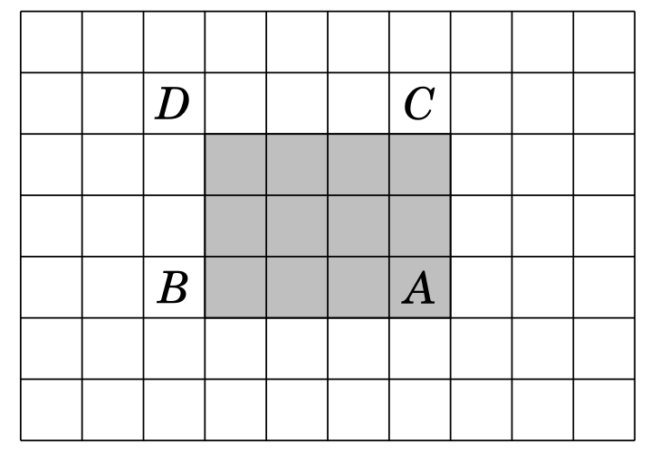

solamente devemos devolver `psa[posiA][posjA]` - `psa[posiB][posjB]` - `psa[posiC][posjC]` + `psa[posiD][posjD]`.

> *Complejidad construccion: $\mathcal{O}(n \cdot m)$*

> *Complejidad consulta: $\mathcal{O}(1)$*

> *Complejidad actualizacion: $\mathcal{O}(n)$*

# Sparse Table

Especialmente eficiente para:

- Responder consultas de rango o subintervalos donde se desea hallar el minimo o maximo elemento

> *Complejidad construccion: $\mathcal{O}(n \cdot \log(n))$*

> *Complejidad consulta: $\mathcal{O}(1)$* 

> *Complejidad actualizacion: $\mathcal{O}(n \cdot \log(n))$*

## Minimo

```c++
// lookup[i][j] is going to store minimum 
// value in arr[i..j]. Ideally lookup table 
// size should not be fixed and should be 
// determined using n Log n. It is kept 
// constant to keep code simple. 
int lookup[MAXN][MAXN]; 
  
// Fills lookup array lookup[][] in bottom up manner. 
void buildSparseTable(int arr[], int n) 
{ 
    // Initialize M for the intervals with length 1 
    for (int i = 0; i < n; i++) 
        lookup[i][0] = arr[i]; 
  
    // Compute values from smaller to bigger intervals 
    for (int j = 1; (1 << j) <= n; j++) { 
  
        // Compute minimum value for all intervals with 
        // size 2^j 
        for (int i = 0; (i + (1 << j) - 1) < n; i++) { 
  
            // For arr[2][10], we compare arr[lookup[0][7]]  
            // and arr[lookup[3][10]] 
            if (lookup[i][j - 1] <  
                        lookup[i + (1 << (j - 1))][j - 1]) 
                lookup[i][j] = lookup[i][j - 1]; 
            else
                lookup[i][j] =  
                         lookup[i + (1 << (j - 1))][j - 1]; 
        } 
    } 
} 
  
// Returns minimum of arr[L..R] 
int query(int L, int R) 
{ 
    // Find highest power of 2 that is smaller 
    // than or equal to count of elements in given 
    // range. For [2, 10], k = 3 
    int k = 31 - __builtin_clz(R - L + 1);
  
    // Compute minimum of last 2^k elements with first 
    // 2^k elements in range. 
    // For [2, 10], we compare arr[lookup[0][3]] and 
    // arr[lookup[3][3]], 
    if (lookup[L][k] <= lookup[R - (1 << k) + 1][k]) 
        return lookup[L][k]; 
  
    else
        return lookup[R - (1 << k) + 1][k]; 
} 
```

## Maximo

```c++
// lookup[i][j] is going to store maximum
// value in arr[i..j]. Ideally lookup table 
// size should not be fixed and should be 
// determined using n Log n. It is kept 
// constant to keep code simple. 
int lookup[MAXN][MAXN]; 
  
// Fills lookup array lookup[][] in bottom up manner. 
void buildSparseTable(int arr[], int n) 
{ 
    // Initialize M for the intervals with length 1 
    for (int i = 0; i < n; i++) 
        lookup[i][0] = arr[i]; 
  
    // Compute values from smaller to bigger intervals 
    for (int j = 1; (1 << j) <= n; j++) { 
  
        // Compute maximum value for all intervals with 
        // size 2^j 
        for (int i = 0; (i + (1 << j) - 1) < n; i++) { 
  
            // For arr[2][10], we compare arr[lookup[0][7]]  
            // and arr[lookup[3][10]] 
            if (lookup[i][j - 1] >  
                        lookup[i + (1 << (j - 1))][j - 1]) 
                lookup[i][j] = lookup[i][j - 1]; 
            else
                lookup[i][j] =  
                         lookup[i + (1 << (j - 1))][j - 1]; 
        } 
    } 
} 
  
// Returns maximum of arr[L..R] 
int query(int L, int R) 
{ 
    // Find highest power of 2 that is smaller 
    // than or equal to count of elements in given 
    // range. For [2, 10], k = 3 
    int k = 31 - __builtin_clz(R - L + 1);
  
    // Compute maximum of last 2^k elements with first 
    // 2^k elements in range. 
    // For [2, 10], we compare arr[lookup[0][3]] and 
    // arr[lookup[3][3]], 
    if (lookup[L][k] >= lookup[R - (1 << k) + 1][k]) 
        return lookup[L][k]; 
  
    else
        return lookup[R - (1 << k) + 1][k]; 
} 
```

# Difference Array

Especialmente eficiente para:

- Actualizar rangos

```c++
// Creates a diff array D[] for A[] and returns 
// it after filling initial values. 
vector<int> initializeDiffArray(vector<int>& A) 
{ 
    int n = A.size(); 
  
    // We use one extra space because 
    // update(l, r, x) updates D[r+1] 
    vector<int> D(n + 1); 
  
    D[0] = A[0], D[n] = 0; 
    for (int i = 1; i < n; i++) 
        D[i] = A[i] - A[i - 1]; 
    return D; 
} 
```

<u>Consulta:</u>

```c++ 
int retrieveDiffArray(vector<int>& D, int index) 
{ 
    int sum = 0;
    for (int i = 0; i < index; i++) 
        sum += D[i]; 
    return s; 
} 
```
>*`index` debe estar indexado desde 1*

<u>Actualizacion:</u>

```c++
void updateDiffArray(vector<int>& D, int l, int r, int x) 
{ 
    D[l] += x; 
    D[r + 1] -= x; 
} 
```
>*`l` y `r` debe estar indexado desde 0*

> *Complejidad construccion: $\mathcal{O}(n)$*

> *Complejidad consulta: $\mathcal{O}(n)$* 

> *Complejidad actualizacion: $\mathcal{O}(1)$*

# Vectors

Es como un arreglo pero con la posibilidad de tener un tamaño dinamico.

<u>Inicializacion:</u>

```c++
vector<int> v; // vector vacío
vector<int> v = {2,4,2,5,1}; // vector con valores arbitrarios
vector<int> v(9); // vector de 9 ints con valor 0
vector<int> v(9, 3); // vector de 9 ints, todos con valor 3
```

<u>Funciones:</u>
**v.size():** Devuelve el tamaño del arreglo
**v.empty():** Es *true* si el vector no tiene elementos
**v.clear():** Deja sin elementos al vector
**v.push_back():** Insertar un elemento al final del vector
**v.pop_back():** Eliminar el ultimo elemento
**v.back():** Devuelve el valor del ultimo elemento
**v.assign(k,x):** Modifica el vector para que tenga tamaño `k` elementos con valor `x`

> *Se puede acceder como si fuese un array*

> *Las funciones `push_back` y `pop_back` se pueden utilizar para simular el comportamiento de un **stack** (pila), aunque la funcion `top` debe reemplazarse por `v.back()` o `v[v.size()-1]`*

# Strings

Tienen las mismas funciones que los vectores pero cuentan con caracteristicas adicionales.

Un string de largo $n$ tiene $\frac{n(n + 1)}{2}$ substrings posibles.

<u>Inicializacion:</u>

```c++
string s; // cadena vacia
```

<u>Funciones (particulares):</u>
**s+s':** Devuelve la concatenacion de los strings `s` y `s'` $\rightarrow \mathcal{O}(|s| + |s'|)$
**substr(k,x):** Devuelve un substring que comienza en la posicion `k` y tiene longitud `x` $\rightarrow \mathcal{O}(x)$
**find(t):** Devuelve la posicion en la que aparece el primer caracter (de izquierda a derecha) del primer substring `t` o `string::npos` en su defecto $\rightarrow \mathcal{O}(|s| \cdot |s'|)$
**rfind(t):** Devuelve la posicion en la que aparece el primer caracter (de derecha a izquierda) del primer substring `t` o `string::npos` en su defecto $\rightarrow \mathcal{O}(|s| \cdot |s'|)$

# Tries

Arbol que representa un conjunto de [strings](#strings). Cumple lo siguiente:
- el nodo raiz representa el string vacio
- cada arista posee exactamente un caracter y recorrer la arista representa escribirlo
- los nodos donde termina (`term == true`) un string son **nodos terminales** (no necesariamente las hojas)
- a cada nodo le corresponde un string generado por las aristas en el camino desde la raiz, estos strings son prefijos del diccionario.

Especialmente eficiente para:
- Busquedas en diccionarios
- Problemas de substrings (puede requerir mas informacion por nodo)

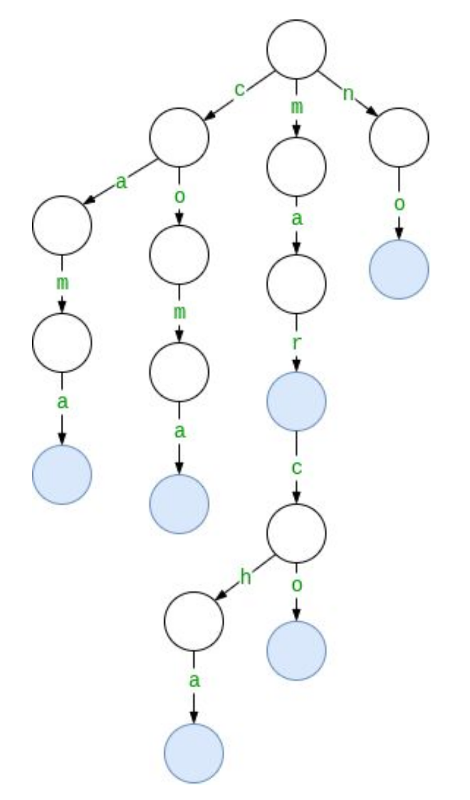
> *Ejemplo de trie para el diccionario "cama", "coma", "mar", "marco", "marcha" y "no"*

```c++
struct trie {
    map<char, trie> hijos;
    bool term = false;

    void insertar(string const& s, int pos = 0) {
        char c = s[pos];
        if (pos < int(s.size())) hijos[c].insertar(s, pos+1);
        else term = true;
    }

    bool buscar(string const& s, int pos = 0) {
        char c = s[pos];
        if (pos < int(s.size())) return hijos.count(c) && hijos[c].buscar(s, pos+1);
        else return term;
    }
};
```
> *Complejidad construccion: $\mathcal{O}(n \cdot |diccionario|)$*

> *Complejidad consulta: $\mathcal{O}(n)$* 

> *Complejidad actualizacion: $\mathcal{O}(n)$*

# Hashes

Sea $\sum = \{a_1, a_2, \ldots, a_n\}$ un alfabeto con $n$ caracteres. Si le asociamos a cada $a_i$ el valor $i$, podemos representar a cada [string](#strings) $s = s_0s_1 \ldots s_k$ como el polinomio:

$$
\text{hash}(s) = \sum_{i=0}^{k} \text{valor}(s_i) \cdot b^{k - i}
$$

donde $b$ es una **base** suficientemente grande ($>n$), y el resultado se toma modulo algun numero primo $m$ para evitar overflows y colisiones. Asi, cada string tendra asociado un numero unico al cual llamamos su **hash**.


Especialmente eficiente para:
- Contar ocurrencias de un string en otro
- Comparaciones lexicograficas de strings

```c++
struct StrHash { // Hash polinomial con exponentes decrecientes.
	static constexpr ll ms[] = {1'000'000'007, 1'000'000'403};
	static constexpr ll b = 500'000'000;
	vector<ll> hs[2], bs[2];
	StrHash(string const& s) {
		int n = sz(s);
		forn(k, 2) {
			hs[k].resize(n+1), bs[k].resize(n+1, 1);
			forn(i, n) {
				hs[k][i+1] = (hs[k][i] * b + s[i]) % ms[k];
				bs[k][i+1] =  bs[k][i] * b         % ms[k];
			}
		}
	}
	ll get(int idx, int len) const { // Hashes en `s[idx, idx+len)`.
		ll h[2];
		forn(k, 2) {
			h[k] = hs[k][idx+len] - hs[k][idx] * bs[k][len] % ms[k];
			if (h[k] < 0) h[k] += ms[k];
		}
		return (h[0] << 32) | h[1];
	}
};
```

<u>Inicializacion:</u>

```c++
string s = "hello world";
strhash hs(s);
```

> *Complejidad construccion: $\mathcal{O}(n)$*

> *Complejidad consulta: $\mathcal{O}(1)$*

# Z Function

Dado un [string](#strings) $s$, definimos el arreglo $z$ tal que $z[i]$ es la longitud del prefijo mas largo de $s$ que a su vez empieza en el indice $i$.

Especialmente eficiente para:
- Deteccion de patrones en strings
- Comparaciones de prefijos con sufijos

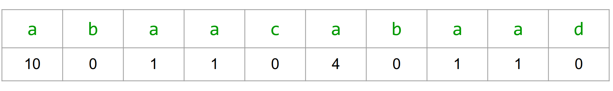
> *Ejemplo de del arreglo $z$ para el string "abaacabaad"*

```c++
// Retorna un vector `z` tal que `z[i]` es la longitud del prefijo más largo del
// string `s` que a su vez empieza en el índice `i`.
vector<int> z_function(string const& s) {
	int n = int(size(s));
	vector<int> z(n);
	z[0] = n;
	int l = 0, r = 0;
	forr(i, 1, n) {
		if (i <= r) { z[i] = min(r-i+1, z[i-l]); }
		while (i+z[i] < n && s[z[i]] == s[i+z[i]]) { ++z[i]; }
		if (i+z[i]-1 > r) { l = i, r = i+z[i]-1; }
	}
	return z;
}
```
> *Complejidad construccion: $\mathcal{O}(n)$*

> *Complejidad consulta: $\mathcal{O}(1)$*

# Deques

Es como un vector pero se pueden insertar y eliminar elementos por delante y por detras en $\mathcal{O}(1)$.

<u>Inicializacion:</u>

```c++
deque<int> dq;
```

<u>Funciones (particulares):</u>
**dq.push_front():** Insertar un elemento al comienzo
**dq.pop_front():** Eliminar el primer elemento

> *Suelen ser ligeramente mas lentos que los vectores pero en promedio la insercion y la eliminacion son $\mathcal{O}(1)$*

# Stacks

En las competencias ICPC conviene utilizar un vector en vez de un stack debido a que tiene mas flexibilidad.

# Queues

Simula una cola/fila. Tiene un comportamiento FIFO (First In, First Out).

> *Resulta util cuando queremos agregar cosas para procesarlas luego en un orden FIFO*

> *Es preferible antes que un **set***

> *Inserciones, eliminaciones y accesos $\rightarrow \mathcal{O}(1)$*

<u>Inicializacion:</u>

```c++
queue<int> q;
```

<u>Funciones:</u>
**q.push():** // q.push(5); q.push(3); q.push(-1);
**q.front():** // 5
**q.pop():** // chau 5
**q.front():** // 3
**q.back():** // -1

# Priority Queues

Como una *queue* normal, pero ordena internamente los elementos de mayor a menor.

<u>Inicializacion:</u>

```c++
priority_queue<int> PQ;
priority_queue<int, vector<int>, greater<int>> PQ; // cola de prioridades inversa (ordena de menor a mayor)
```

<u>Funciones:</u>
**PQ.push():** // PQ.push(5); PQ.push(10); PQ.push(7);
**PQ.top():** // 10
**PQ.pop():** // chau 10

> *Ojo! insertar y remover elementos aqui es $\mathcal{O}(\log(n))$*

# Sets

Es una coleccion **ordenada** de menor a mayor de elementos **unicos**.

<u>Inicializacion:</u>

```c++
set<int> s;
set<int> s = {2,5,6,8}; // set con valores arbitrarios
```

<u>Funciones:</u>
**s.insert():** // S.insert(5); S.insert(10); S.insert(5); no da error, pero el elemento no se agrega
**s.size():** // 2
**s.erase():** // S.erase(5); chau 5
**s.count(5):** // 0; puede ser solo 0 o 1
**s.find(x):** // puntero (iterador) al elemento `x` o `end` si `x` no se encuentra en `s`
**s.lower_bound(x):** // puntero (iterador) al primer elemento >= `x` o `end` en caso contrario
**s.upper_bound(x):** // puntero (iterador) al primer elemento > `x` o `end` en caso contrario

<u>Operaciones:</u>

- **union**

```c++
set1.insert(set2.begin(), set2.end());
```
> *Complejidad: $\mathcal{O}(m \cdot \log(n))$*

- **interseccion**

```c++
set_intersection(A.begin(), A.end(), B.begin(), B.end(), inserter(A∩B, A∩B.begin()));
```
> *Complejidad: $\mathcal{O}(n + m)$*

- **diferencia**
```c++
set_difference(A.begin(), A.end(), B.begin(), B.end(), inserter(A/B, A/B.begin()));
```
> *Complejidad: $\mathcal{O}(n \cdot \log(n))$*

<u>Como iterar un set:</u>

```c
for (auto it = s.begin(); it != s.end(); it++) {
    cout << *it << "\n";
}
```

> *Se maneja internamente con **punteros***

> *Es mas costoso de insertar ($\mathcal{O}(\log(n))$) que un vector pero es mas rapido de buscar ($\mathcal{O}(\log(n))$)*

> *Iterar el set es $\mathcal{O}(n)$. No se puede indexar como un arreglo o vector*

> *La gran mayoria de sus operaciones son $\mathcal{O}(\log(n))$*

> *Considerar utilizar [bitsets](#bitsets) si se requiere de poca memoria*

# Multisets

Es como un set, pero permite meter mas de una vez un elemento.

<u>Inicializacion:</u>

```c++
multiset<int> MS;
```

<u>Funciones:</u>
**MS.insert():** // MS.insert(3); MS.insert(3);
**MS.erase():** // MS.erase(3); OJO: esto borra todas las repeticiones!
**MS.size():** // 0. MS.insert(10); MS.insert(10); MS.erase(MS.find(10)); MS.size(); // 1

# Indexed Sets

Es como un set, pero podemos utilizar funciones adicionales.

Como un indexed set es una *policy-based data structure*, debemos agregar lo siguiente para poder utilizarlo para numeros enteros:

```c++
#include <ext/pb_ds/assoc_container.hpp>
using namespace __gnu_pbds;
typedef tree<int,null_type,less<int>,rb_tree_tag,
            tree_order_statistics_node_update> indexed_set;
```

<u>Inicializacion:</u>

```c++
indexed_set is;
```

<u>Funciones (particulares):</u>
**is.find_by_order(i):** Devuelve un puntero (iterador) al elemento i-esimo 
**is.order_of_key(x):** Devuelve la posicion en la que deberia estar `x`; No hace falta que `x` pertenezca al set

> *La complejidad de estas funciones es $\mathcal{O}(\log(n))$*

# Bitmask Sets

La idea se basa en utilizar **numeros enteros** como conjuntos.

<u>Inicializacion:</u>

```c++
int x = 0;
x |= (1<<1);
x |= (1<<3);
x |= (1<<4);
x |= (1<<8);
// x = {1, 3, 4, 8}
```

<u>Funciones:</u>
**Interseccion:** `x & y;`
**Union:** `x | y;`
**Complemento:** `~x;`
**Diferencia:** `x & ~(y);`

<u>Como iterar un bitmask set:</u>

```c++
for (int i = 0; i < 32; i++) {
    if (x&(1<<i)) 
        cout << i << " ";
}
```

<u>Como iterar subsets:</u>

- **Desde {0, 1, ... , n − 1}:**

```c++
for (int b = 0; b < (1<<n); b++) {
    // process subset b
}
```

- **Subsets de longitud fija `k`:**

```c++
for (int b = 0; b < (1<<n); b++) {
    if (__builtin_popcount(b) == k) {
        // process subset b
    }
}
```

- **Subsets de un bitmask set `x`:**

```c++
int b = 0;
do {
    // process subset b
} while (b=(b-x)&x);
```

**NOTA**:
- Este tipo de conjuntos solamente puede almacenar **hasta 64 elementos** (utilizando *long long*)

# Disjoint Set Union

Un DSU mantiene una coleccion de conjuntos disjuntos. Cada conjunto tiene un elemento **representativo** y una **cadena** que une a cualquier elemento con el rerpesentativo.

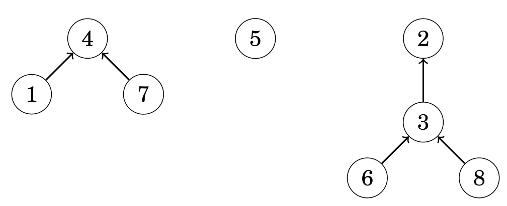 
> *Representacion grafica de los sets {1, 4, 7}, {5} y {2, 3, 6, 8}*

Especialmente eficiente para:

- Ver si dos nodos pertenecen a la misma componente

<u>Inicializacion:</u>

El arreglo `link` indica, para cada elemento, el siguiente elemento en la cadena o el mismo elemento si este es representativo. El arreglo `size` indica el tamaño de cada conjunto para cada elemento representativo. Inicilamente, cada conjunto contiene solo un elemento.

```c++
int link[n], size[n];
for (int i = 0; i < n; i++) link[i] = i;
for (int i = 0; i < n; i++) size[i] = 1;
```

<u>Funciones:</u>

- **find:** Retorna el representativo para un elemento `x`

```c++
int find(int x) {
    while (x != link[x]) x = link[x];
    return x;
}
```
> *Complejidad: $\mathcal{O}(\log(n))$*

- **same:** Devuelve true si los elementos `x` e `y` pertenecen al mismo conjunto. Decimos que dos elementos pertenecen al mismo conjunto si y solo si sus representativos son los mismos

PRECONDICION: `x` e `y` deben pertenecer a diferentes sets

```c++
bool same(int x, int y) {
    return find(x) == find(y);
}
```
> *Complejidad: $\mathcal{O}(\log(n))$*

- **unite:** Une el set mas chico de los elementos `x` e `y` al mas grande

```c++
void unite(int x, int y) {
    a = find(x);
    b = find(y);
    if (size[x] < size[y]) swap(x,y);
    size[x] += size[y];
    link[y] = x;
}
```
> *Complejidad: $\mathcal{O}(\log(n))$*

# Maps

Es como un arreglo de pares clave-valor, pero lo podes indexar con la estructura que quieras y ordena los indices de mayor a menor.

<u>Inicializacion:</u>

```c++
map<int, string> M; // mapea de tipo `int` a tipo `string`
```

<u>Funciones:</u>
M[5] = “V”; // asociamos el 5 con la string “V”
**M.size()**; // 1
M[7] = “VII”; // asociamos el 7 con la string “VII”
M.size(); // 2. if (M[10] == “X”) { … } OJO: este patrón agrega el elemento 10
// if (M.count(3) > 0 && M[3] == “III”) { … } este patrón si funciona como esperamos

<u>Como iterar un map:</u>

```c++
for (auto [key, value] : m) {
    cout << key << ": " << value;
}
```

# Unordered Sets & Unordered Maps

Como set y map, pero sus elementos no están ordenados.

> *Muchas operaciones pasan a ser $\mathcal{O}(1)$ (en promedio) en vez de $\mathcal{O}(\log(n))$*

## Diferencias

<u>Operaciones en Unordered Sets</u>

- **union**

```c++
uset1.insert(uset2.begin(), uset2.end());
```
> *Complejidad: $\mathcal{O}(\log(m))$ caso promedio, $\mathcal{O}(n \cdot m)$ caso peor (colisiones de hash extremas)*

- **interseccion**

```c++
for (int x : A) {
    if (B.count(x)) {
        A∩B.insert(x);
    }
}
```
> *Complejidad: $\mathcal{O}(\log(m))$ caso promedio, $\mathcal{O}(n \cdot m)$ caso peor (colisiones de hash extremas)*

- **diferencia**

```c++
for (int x : A) {
    if (!B.count(x)) {
        A/B.insert(x);
    }
}
```
> *Complejidad: $\mathcal{O}(\log(m))$ caso promedio, $\mathcal{O}(n \cdot m)$ caso peor (colisiones de hash extremas)*

# Iteradores

Es una variable que a punta a un elemento en una estructura de datos. Los iteradores `begin` y `end` definen el rango que contiene todos los elementos de una estructura de datos.

- **begin:** Apunta al primer elemento.
- **end:** Apunta a la posicion siguiente del ultimo elemento (OJO! No se puede desreferenciar ya que la posicion es invalida).

 

> *Los iteradores pueden irse moviendo (de a un elemento) en la estructura por medio de `++` y `--`*

> *Tambien se pueden utilizar los iteradores **rbegin** y **rend** que apuntan al ultimo elemento y a la posicion anterior al primer elemento respectivamente*

# Fenwick Tree

Especialmente eficiente para:

- Responder consultas de rango o subintervalos donde se aplican operaciones de prefijos (como la suma, el producto, AND, OR, XOR, MCD, MCM, etc.)

```c++
int tree[MAXN] = {};

void constructBITree(int arr[], int n)
{
    for (int i=0; i<n; i++)
        add(i, arr[i]);

    //for (int i=1; i<=n; i++)
    //     cout << tree[i] << " ";
}

void add(int k, int x) {
    while (k <= n) {
        tree[k] += x;
        k += k&-k;
    }
}

int sum(int k) {
    int s = 0;
    while (k >= 1) {
        s += tree[k];
        k -= k&-k;
    }
    return s;
}
```

Toda consulta de rango puede resolverse de la siguiente manera: $sum(r) - sum(l-1)$

> *Complejidad construccion: $\mathcal{O}(\log(n))$*

> *Complejidad consulta: $\mathcal{O}(\log(n))$* 

> *Complejidad actualizacion: $\mathcal{O}(\log(n))$*

**NOTA**:
- A pesar de ser una estructura de arbol binario, utilizamos un **arreglo** para implementarlo

# Segment Tree

Es un arreglo que responde tanto consultas de operaciones de prefijos sobre rangos (suma, producto, AND, OR, XOR, MCD, MCM, etc.) como consultas sobre minimos y maximos de rangos.

Espcialmente eficiente para:

- Modificar y consultar/buscar valores $\rightarrow \mathcal{O}(\log(n))$
- Responder consultas (*querys*) sobre subintervalos $\rightarrow \mathcal{O}(\log(n))$

<u>Proceso de creacion:</u>
1. Dado un arreglo `A` con `N` elementos, extender `A` con "elementos neutros" (sule ser 0 generalmente) hasta que tenga tamaño potencia de 2.
2. Crear un arbol binario completo cuyas hojas sean los elementos de A.

Luego, cada hoja representa el rango [i, i + 1), y los nodos internos representan la unión de los rangos de los hijos.

 
> *Este segment tree esta orientado a responder querys relacionadas con la suma de los subarreglos*

``` c++
int n, t[2*MAXN];
void buildst(int a[], int v, int tl, int tr) { // arreglo, nodo raiz, 0, n
    if (tl == tr) {
        t[v] = a[tl];
    }
    else {
        int tm = (tl + tr) / 2;
        buildst(a, v*2, tl, tm);
        buildst(a, v*2+1, tm+1, tr);
        t[v] = t[v*2] + t[v*2+1];
    }
}
```

Los nodos se almacenan desde abajo hacia arriba. Por ejemplo, el segment tree

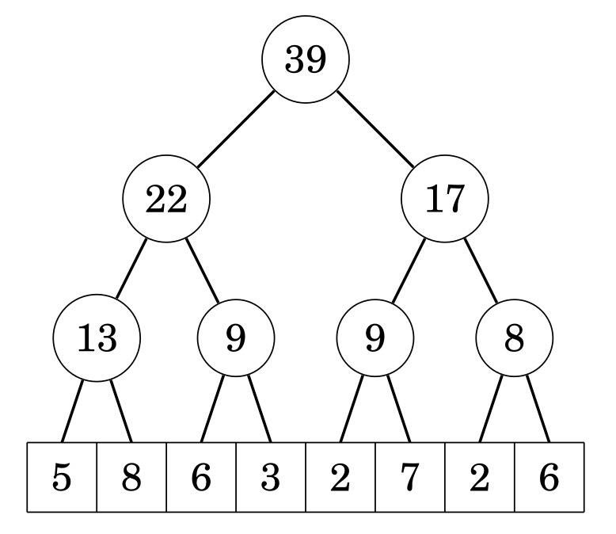

se guarda como:

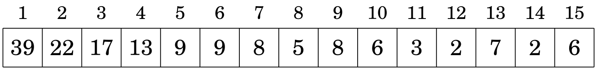
>*Usando esta representacion, el padre del nodo `tree[k]` es `tree[floor(k/2)]`, y sus hijos son `tree[2k]` and `tree[2k+1]`. Notar que esto implica que la posicion de un nodo es impar si es un hijo izquierdo y par si es un hijo derecho*

<u>Actualizacion:</u>
1. Actualizo el valor del nodo actual.
2. Actualizo todos los nodos internos hasta llegar a la raiz.

``` c++
void updatest(int k, int x) { // posicion del elemento a actualizar en A, nuevo valor
    k += n;
    tree[k] += x;
    for (k /= 2; k >= 1; k /= 2) {
        tree[k] = tree[2*k] + tree[2*k+1];
    }
}
```
>*`k` debe estar indexado desde 0*

<u>Responder query:</u>
En cada paso, el rango se desplaza un nivel más arriba en el árbol, y antes se añaden a la suma los valores de los nodos que no pertenecen al rango superior.

``` c++
int sumst(int l, int r) { // indice izquiero del subarreglo, indice derecho del subarreglo
    l += n; r += n;
    int s = 0;
    while (l <= r) {
        if (l%2 == 1) s += tree[l++];
        if (r%2 == 0) s += tree[r--];
        l /= 2; r /= 2;
    }
    return s;
}
```
>*`l` y `r` deben estar indexados desde 0*

> *Complejidad construccion: $\mathcal{O}(n \cdot \log(n))$*

> *Complejidad consulta: $\mathcal{O}(\log(n))$* 

> *Complejidad actualizacion: $\mathcal{O}(\log(n))$*

**NOTAS**:
- A pesar de ser una estructura de arbol binario, utilizamos un **arreglo** de tamaño `(n+k)*2` para implementarlo, donde `k` son los elementos neutros agregados para lograr que `n` sea potencia de 2
- Si bien es una estructura **mas general** que un *fenwick tree*, **requiere mas memoria** y es un poco **mas dificil de implementar**

# Matematicas

## Progresiones

### Sumas Gaussianas

- Sum(n) -> (n*(n+1))/2
- Sum(n-1) -> (n*(n-1))/2

### Formula de Faulhaber (hasta 6)

$1 + 2 + 3 + \cdots + n = \frac{n(n+1)}{2} = \frac{n^2 + n}{2}$

$1^2 + 2^2 + 3^2 + \cdots + n^2 = \frac{n(n+1)(2n+1)}{6} = \frac{2n^3 + 3n^2 + n}{6}$

$1^3 + 2^3 + 3^3 + \cdots + n^3 = \left(\frac{n^2 + n}{2}\right)^2 = \frac{n^4 + 2n^3 + n^2}{4}$

$1^4 + 2^4 + 3^4 + \cdots + n^4 = \frac{6n^5 + 15n^4 + 10n^3 - n}{30}$

$1^5 + 2^5 + 3^5 + \cdots + n^5 = \frac{2n^6 + 6n^5 + 5n^4 - n^2}{12}$

$1^6 + 2^6 + 3^6 + \cdots + n^6 = \frac{6n^7 + 21n^6 + 21n^5 - 7n^3 + n}{42}$

### Progresion Aritmetica

$\underbrace{a + \cdots + b}_{n \text{ numbers}} = \frac{n(a + b)}{2}$

Donde *a* es el primer numero, *b* el ultimo y *n* la cantidad total de numeros.

**NOTA**:
- La formula es **independiente de la constante de separacion** entre los Vdos

### Progresion Geometrica

$a + ak + ak^2 + \cdots b = \frac{bk - a}{k - 1}$

Donde *a* es el primer numero, *b* el ultimo y *k* es el radio entre los sumandos.

## Algebra

### Enteros vs Flotantes

| Enteros                   | Flotantes                         |
|---------------------------|-----------------------------------|
| `int` hasta 2*10^9        | `float` hasta 6 digitos (NO usar) |
| `long long` hasta 4*10^18 | `double` hasta 15 digitos         |
| >= usar STRINGS           | `long double` hasta 18 digitos    |

#### Raices

##### Flotantes

- sqrt(x)  -> si x es Double
- sqrtl(x) -> si x es Long Double

##### Enteros

``` c++
int raiz(int x) {
    int l = 0, r = x+1;
    while (R - L > 1) {
        int m = (l + r) / 2;
        if (m*m <= x) l = m;
        else r = m;
    }
    return l;
}
```
> *Complejidad: $\mathcal{O}(\log(n))$*

**NOTA**: 
- Utiliza **busqueda lineal** y **devuelve el piso de la raiz**

#### Exponenciacion

##### Flotantes

- pow(x, e)  -> si x es Double      
- powl(x, e) -> si x es Long Double

**NOTA**: 
- SE QUEDA CORTO EN PRECISION PARA ICPC

##### Enteros

``` c++
ll pot(ll x, int n) {
    if (n == 1) return x;
    if (n % 2 == 0) return pot(x*x, n/2);
    return x * pot(x, n - 1);
}
```
> *Complejidad: $\mathcal{O}(\log(n))$*

### Formula de Binet

$f(n) = \frac{(1 + \sqrt{5})^n - (1 - \sqrt{5})^n}{2^n \sqrt{5}}$

Calcula el n-esimo numero de la sucesion de *Fibonacci*.

**NOTA**: 
- El resultado debe estar en **punto flotante**

### Gauss

``` c++
double reduce(vector<vector<double>> &a){  //Devuelve determinante si m == n
	int m = sz(a), n = sz(a[0]);
	int i = 0, j = 0;
	double r = 1.0;
	while(i < m and j < n){
		int h = i;
		forr(k, i+1, m) if(abs(a[k][j]) > abs(a[h][j])) h = k;
		if(abs(a[h][j]) < EPS){
			j ++;
			r = 0.0;
			continue;
		}
		if(h != i){
			r = -r;
			swap(a[i], a[h]);
		}
		r *= a[i][j];
		dforr(k, j, n) a[i][k] /= a[i][j];
		forr(k, 0, m){
			if(k == i) continue;
			dforr(l_, j, n) a[k][l_] -= a[k][j] * a[i][l_];
		}
		i ++; j ++;
	}
	return r;
}
```
> *Complejidad: $\mathcal{O}(m^2 \cdot n)$*

**NOTA**: 
- La version con aritmetica modular solo funciona si el modulo es **primo**

## Geometria

### Representacion

#### Punto 

``` c++
struct pto {
    ll x, y;
    pto() : x(0), y(0) {}
    pto(ll _x, ll _y) : x(_x), y(_y) {}
    pto operator+(pto b) { return pto(x+b.x, y+b.y); }
    pto operator-(pto b) { return pto(x-b.x, y-b.y); }
    pto operator+(ll k) { return pto(x+k, y+k); }
    pto operator*(ll k) { return pto(x*k, y*k); }
    pto operator/(ll k) { return pto(x/k, y/k); }
    ll operator*(pto b) { return x*b.x + y*b.y; }
    pto proj(pto b) { return b*((*this)*b) / (b*b); }
    ll operator^(pto b) { return x*b.y - y*b.x; }
    ld norm() { return sqrt(x*x + y*y); }
    ld dist(pto b) { return (b - (*this)).norm(); }
};
```

#### Vector

``` c++
struct vec {
    int x, y;
}
```
#### Recta

``` c++
struct recta {
    pto p, pq;
    constructor(pto p, pto q) {
        this.p = p;
        this.pq.x = q.x - p.x;
        this.pq.y = q.y - p.y;
    }
}
```
> *Se representa por un punto origen y un vector tangente*

#### Poligono

``` c++
pto PolygonA[n]; //estatica
vector<pto> PolygonB; // dinamica
```
> *Se representa por una lista ordenada de puntos*

### Algebra Vectorial

#### Suma y Resta de Vectores

 

El valor absoluto de la diferencia de vectores nos permite calcular la distancia entre dos puntos!

#### Multiplacion y Division por Escalares


Podemos alterar el tamaño de un vector por medio de multiplicarlo o dividirlo por un valor k respectivamente.

#### Norma

Es el largo o la extension de un vector U en el espacio.

``` c++
ld Ux, Uy; // Vector U
ld norma = abs(sqrtl(Ux*Ux + Uy*Uy));
```
> *Complejidad: $\mathcal{O}(1)$*


#### Proyeccion

Proyeccion de un vector U sobre un vector V:

``` c++
ld Ux, Uy; // Vector U
ld Vx, Vy; // Vector V
ld proyeccionUV =  (Vx + Vy)*((Ux*Vx + Uy*Vy)/abs(sqrtl(Ux*Ux + Uy*Uy)));
```
> *Complejidad: $\mathcal{O}(1)$*

- Podemos interpretarla como la proyeccion ortogonal del vector U sobre la linea que contiene alvector V:


- Dado un punto P y una linea/segmento L, podemos encontrar el punto en L mas cercano a P si calculamo la proyeccion de P sobre L.


#### Producto Punto

- Dos vectores son perpendiculares **<=>** su producto escalar es 0

``` c++
int Ux, Uy; // Vector U
int Vx, Vy; // Vector V
int escalar = Ux*Vx + Uy*Vy;
```
> *Complejidad: $\mathcal{O}(1)$*

- Podemos interpretar el producto punto entre una direccion U y un punto V, como una medida de ”que tan lejos esta el punto V en la direccion U”:


- Por teorema, el producto punto entre dos vectores alcanza un maximo cuando U y V tienen igual direccion (*cos(α) = 1*) y un minimo cuando tienene direccion opuesta  (*cos(α) = -1*)

#### Producto Cruz

- Dos vectores son paralelos **<=>** el valor absoluto de su producto vectorial es 0

``` c++
int Ux, Uy; // Vector U
int Vx, Vy; // Vector V
int vectorial = Ux*Vy - Uy*Vx;
```
> *Complejidad: $\mathcal{O}(1)$*

- El producto vectorial es igual al área del paralelogramo formado por los vectores


### Algoritmos

#### Calculo de Perimetro

``` c++
double dist(pto A, pto B) {
    double dx = A.x - B.x
    double dy = A.y - B.y;
    return hypot(dx, dy);
}
// ...
vector<pto> Poly(n);

double per = 0;
for (int i = 0; i < n-1; i++) {
    per += dist(Poly[i], Poly[i+1]);
}
per += dist(Poly[n-1], Poly[0]);
```
> *Complejidad: $\mathcal{O}(n)$*


#### Calculo de Area

- Un polígono se puede separar en triángulos. Luego se puede calcular el área como suma de muchas áreas pequeñas.

``` c++
double areaTri(vec A, vec B) {
    double prodVec = A.x*B.y - B.x*A.y;
    return prodVec/2;
}
// ...
vector<pto> Poly(n);
double area = 0;
for (int i = 0; i < n-1; i++) {
    area += areaTri(Poly[i], Poly[i+1]);
}
area += areaTri(Poly[n-1], Poly[0]);
```
> *Complejidad: $\mathcal{O}(\#lados)$*

#### Polar Sort

Dado un punto O y un vector V, el polar sort de un conjunto de puntos S es el ordenamiento de los puntos de S, en sentido antihorario, tomando a O como centro y V como direccion inicial.


``` c++
struct cmp {
    pto o, v;
    cmp(pto no, pto nv) : o(no), v(nv) {}
    bool half(pto p) {
        assert(!(p.x == 0 && p.y == 0)); // (0,0) isn't well defined
        return (v ^ p) < 0 || ((v ^ p) == 0 && (v * p) < 0);
    }
    bool operator()(pto& p1, pto& p2) {
        return mp(half(p1 - o), T(0)) < mp(half(p2 - o), ((p1 - o) ^ (p2 - o)))
    }
};
```
> *Complejidad: $\mathcal{O}(n \cdot \log(n))$*

#### Convex Hull

El convex hull de un conjunto de puntos S es el conjunto convexo[^1] minimo que contiene a S.

|  |  |
|:------------------------------------------------:|:------------------------------------------------:|

``` c++
vector<pto> upper_hull(vector<pto>& p) {
    vector<pto> uh;
    sort(p.begin(), p.end());
    forn(i, sz(p)) {
        while(sz(uh)>=2 && (uh[sz(uh)-1]-uh[sz(uh)-2])^(p[i]-uh[sz(uh)-2])>=0)
        uh.pop_back();
        uh.push_back(p[i]);
    }
    return uh;
}
```
> *Complejidad: $\mathcal{O}(n \cdot \log(n))$*

``` c++
vector<pto> lower_hull(vector<pto>& p) {
    vector<pto> uh;
    sort(p.begin(), p.end());
    forn(i, sz(p)) {
        while(sz(uh)>=2 && (uh[sz(uh)-1]-uh[sz(uh)-2])^(p[i]-uh[sz(uh)-2])<=0)
        uh.pop_back();
        uh.push_back(p[i]);
    }
    return uh;
}
```
> *Complejidad: $\mathcal{O}(n \cdot \log(n))$*

## Combinatoria

### Factoriales

#### Computo de factoriales

- Lo que se hace para calcular factoriales cuando **$n$ ≤ 10^6** es **precalcular** los factoriales y guardarlos en un arreglo.

``` c++
const int MAXN = 1e6, M = 1e9+7;
ll F[MAXN];
// ...
F[0] = 1;
for(ll i = 1; i < MAXN; i++) F[i] = F[i-1]*i %M;
```
> *Aqui M es un numero primo GRANDE*
> *Complejidad: $\mathcal{O}(MAXN)$*

#### Computo de Factoriales Inversos

- Le llamamos “factorial inverso” de $n$ módulo $M$, al inverso modular del factorial de $n$ módulo $M$.

- Cuando $n$ ≤ 10^6, es más eficiente tener en cuenta que:


- Tras lo cual podemos precalcular los factoriales inversos en tiempo lineal:

``` c++
const int MAXN = 1e6, M = 1e9+7;
ll F[MAXN], INV[MAXN], FI[MAXN];
// ...
F[0] = 1; forr(i, 1, MAXN) F[i] = F[i-1]*i %M;
INV[1] = 1; forr(i, 2, MAXN) INV[i] = M - (ll)(M/i)*INV[M%i]%M;
FI[0] = 1; forr(i, 1, MAXN) FI[i] = FI[i-1]*INV[i] %M;
```
> *Complejidad: $\mathcal{O}(MAXN)$*

### Permutaciones

Una permutacion es un arreglo que consta de $n$ enteros distintos de $1$ a $n$ ordenados arbitrariamente.

Si $p$ es una permutacion de longitud $n$, decimos que $p^{-1}$ es su **inversa** si se cumple que:

$$
p[i] = j \Leftrightarrow p^{-1}[j] = i, \quad \forall i,j \in \{1, \ldots, n\}
$$

La inversa resulta util cuando queremos consultar en $\mathcal{O}(1)$ en que posicion se encuentra cada elemento de la permutacion **identidad**. Denotamos por $I_d$ a la permutacion identidad la cual cumple que: 

$$
I_d[i] = i, \quad \forall i \in \{1, \ldots, n\}.
$$

Dada una permutacion $p$ de longitud $n$, decimos que $i \in \{1, \ldots, n\}$ es un **punto fijo** de $p$ si $p[i] = i$.

Sean $c_1, c_2, \ldots, c_k \in \{1, \ldots, n\}$ $k$ enteros distintos, decimos que el conjunto $\{c_1, c_2, \ldots, c_k\}$ es un **ciclo** de $p$ con **periodo** $k$ si:

$$
p[c_1] = c_2, \ldots, p[c_{k-1}] = c_k, p[c_k] = c_1
$$

Podemos ver a las permutaciones como un grafo funcional[^2] y luego calcular la cantidad de ciclos en $\mathcal{O}(n)$ utilizando [DFS](#dfs).
Por ejemplo, la permutacion [1,5,6,7,4,3,2] se representa graficamente de la siguiente forma:

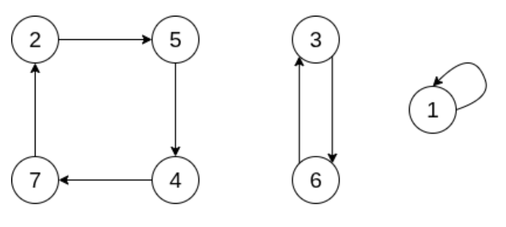

Dada una permutacion $p$ de longitud $n$, definimos $swap(i,j) = $  cambiar los valores de $p[i]$ y $p[j]$ para $i \neq j$. Una permutacion **swap** $s_{i,j}$ cumple que todas sus posiciones son puntos fijos a excepcion de $i$ y $j$, para $i \neq j$.

Si $p$ y $q$ son permutaciones de longitud igual a $n$, denotamos a su **composicion** como:

$$
(p \circ q)(i) = p[q[i]], \quad \forall i \in \{1, \ldots, n\}.
$$

**Teorema:**  
Sean $s_{i_1, j_1}, s_{i_2, j_2}, \ldots, s_{i_k, j_k}$ $k \in \mathbb{N}$ permutaciones swap. Toda permutacion $p$ de longitud $n \ge 1$ puede ser construida componiendo $s_{i_1, j_1}, s_{i_2, j_2}, \ldots, s_{i_k, j_k}$ con $I_d$. Es decir:

$$
p = s_{i_1, j_1} \circ s_{i_2, j_2} \circ \ldots \circ s_{i_k, j_k} \circ I_d
$$

Dada una permutacion $p$ de longitud $n$, denotamos:
 
$$
p^m = \overbrace{p \circ p \circ \ldots \circ p}^{\text{m veces}}.
$$

Una **inversion** en una permutacion $p$ es un par $(i,j)$ tal que $i < j$ y $p[i] > p[j]$.
Por ejemplo: para $p = [5,2,4,1,3]$, $(3,5)$ es una inversion ya que $3 < 5$ y $p[3] = 4 > 3 = p[5]$.
En una permutacion de largo $n$, la **minima cantidad de inversiones** es 0 (en la identidad) y la **maxima cantidad de inversiones** es $\frac{n(n - 1)}{2}$ (en la reversa de la identidad). Todas las cantidades entre medio son conseguibles con alguna permutacion. 
> *Esta definicion tambien aplica para **arreglos con elementos repetidos***

La **paridad** de una permutacion se define como la paridad de su cantidad de inversiones.

**Lema:** 
Aplicar un $swap$ hace que la cantidad de inversiones aumente o disminuya en exactamente uno. Es decir, cada vez que realizamos un $swap$, la paridad de la permutacion resultante cambia.

Como podemos interpretar a una permutacion como una composicion de swaps, se tiene que al componer dos permutaciones sus paridades se suman.

Vimos que podemos formar un ciclo de periodo $k$ con $k-1$ $swaps$. Por lo tanto, se da que:

Un **ciclo con periodo par** $\: \xrightarrow{\text{es}} \:$ una **permutacion impar**
Un **ciclo con periodo impar** $\: \xrightarrow{\text{es}} \:$ una **permutacion par**

<u>Aplicaciones</u>

En lo que sigue, $p$ sera un permutacion de largo $n$.

- **Minima Cantidad de Swaps para Llevar una Permutacion a la Identidad:** $p$ sera igual a $I_d$ cuando todos sus ciclos tengan periodo $1$. Dado un ciclo $c_1, c_2, \ldots, c_k \in \{1, \ldots, n\}$ de largo $k$, podemos hacer que cada $c_i$ sea un punto fijo en $k-1$ operaciones. Una forma simple y ordenada de hacerlo es haciendo las operaciones $swap(c1,c2), swap(c1,c3), \ldots, swap(c1,ck)$.
    > *Complejidad: $\mathcal{O}(n)$ (contar ciclos)*

- **Minimo $m$ tal que $p^m = I_d$:** Obsevar que para cada ciclo de $p$, siempre vale que al hacer $p^{l_i}$ todas la posiciones del ciclo se convierten en puntos fijos. Aqui $l_i$ es el periodo del $i$-esimo ciclo, $\forall i \in \{1, \ldots, c\}$ donde $c = $ cantidad de ciclos de $p$. Por lo tanto, $m = lcm(l_1, l_2, \ldots, l_c)$.
    - **Ojo!** $m$ puede ser tan grande que no entre en `long long`.
    > *Complejidad: $\mathcal{O}(n)$ (contar ciclos)*

- **Raiz Cuadrada de una Permutacion:** Se nos pide dar una permutacion $r$ tal que $p = r \circ r$. Veamos como cambian los ciclos de $r$ al hacer componerla consigo misma:
    - Un ciclo par $c_1, c_2, \ldots, c_{2k}$ se convierte en dos ciclos $c_1, c_3, \ldots, c_{2k-1}$ y $c_2, c_4, \ldots, c_{2k}$ cada uno de periodo $k$.
    - Un ciclo impar $c_1, c_2, \ldots, c_{2k + 1}$ se convierte en un ciclo $c_1, c_3, \ldots, c_{2k - 1}, c_{2k + 1}, c_2, c_4, \ldots, c_{2k}$ de periodo $2k + 1$.

    Por lo tanto, para que dicha raiz exista es necesario que en $p$ haya una cantidad par de ciclos de periodo $k$, siempre que $k$ sea par. Cuando se de esa condcicion, podemos construir $r$ reordenando los indices de los ciclos impares y juntando de a pares a los ciclos pares.
    > *Complejidad: $\mathcal{O}(n)$ (contar ciclos)*

- **Contar Inversiones/Minima Cantidad de Swaps Adyacentes:** Comenzamos con $p[1], p[2], \ldots, p[n]$ los elementos de la permutacion $p$. Los recorremos de izquierda a derecha y los vamos metiendo en un [indexed set](#indexed-sets). Antes de insertar un nuevo elemento, contamos cuantos elementos mayores a el ya agregamos al set, sumamos eso a la respuesta y recien despues lo agregamos.
Notar que si $p \neq I_d$, entonces existe $i$ tal que $p[i] > p[i + 1]$. Aplicando $swap(i, i + 1)$, disminuimos en $1$ la cantidad de inversiones. De esta forma, podemos hacer un algoritmo que transforme a $p$ en la permutacion identidad en $inv(p)$ operaciones.     
    > *Complejidad: $\mathcal{O}(n \cdot \log n)$*

- **Calcular Paridad:** Supongamos que $p$ consta de $c$ ciclos cada uno con periodo $l_i$. Como podemos llevar cada ciclo a la permutacion identidad en $l_i - 1$ $swaps$, tenemos que la paridad de $p$ se calcula como:
$$
\sum_{i=1}^{c} (\ell_i - 1) = \left( \sum_{i=1}^{c} \ell_i \right) - c = n - c.
$$
    > *Complejidad: $\mathcal{O}(n)$ (contar ciclos)*

- **Cantidad de Permutaciones con Exactamente $m$ Puntos Fijos de Largo $n$:** Comenzemos con el caso $m = 0$.
Denotemos por $D_n$ a tal cantidad. Notar que $D_0 = 1$ y $D_1 = 0$. Podemos calcular $D_i$ recursivamente utilizando [programacion dinamica](#programacion-dinamica). Si $p$ no tiene puntos fijos, $p[n] = k \neq n$, por lo que hay $n - 1$ posibilidades para el valor $k$. Luego, hay dos casos para $k$:
    - Si $p[k] = n$, entonces los otros $n-2$ valores forman una permutacion. Hay $D_{n-2}$ formas en este caso.
    - Si $p[k] \neq n$, entonces podemos renombrar $n$ a $k$ y los primeros $n - 1$ valores forman una permutacion. Hay $D_{n-1}$ formas en este caso.

    Asi, la recursion que obtenemos esta dada por:
    $$
    D_n = (n-1)(D_{n-1} + D_{n-2}).
    $$
    Para $m > 1$, la cantidad de permutaciones esta dada por:
    $$
    \binom{n}{m} D_{n-m}.
    $$
    > *Complejidad: $\mathcal{O}(n)$*

- **Minima Descomposicion en Subsecuencias Decrecientes/Maxima Subsecuencia Creciente (LIS):** Podemos descomponer una permutacion en la minima cantidad de subsecuencias decrecientes con un algoritmo greedy. La idea consiste en procesar los elementos de a uno y en cada paso agregar el elemento actual a la primera subsecuencia posible.
Por ejemplo: para $p = [4,2,6,8,3,1,5,7]$, si seguimos el algoritmo anterior, nos quedan las subsecuencias en el siguiente orden: $[4,2,1], [6,3], [8,5], [7]$. En cada paso, debemos aplicar busqueda binaria sobre el menor valor de cada subsecuencia para saber a cual debemos añdirle el elemento que estemos procesando. Notar que por como itera el algoritmo, los menores elementos de las subsecuencias quedan ordenados de mayor a menor (asi tambien como los elementos de la propia subsecuencia), por lo que no hace falta utilizar una estructura que mantega ordenado los elementos.
Por teorema, tenemos que en toda permutacion siempre vale que el largo de la maxima subsecuencia creciente es igual a la cantidad de secuencias en la minima descomposicion en subsecuencias decrecientes. Por lo que el LIS sera igual a la cantidad de secuencias obtenidas tras correr el algoritmo greedy. Si queremos obtener los elementos que conforman la subsecuencia, debemos modificar el algoritmo para que agregue una arista dirigida entre el elemento que se esta procesando y el ultimo elemento agregado a la subsecuencia anterior, creando asi un DAG (Observar que no hay aristas que salen de la primer subsecuencia). Luego, la maxima subsecuencia creciente estara dada por los nodos presentes en el camino que parte desde algun elemento de la ultima subsecuencia hasta su raiz. 
    > *Complejidad: $\mathcal{O}(n \cdot \log(n))$* 

### Principio de Inclusion Exclusion

El principio de inclusion-exclusion es un importante metodo combinatorio para calcular el tamaño de un conjunto o la probabilidad de sucesos complejos. Relaciona el tamaño de conjuntos individuales con su union.

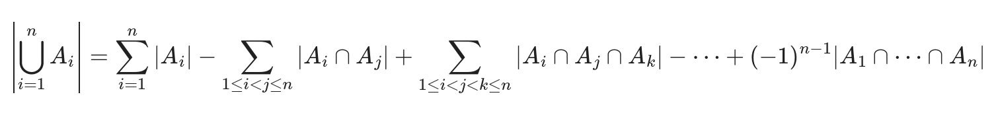

``` c++
int inclusion_exclusion_general(int n, function<int(int)> f) {
    int total = 0;
    for (int mask = 1; mask < (1 << n); ++mask) {
        int sign = (__builtin_popcount(mask) % 2 == 1 ? +1 : -1);
        total += sign * f(mask);
    }
    return total;
}
```
> *Complejidad $\mathcal{O}(2^n)$*

**NOTA**: 
- Aqui `f(mask)` representa cuantos elementos cumplen las propiedades en `mask`

#### Ejemplo

Se nos pide calcular cuantos de los primeros 100 numeros naturales son divisbles por 2,3 y 5 (3 propiedaes). En este caso, f es como sigue:

``` c++
int f(int mask) {
    vector<int> primes = {2, 3, 5};
    int mcm = 1;
    forn(i, 3) if (mask & (1 << i))
        mcm = lcm(mcm, primes[i]);
    return 100 / mcm;
}

cout << inclusion_exclusion_general(3, f) << endl;
```

### Coeficiente Binomial

El coeficiente binomial $\binom{n}{k}$ representa el numero de formas en la que podemos elegir un subconjunto (sin importar el orden) de $k$ elementos de un conjunto de $n$ elementos.

**Formula recursiva:**
$$
\binom{n}{k} = \binom{n-1}{k-1} + \binom{n-1}{k}
$$

Aqui los casos bases son $\binom{n}{0} = \binom{n}{n} = 1$.

**Formula cerrada:**
$$
\binom{n}{k} = \frac{n!}{k!(n-k)!}
$$

#### Propiedades

- $\binom{n}{k} = \binom{n}{n-k}$
- $\binom{n}{0} + \binom{n}{1} + \cdots + \binom{n}{n} = 2^n$
- $(a + b)^n = \binom{n}{0}a^n b^0 + \binom{n}{1}a^{n-1} b^1 + \cdots + \binom{n}{n}a^0 b^n$

#### Coeficiente Multinomial

El coeficiente multinomial

$$
\binom{n}{k_1, k_2, \dots, k_m}
= \frac{n!}{k_1! \, k_2! \cdots k_m!}
$$

representa el numero de formas en la que podemos dividir un conjunto de $n$ elementos en $m$ subconjuntos de tamaños $k_1, k_2, \cdots, k_m$, tales que $k_1 + k_2 + \cdots + k_m = n$.

### Numeros de Catalan

El numero de Catalan $C_n$ representa el numero de expresiones con parentesis **validas** que consisten de $n$ parentesis que cierran y $n$ parentesis que abren.

**Formula recursiva:**
$$
C_n = \sum_{i=0}^{n-1} C_i \, C_{n-i-1}
$$

Aqui el caso base es $C_0 = 1$.

**Formula cerrada:**
$$
C_n = \frac{1}{n+1} \binom{2n}{n}
$$

#### Propiedades

- Una expresión de paréntesis vacía es válida.
- Si una expresión $A$ es válida, entonces la expresión $(A)$ también es válida.
- Si las expresiones $A$ y $B$ son válidas, entonces la expresión $AB$ también es válida.

#### Usos

- **Contar arboles binarios:** hay $C_n$ arboles binarios con exactamente $n$ nodos.
- **Contar arboles enraizados:** hay $C_n-1$ arboles binarios con exactamente $n$ nodos.

### Lema de Burnside

El lema de Burnside se puede utilizar para contar el numero de combinaciones, de modo que
solo se cuente un representante por cada grupo de combinaciones simetricas. Tal lema establece que:

$$
\sum_{k=1}^{n} \frac{c(k)}{n},
$$

donde hay $n$ formas de cambiar la posicion de una combinacion, y hay $c(k)$ combinaciones que permanecen sin cambios cuando se aplica la k-esima forma.

#### Ejemplo

Se nos pide calcular el numero de collares distintos de $n$ perlas, donde cada perla tiene $m$ colores posibles. Decimos que dos collares son identicos cuando uno sea igual al otro después de rotarlos.

Hay $n$ rotaciones distintas para cada collar.
Cuando el numero de pasos es $k$, un total de $m^{gcd(k,n)}$ siguen siendo identicos. La razón de esto es que los bloques de perlas de tamaño $gcd(k, n)$ se reemplazaran entre si.

Asi, el lema de Burnside nos dice que el numero de collares distintos es 

$$
\sum_{i=0}^{n-1} \frac{m^{gcd(i,n)}}{n}.
$$
 
## Teoria de Numeros

### Divisibilidad

#### Numeros Primos

- Un número primo es aquel que tiene como únicos divisores el 1 y sí mismo.

``` c++
bool isPrime(int n) {
    if (n < 2) return false;
    for(int p = 2; p*p <= n; p++) {
        if(n%p == 0) return false;
    }
    return true;
}
```
> *Complejidad: $\mathcal{O}(\sqrt{n})$*

#### Criba de Eratóstenes

- La criba de eratóstenes es una tabla que te indica si un número es primo o no.

``` c++
bitset isPrime[MAXN];
void criba() {
    isPrime.set();
    isPrime[0] = isPrime[1] = false;
    for(int p = 2; p < MAXN; p++) {
        if (isPrime[p]) {
            for(int m = 2*p; m < MAXN; m += p) isPrime[m] = false;
        }
    }
}
```
> *Complejidad: $\mathcal{O}(n \cdot \log(n))$*

#### MCD y MCM

**NOTA**:
- Usar [gcd](#gcd) y [lcm](#lcm) en su lugar

Para calcular el máximo común divisor entre dos números podemos usar el **algoritmo de euclides**.

``` c++
int mcd(int a, int b) {
    if (b == 0) return a;
    return mcd(b, a%b);
}
```
> *Complejidad: $\mathcal{O}(\log(min(a,b)))$*

Para calcular el mínimo común múltiplo entre dos números usamos el MCD

``` c++
int mcm(int a, int b) { return (a / mcd(a, b)) * b; }
```
> *Complejidad: $\mathcal{O}(\log(min(a,b)))$*

**PROPIEDAD**: 
- mcd(a,b) = mcd (a,b+a*k) para cualquier k entero.

#### Divisores de un Numero

``` c++
vector<int> Div;
void getDiv(int n) {
    Div.clear();
    for (int d = 1; d * d <= n; d++) {
        if (n%d == 0) {
            Div.push_back(d);
            Div.push_back(n/d);
        }
        if (d*d == n) Div.pop_back();
    }
    // sort(Div.begin(), Div.end()); // OPCIONAL
}
```
> *Complejidad: $\mathcal{O}(\sqrt{n})$ ($\:+\: \mathcal{O}(\sqrt{n} \cdot \log(\sqrt{n}))$ si se ordena)*

#### Factorizacion de un Numero

``` c++
vector<pair<int, int>> F;
void fact(ll n) {
    F.clear();
    for (ll p = 2; p * p <= n; p++) {
        int k = 0;
        while (n%p == 0) {
            k++;
            n /= p;
        }
        F.pb({p,k});
    }
    if (n > 1) F.pb({n,1});
}
```
> *Complejidad: $\mathcal{O}(\sqrt{n})$*

#### Cantidad de Factores de un Numero

``` c++
ll count_fact(){
    ll res = 1;
    for (int i = 0; i < F.size(); i++) {
        res *= (F[i].snd + 1)
    }
    return res;
}
```
> *Complejidad: $\mathcal{O}(\sqrt{n})$*

#### Suma de Factores de un Numero

``` c++
ll sum_fact(ll M){
    ll res = 1;
    for (int i = 0; i < F.size(); i++) {
        res *= (expmod(F[i].fst, F[i].snd, M) - 1) / (F[i].fst - 1);
    }
    return res;
}
```
> *Complejidad: $\mathcal{O}(\sqrt{n})$*

#### Producto de Factores de un Numero

``` c++
ll product_fact(ll n, ll M){
    return expmod(n, count_fact()/2, M);
}
```
> *Complejidad: $\mathcal{O}(\sqrt{n})$*

#### Cantidad de Coprimos hasta $n$

``` c++
ll count_coprime(ll n){
    ll res = 1;
    for (int i = 0; i < F.size(); i++) {
        res *= expmod(F[i].fst, F[i].snd-1, M) * (F[i].fst - 1);
    }
    return res;
}
```
> *Complejidad: $\mathcal{O}(\sqrt{n})$*

**NOTA**:
- Si $n$ es primo, *count_prime($n$)* = $n-1$

### Aritmetica Modular

- a **es congruente** a b en modulo m (a≡b mod(m)) $\iff$ a tiene el mismo resto que b al dividirse por m $\iff$ |a $\pm$ b| % m == 0
- $ (x + y) \bmod m = \big( (x \bmod m) + (y \bmod m) \big) \bmod m $
- $ (x - y) \bmod m = \big( (x \bmod m) - (y \bmod m) \big) \bmod m $
- $ (x \cdot y) \bmod m = \big( (x \bmod m) \cdot (y \bmod m) \big) \bmod m $


### Inverso Modular

- El Pequeño Teorema de Fermat dice que sea **$p$ primo** y **$a$ coprimo a $p$**:


``` c++
ll expmod(ll b, ll e, ll M) {
    ll val = 1;
    b %= M;
    while (e > 0) {
        if (e & 1) val = val * b % M;
        b = b * b % M;
        e >>= 1;
    }
    return val;
}

ll invmod(ll a){ return expmod(a, M - 2, M); }
```
> *Complejidad: $\mathcal{O}(\log({M}))$*

### Computo de Inversos Modulares

- Cuando el módulo **$M$ es un número primo** se satisface la siguiente fórmula:


- Podemos precalcular los inversos modulares de $M$ para valores de **$n$ ≤ 10^6** con el siguiente algoritmo:

``` c++
const int MAXN = 1e6+6, M = 1e9+7;
int INV[MAXN];

INV[1] = 1;
for(ll a = 2; a < MAXN; a++) INV[a] = M - (ll)(M/a)*INV[M%a]%M;
```
> *Complejidad: $\mathcal{O}(MAXN)$*

### Ecuación Diofantica Lineal

El problema consite en determinar si existe solucion para la siguiente ecuacion:

$$
ax + by = c
$$

done $a$, $b$ y $c$ **son enteros**.

Se resuelve modificando ligeramente el [algoritmo de Euclides](#mcd-y-mcm) como sigue:

```c++
int gcd(int a, int b, int& x, int& y) {
    if (b == 0) {
        x = 1;
        y = 0;
        return a;
    }
    int x1, y1;
    int d = gcd(b, a % b, x1, y1);
    x = y1;
    y = x1 - y1 * (a / b);
    return d;
}

bool find_any_solution(int a, int b, int c, int &x0, int &y0, int &g) {
    g = gcd(abs(a), abs(b), x0, y0);
    if (c % g) {
        return false;
    }

    x0 *= c / g;
    y0 *= c / g;
    if (a < 0) x0 = -x0;
    if (b < 0) y0 = -y0;
    return true;
}
```
> *Complejidad: $\mathcal{O}(\log(min(a,b)))$*

**NOTA**:
- El algoritmo no contempla el caso en el que **$a = b = 0$**

Dada una solucion, podemos obtener infinitas soluciones de la siguiente manera:

$$
\left( x + k\frac{b}{\gcd(a,b)},\; y - k\frac{a}{\gcd(a,b)} \right), \quad \forall k \in \mathbb{Z}.
$$

### Teorema Chino del Resto

El problema consiste en resolver sistemas de ecuaciones de la forma:

$$
\begin{aligned}
x &\equiv a_1 \pmod{m_1} \\
&\;\;\vdots \\
x &\equiv a_n \pmod{m_n}
\end{aligned}
$$

donde los módulos $m_1,\cdots,m_n$ son **coprimos dos a dos**.

Definimos:

$$
X_k = \frac{m_1 m_2 \cdots m_n}{m_k}.
$$

Luego, una solucion es:

$$
x = \sum_{i=1}^{n} a_i X_i \left( X_i^{-1} \right)_{m_i}
$$

la cual podemos obtener como:

```c++
struct Congruence {
    long long a, m;
};

long long crt(vector<Congruence> const& congruences) {
    long long M = 1;
    for (auto const& congruence : congruences) {
        M *= congruence.m;
    }

    long long solution = 0;
    for (auto const& congruence : congruences) {
        long long a_i = congruence.a;
        long long M_i = M / congruence.m;
        long long N_i = mod_inv(M_i, congruence.m);
        solution = (solution + a_i * M_i % M * N_i) % M;
    }
    return solution;
}
```
>*Complejidad: $\mathcal{O}(n)$*

Dada una solucion $x$, podemos obtener infinitas soluciones de la siguiente manera:

$$
x + k\, m_1 \cdots m_n, \quad \forall k \in \mathbb{Z}.
$$

# Algoritmos de Busqueda

## Busqueda Lineal

``` c++
for (int i = 0; i < n ; i ++) {
    if (array[i] == X) {
    // encontre X
    }
}
```
> *Complejidad: $\mathcal{O}(n)$*

## Busqueda Binaria

Especialmente eficiente para:

- Buscar valores "menores que" o "mayores que"
- Buscar valores minimos y maximos de funciones
- Buscar la primer posicion en la que cambia el valor de una funcion

``` c++
int a = 0 , b = n -1;
while (a <= b) {
    int k = (a+b )/2;
    if (array [k] == x) {
        // encontre X en indice K
    }
    if (array [k] > x) b = k -1;
    else a = k+1;
}
```
> *Complejidad: $\mathcal{O}(\log(n))$*

**Implementacion alternativa con saltos:**

``` c++
int k = 0;
for (int b = n/2; b >= 1; b /= 2) {
    while (k + b < n && array [k+b] <= x) k += b ;
}
if (array [k] == x) {
    // encontre X en indice K
}
```
> *Complejidad: $\mathcal{O}(\log(n))$*

**NOTA**: 
- Para poder utilizar estos algoritmos se deben **ordenar** los elementos

## Ventana Deslizante

Especialmente eficiente para:

- Problemas de subarreglos continuos

``` c++
// En iR , jR devolvemos la respuesta
void ventanaDeslizante  (vector<int > &A , int x , int &iR , int &jR) {
    int n = int ( A.size()), j = n-1;
    for (int i = 0; i < n ; i ++) // fijando el extremo i:
    { // mientras la suma sea > x, disminuimos j
        while ( j > i && A[i] + A[j] > x )
        j--;
        // Sale del while : (A[i] + A[j] <= x) o (j == i)
        if ( j > i && A[i] + A[j] == x )
        {
            iR = i;
            jR = j;
        }
    }
}
```
> *Complejidad: $\mathcal{O}(n)$*
> *Este algoritmo resuelve el problema de: Dado un arreglo de n numeros positivos, y un numero x, nos interesa saber si existe un subarreglo cuya suma sea x.*

**NOTAS**:
- La ventana puede tener tanto un **tamaño fijo** como un **tamaño variable** 
- Se necesitan **dos indieces/punteros** (uno para el primer elemento y otro para el ultimo)
- los numeros **deben tener el mismo signo**

## 2SUM

Especialmente eficiente para:

- Buscar dos numeros que sumen "X"

``` c++
// En iR , jR devolvemos la respuesta
void sum2  (vector<int > &A, int x, int &iR , int &jR) {
    int i, j;
    i = 0;
    j = A.size()-1;
    while((j > i) && ((A[i] + A[j]) != x)) {
        if((A[i] + A[j]) < x)) ++i;
        else --j;
    }
    if((A[i] + A[j]) == x) {
        iR = i;
        jR = j;
    }
}
```
> *Complejidad: $\mathcal{O}(n)$*

**NOTAS**:
- Los elementos deben estar **ordenados** 
- Se necesitan **dos indieces/punteros** (uno para el primer elemento y otro para el ultimo)

# Grafos

## Representacion

**NOTA**: Las siguientes estructuras son para [grafos dirigidos](#grafos-dirigidos). Para grafos no dirigidos o bidireccionales, simplemente duplicar la cantidad de aristas

### Lista de Adyacencias

En la representación de lista de adyacencia, a cada nodo `x` del grafo se le asigna una lista de adyacencia que consiste en nodos a los que existe una arista desde `x`.

- **ventaja:** brindan una forma eficiente de encontrar todos los nodos a los que se puede viajar desde un nodo en particular
``` c++
for (auto u : adj[x]) {
    // process node u
}
```

#### Grafo Dirigido

``` c++
vector<int> adj[MAXN];

// Para agregar usamos:

adj[1].push_back(2) // Si existe una arista de 1 a 2;
// ...
```

#### Grafo Dirigido Pesado

``` c++
vector<pair<int,int>> adj[MAXN];

// Para agregar usamos:

adj[1].push_back({2,5}) // Si existe una arista de 1 a 2 con peso 5;
// ...
```

### Lista de Aristas

Una lista de aristas contiene todos las aristas del grafo en algun orden. Resulta conveniente utilizar esta representacion cuando el algortimo procesa todas las aristas y no es necesario encontrar aristas relacionadas a un nodo determinado.

#### Grafo Dirigido

``` c++
vector<pair<int,int>> edges;

// Para agregar usamos:

edges.push_back({1,2}) // Si existe una arista de 1 a 2;
// ...
```

#### Grafo Dirigido Pesado

``` c++
vector<tuple<int,int,int>> edges;

// Para agregar usamos:

edges.push_back({1,2,5}) // Si existe una arista de 1 a 2 con peso 5;
// ...
```

### Matriz de Adyacencia

Una matriz de adyacencia es un arreglo de dos dimensiones que representa las aristas existentes en el grafo.

- **ventaja:** se pueden realizar chequeos eficientes sobre existencias de aristas

- **desventaja:** inviable en memoria para grafos grandes

#### Grafo Dirigido 

``` c++
int adj[n][n];

// Para agregar hacemos:

for(int i = 0; i < n; ++i) {
    for(int j = 0; j < n; ++j) {
        if(/* Existe arista desde i a j */) {
            adj[i][j] = 1;
        }
        else {
            adj[i][j] = 0;
        }
    }
}
```

#### Grafo Dirigido Pesado

``` c++
int adj[n][n];

// Para agregar hacemos:

for(int i = 0; i < n; ++i) {
    for(int j = 0; j < n; ++j) {
        if(/* Existe arista desde i a j */) {
            adj[i][j] = /* peso de la arista */;
        }
        else {
            adj[i][j] = -1; // <-- valor para indicar que no hay arista de i a j;
        }
    }
}
```

## Algoritmos de Recorrido

Suelen ser usados para:

- Chequear conectividad[^3]
- Hallar componentes[^4]
- Encontrar ciclos
- Chequear Biparticidad[^5]

### DFS

Ve los vecinos en algun orden.

Especialmente eficiente para:

- Resolver puentes[^6]
- Resolver puntos de articulacion[^7]
- Armar un [spanning tree](#spanning-tree) (provee una estructura del grafo)
- Checkear ancestros en $\mathcal{O}(1)$
    - Definimos el rango de un nodo respecto al orden de recorrido DFS como $[t_{\text{entrada}},\ t_{\text{salida}}]$. Luego, un nodo `u` es hijo del nodo `v` si y solo si, el rango de `u` esta contenido en el rango de `v`

``` c++
bitset<MAXN> visited;

void dfs(int r) { // <-- pasamos la raiz como parametro
    if(visited[r]) return;
    visited[r] = 1;
    // process node r
    for(auto u:adj[r]) {
        dfs(u);
    }
}
```
> *Complejidad $\mathcal{O}(n + m)$*

**NOTAS**:
- adj es la representacion del grafo en forma de una [lista de adyacencias](#lista-de-adyacencias)
- MAXN debe ser ser igual a la cantidad de vertices (o un poquito mas por las moscas)

### BFS

Encuentra **el camino mas corto** a cada vertice desde la raiz `r`.

``` c++
queue<int> q;
bitset<MAXN> visited;
int distance[n];

void bfs(int r) { // <-- pasamos la raiz como parametro
    visited[r] = 1;
    distance[r] = 0;
    q.push(r);
    while(!q.empty()) {
        int s = q.front(); q.pop();
        // process node s
        for (auto u:adj[s]) {
            if(visited[u]) continue;
            visited[u] = 1;
            distance[u] = distance[s] + 1;
            q.push(u);
        }
    }
}
```
> *Complejidad $\mathcal{O}(n + m)$*

**NOTAS**:
- `adj` es la representacion del grafo en forma de una [lista de adyacencias](#lista-de-adyacencias)
- MAXN debe ser ser igual a la cantidad de vertices (o un poquito mas por las moscas)

## Algoritmos para Obtener el Camino Minimo

### BFS

Mismo algoritmo de la seccion anterior.

**NOTA**:
- **solo funciona si el peso de todas las aristas son iguales**

#### BFS 0-1

Cuando queremos hallar el camino minimo de un nodo a otro en un grafo cuyas aristas solamente tienen peso 0 o 1 podríamos optar por utilizar el algoritmo de [Dijkstra](#dijkstra), sin embargo existe una solucion mas eficiente que consite en modificar el algoritmo clascio de BFS.

``` c++
deque<int> dq;
int distance[n];
for (int i = 0; i < n; i++) {
    distance[i] = INF; // INF es un valor inalcanzable
}

void bfs(int r) { // <-- pasamos la raiz como parametro
    distance[r] = 0;
    dq.push_front(r);
    while(!dq.empty()) {
        int s = dq.front(); dq.pop_front();
        // process node s
        for (auto e:adj[s]) {
            if (distance[e.first] > distance[s] + e.second)
            {
                distance[e.first] = distance[s] + e.second;
                if (e.second)
                    dq.push_back(e.first);
                else
                    dq.push_front(e.first);
            }
        }
    }
}
```
> *Complejidad $\mathcal{O}(n + m)$*

**NOTAS**:
- `adj` es la representacion del grafo en forma de una [lista de adyacencias](#lista-de-adyacencias)
- Cada nodo puede aparecer mas de una vez en la dequeue

### Bellman-Ford

Calcula el camino minimo desde un vertice hacia todos.

``` c++
int distance[n];
void bf (int v) {
    for(int i = 0; i < n; ++i) {
        distance[i] = INF; // INF es un valor inalcanzable
    }
    distance[v] = 0;
    for(int i = 1; i <= n-1; i++) {
        for(auto e:edges) {
            int a, b, w;
            tie(a, b, w) = e;
            distance[b] = min(distance[b], distance[a]+w);
        }
    }
}
```
> *Invariante: luego de su k-esima iteracion, calcula la distancia minima a todo v usando a lo sumo k aristas*
> *Complejidad: $\mathcal{O}(n \cdot m)$*

**NOTAS**:
- `edges` es la representacion del grafo en forma de una [lista de aristas](#lista-de-aristas)
- **funciona PARA TODO tipo de grafos**

#### Ciclos Negativos

El algoritmo de Bellman-Ford puede ser utilizado para hallar ciclos negativos en el grafo. Si se realiza una iteracion extra y alguna distancia es reducida, signifca que existe al menos un ciclo negativo.

### Dijkstra

Devuelve el camino minimo de un vertice a todos.

``` c++
priority_queue<pair<int,int>> q;
bitset<MAXN> visited;
int distance[n];
for(int i = 0; i < n; ++i) {
    distance[i] = INF; // INF es un valor enorme
}

void dijkstra(int v) {
    pq.push({0,x});
    while (!pq.empty()) {
        int a = pq.top().second; pq.pop();
        if (visited[a]) continue;
            visited[a] = 1;
        for (auto u : adj[a]) {
            int b = u.first, w = u.second;
            if (distance[a]+w < distance[b]) {
                distance[b] = distance[a]+w;
                pq.push({-distance[b],b});
            }
        }
    }
}
```
> *Invariante: Antes de la k-esima iteracion, calcula correctamente la distancia hacia los k vertices mas cercanos al origen*
> *Invariante: En cada iteracion, toma al vertice no procesado que este a distancia minima del origen*
> *Complejidad: $\mathcal{O}(\min\{n^2,\ m \cdot \log(n)\})$*

**NOTAS**:
- `adj` es la representacion del grafo en forma de una [lista de adyacencias](#lista-de-adyacencias)
- **Requiere que el costo de las aristas sea no negativo**
- MAXN debe ser ser igual a la cantidad de vertices (o un poquito mas por las moscas)
- Util para **grafos densos**

### Floyd-Warshall

Computa la distancia entre todo par de vertices.

``` c++
int dist[n][n];
for (int i = 1; i <= n; i++) {
    for (int j = 1; j <= n; j++) {
        if (i == j) dist[i][j] = 0;
        else if (adj[i][j]) dist[i][j] = adj[i][j];
        else dist[i][j] = INF; // INF es un valor enorme
    }
}

for(int k = 0; k < n, k++) {
    for(int i = 0; i < n, i++) {
        for(int j = 0; j < n, j++) {
            dist[i][j] = min(dist[i][j], dist[i][k] + dist[k][j]);
        }
    }
}
```
> *Invariante: luego de la k-esima iteracion, computa los caminos k-internos[^8] minimos.*
> *Complejidad $\mathcal{O}(n^3)$*

**NOTAS**:
- `adj` es la representacion del grafo en forma de una [matriz de adyacencia](#matriz-de-adyacencia)
- **Permite arsitas con peso negativo**

#### Ciclos Negativos

Tras haber ejecutado el algoritmo de Floyd-Warshall, podemos detectar la existencia de ciclos negativos ne tiempo $\mathcal{O}(n)$, solamente debemos iterar la diagonal de la matriz con la distancias en busqueda de un valor negativo. De ser ese el caso, sabremos que existe al menos un ciclo negativo presente en el grafo

## Grafos Dirigidos

Los grafos dirigidos poseen aristas que solo pueden ser recorridas en un solo sentido.

### Topological Sorting

Un orden topologico es una forma de ordenacion para los nodos del grafo de forma tal que si existe un camino que lleva desde el nodo `a` al nodo `b`, entonces `a` aparece antes que `b` en la ordenacion.

| 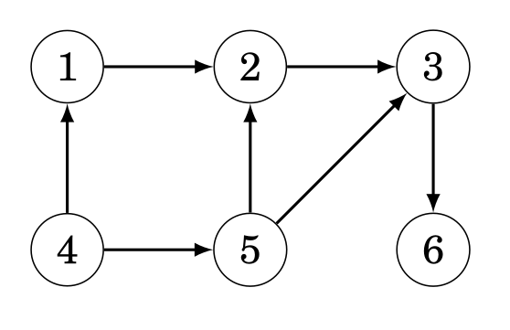 | 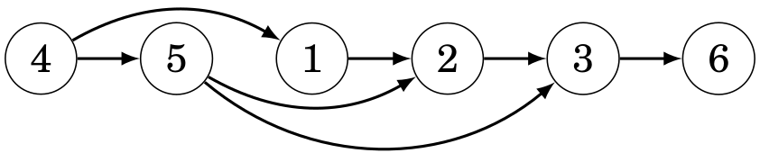 |
|--------------------------|---------------------------------------------------------------------------|
> *A la izquierda vemos un DAG (Directed Acyclic Graph) y a la derecha su ordenamiento topologico*

El algoritmo recorre el grafo con [DFS](#dfs) comenzando desde un nodo no procesado. Decimos que un nodo ha sido procesado si todos sus sucesores han sido procesados. Tras cada DFS, todos los nodos procesados se agregan al orden. Finalmente, debemos ivertir el orden para obtener el orden topologico.

PRECONDICION: El grafo debe ser un DAG

```c++
bitset<MAXN> visited;
vector<int> ans;

void dfs(int v) {
    visited[v] = 1;
    for (int u : adj[v]) {
        if (!visited[u])
            dfs(u);
    }
    ans.push_back(v);
}

void topological_sort() {
    visited.reset();
    ans.clear();
    for (int i = 0; i < n; ++i) {
        if (!visited[i]) {
            dfs(i);
        }
    }
    reverse(ans.begin(), ans.end());
}
```
> *Complejidad: $\mathcal{O}(n + m)$*

**NOTA**:
- `adj` es la representacion del grafo en forma de una [lista de adyacencias](#lista-de-adyacencias)

### Contar el Numero de Caminos en un DAG

El siguiente algoritmo almacena en `paths[a]` la cantidad de caminos desde un nodo dado (en este caso el nodo 0) hacia el nodo `a`.

```c++
ll paths[n] = {};
paths[0] = 1;
for(int i = 1; i<n; i++)
{
    for (int u : adj[ans[i]]) 
    {
        paths[ans[i]] += paths[u];
    }
}
```
> *Complejidad: $\mathcal{O}(n + m)$*

**NOTAS**:
- `adj` es la representacion del grafo en forma de una [lista de adyacencias](#lista-de-adyacencias)
- `ans` es el orden topologico del grafo

### Calcular Destino en un Grafo Sucesor

Un grafo sucesor es un grafo dirigido donde de cada nodo sale exactamente una arista. Estos grafos consisten de una o mas componentes conexas donde cada una contiene un ciclo y caminos que llevan a dicho ciclo, por lo tanto **n=m**.

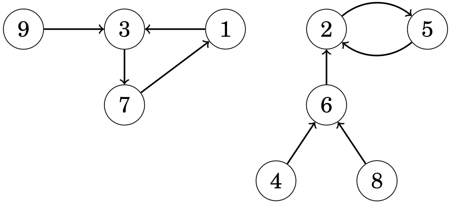
> *Representacion grafica de un Grafo Sucesor*

El algoritmo primero preprocesa la tabla `succ[x][k]` que nos indica para cada nodo `x` el destino luego de realizar `2^k` pasos. Luego podemos recorrer cualquier cantidad de pasos `m` realizando `log(m)` consultas a la tabla.

```c++
const int LOG = ceil(log2(MAXN));
int succ[MAXN][LOG];   // succ[x][j] = nodo alcanzado desde x en 2^j pasos

int n; // Número de nodos

void preprocess(vector<int>& next) {
    // Inicializamos los pasos de 2^0
    for (int i = 0; i < n; i++)
        succ[i][0] = next[i];

    for (int j = 1; j < LOG; j++) {
        for (int i = 0; i < n; i++) {
            succ[i][j] = succ[succ[i][j-1]][j-1];
        }
    }
}

int get_successor(int x, int k) {
    for (int j = 0; j < LOG; j++) {
        if (k & (1 << j)) {
            x = succ[x][j];  // Avanzamos 2^j pasos si el bit j está activo
        }
    }
    return x;
}
```
> *Complejidad construccion: $\mathcal{O}(n \cdot \log(n))$*

> *Complejidad consulta: $\mathcal{O}(\log(n))$* 

**NOTA**:
- `next` es un vector que indicia en la posicion `i-esima`, el sucesor inmediato del nodo `i`

### Floyd

El algoritmo de Floyd sirve para detectar ciclos en grafos sucesores. En particular, el algoritmo devuelve el primer nodo del ciclo y la longitud del ciclo.
El algoritmo de Floyd itera el grafo mediante dos punteros, `a` y `b`. Ambos comienzan desde el nodo `x`, el cual es el nodo inicial del grafo (aquel sin aristas de entrada), y luego `a` avanza un paso y `b` dos hasta que finalmente apunten al mismo nodo. Esto nos indica que `a` ha avanzado `k` pasos y que `b` avanzo `2k` pasos, por lo que la longitud del ciclo divide a `k`. Gracias a esto es que si cambiamos el valor de `a` nuevamente a `x` y avanzamos de a un paso a la vez a `a` y a `b`, eventualmente estos se juntaran en el nodo que da inicio al ciclo. Finalemente, para calcular la longitud del ciclo, simplemente debemos contar la cantidad de pasos unitarios que necesita `b` hasta llegar nuevamente hasta `a`.

```c++
// Primer avance
a = next(x);
b = next(next(x));
while (a != b) {
    a = next(a);
    b = next(next(b));
}

// Calculamos first
a = x;
while (a != b) {
    a = next(a);
    b = next(b);
}
int first = a;

// Calculamos length
b = next(a);
int length = 1;
while (a != b) {
    b = next(b);
    length++;
}
```
> *Complejidad: $\mathcal{O}(n)$*

**NOTA**:
- `next` es un vector que indicia en la posicion `i-esima`, el sucesor inmediato del nodo `i`

### Kosaraju

Encuentra las componentes fuertemente conexas[^9] de un grafo dirigido.

| 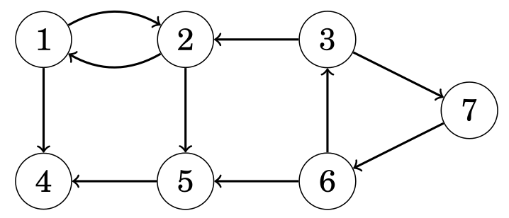 | 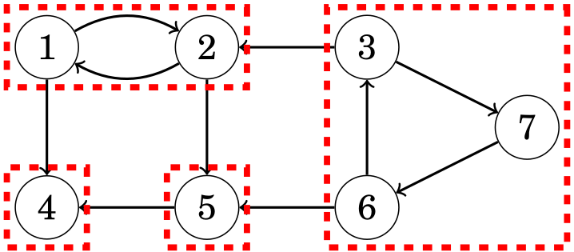 |
|---------------------------------------------------------------|---------------------------------------------------------------------------|
> *A la izquierda vemos un grafo dirigido y a la derecha sus componentes fuertemenete conexas resaltadas con rojo*

Notar que las componentes halladas forman un DAG:

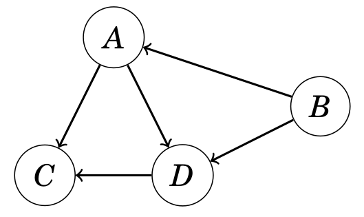
> *Este tipo de grafos se nococen como "grafos condensados"*

```c++
bitset<MAXN> visited;
vector<vector<int>> adj; // Lista de adyacencia del grafo
vector<vector<int>> adj_cond; // Lista de adyacencia del grafo condensado
vector<vector<int>> components; // Comoponentes fuertemente conexos del grafo

void dfs(int v, vector<vector<int>> const& adj, vector<int> &output) {
    visited[v] = 1;
    for (auto u : adj[v])
        if (!visited[u])
            dfs(u, adj, output);    
    output.push_back(v);
}

    vector<int> order; // Lista ordenada segun el tiempo de finalizacion de procesamiento de los nodos

    // Primer DFS
    for (int i = 0; i < n; i++)
        if (!visited[i])
            dfs(i, adj, order);

    // Creamos las lista de adyacencia con las direcciones invertidas
    vector<vector<int>> adj_rev(n);
    for (int v = 0; v < n; v++)
        for (int u : adj[v])
            adj_rev[u].push_back(v);

    visited.reset();
    reverse(order.begin(), order.end());

    vector<int> roots(n, 0); // Almacena la raiz de cada vertice en su propia componente fuertemente conexa

    // Segundo DFS
    for (auto v : order)
        if (!visited[v]) {
            vector<int> component;
            dfs(v, adj_rev, component);
            components.push_back(component);
            int root = *min_element(begin(component), end(component)); // tomamos el elemento mas chico de la componente fuertemente conexa como raiz
            for (auto u : component)
                roots[u] = root;
        }

    // Añadimos los vertices al grafo condensado
    for (int v = 0; v < n; v++)
        for (auto u : adj[v])
            if (roots[v] != roots[u])
                adj_cond[roots[v]].push_back(roots[u]);
```
> *Complejidad: $\mathcal{O}(n + m)$*

### 2SAT

En este tipo de problemas, nos dan una formula logica con la siguiente estructura: *(a1 ∨ b1) ∧ (a2 ∨ b2) ∧ · · · ∧ (am ∨ bm)*, donde cada `ai` y `bi` es una variable logica (*x1, x2, . . . , xn*) o la negacion de una variable (*¬x1 , ¬x2, . . . , ¬xn*). La tarea consiste en asignarle un valor de verdad a cada variable o indicar que no es posible, lo cual se logra mediante el siguiente algoritmo que hace uso del algoritmo de Tarjan:

```c++
bool truth[MAXN]; // truth[cmp[i]] = valor de la variable i en la solución (2SAT)
int nvar; // Número de variables originales
int neg(int x) { return MAXN - 1 - x; } // Retorna la negación de x en el grafo
vector<int> g[MAXN]; // Grafo de implicaciones
int n;
int lw[MAXN]; // Representa el "low-link value" de cada nodo para Tarjan
int idx[MAXN]; // Guarda el índice de descubrimiento en el DFS de Tarjan
int qidx; // Contador de nodos visitados en el DFS de Tarjan
int cmp[MAXN]; // Guarda la componente fuertemente conexa (SCC) a la que pertenece cada nodo
int qcmp; // Contador de SCCs encontradas
stack<int> st; // Pila utilizada por el algoritmo de Tarjan

void tjn(int u) {
    lw[u] = idx[u] = ++qidx; // Asigna índice único y low-link inicial
    st.push(u);
    cmp[u] = -2; // Marcamos como parte del stack

    for (int v : g[u]) { // Recorremos vecinos
        if (!idx[v] || cmp[v] == -2) { // Si no ha sido visitado o está en el stack
            if (!idx[v]) tjn(v);
            lw[u] = min(lw[u], lw[v]); // Actualizamos low-link
        }
    }

    if (lw[u] == idx[u]) { // Si encontramos raíz de una SCC
        int x, l = -1;
        do {
            x = st.top();
            st.pop();
            cmp[x] = qcmp; // Asigna SCC a los nodos
            if (min(x, neg(x)) < nvar) l = x; // Identificamos una variable de la SCC
        } while (x != u);

        if (l != -1) truth[qcmp] = (cmp[neg(l)] < 0); // Determinamos el valor de verdad
        qcmp++; // Pasamos a la siguiente SCC
    }
}

/* Ejecuta Tarjan en todo el grafo */
void scc() {
    memset(idx, 0, sizeof(idx)); // Reseteamos idx
    qidx = 0; // Reiniciamos contador de índices
    memset(cmp, -1, sizeof(cmp)); // Inicializamos SCCs
    qcmp = 0; // Reiniciamos contador de SCCs

    for (int i = 0; i < n; i++) 
        if (!idx[i]) tjn(i); // Ejecutamos Tarjan en cada nodo no visitado
}

/* Construye el grafo de implicaciones */
void addor(int a, int b) {
    g[neg(a)].push_back(b); // ¬a → b
    g[neg(b)].push_back(a); // ¬b → a
}

/* Verificacion de satisfactibilidad */
bool satisf(int _nvar) {
    nvar = _nvar; // Guardamos número de variables originales
    n = MAXN; // Definimos tamaño del grafo

    scc(); // Encontramos SCCs

    for (int i = 0; i < nvar; i++)
        if (cmp[i] == cmp[neg(i)]) return false; // Si x y ¬x están en la misma SCC, es insatisfacible

    return true; // Si no hay conflictos, es satisfacible
}
```
> *Complejidad: $\mathcal{O}(n + m)$*

**NOTA:**

- `g` debe ser cargado en un principio con la variables logicas utilizando la funcion `addor`

## Caminos y Circuitos

### Hierholzer

Suele usarse para:

- Secuencias de De Brujin

El algoritmo de Hierholzer es un metodo para construir un circuito Euleriano[^10] (tambien se explica como construir un camino Euleriano en las notas).

Para que exista un camino Euleriano en un grafo, este, ademas de ser conexo[^3], debe cumplir una de las siguientes dos condiciones dependiendo de si es dirigido o no:

<u>Grafos no Dirigidos:</u>

1. El grado de cada nodo es par
2. El grado de exactamente dos nodos es impar, y el grado del resto de nodos es par

Si se cumple la primera condicion, cada camino Euleriano es tambien un circuito Euleriano. Si la segunda condicion es la que se cumple, los nodos de grados impares son los nodos de inicio y fin de los unicos dos caminos Eulerianos que existen, los cuales no pueden ser circuitos Eulerianos.

<u>Grafos Dirigidos:</u>

1. La cantidad de aristas que entran al nodo es igual a la cantidad de aristas que salen del nodo para cada nodo
2. Un nodo tiene una arista extra de entrada respecto a sus aristas de salida, mientras que otro nodo tiene una arista extra de salida respecto a sus aristas de entrada, y el resto de los nodos tiene la misma cantidad de aristas de entrada que de salida

Similar a como sucede con los grafos no dirigidos, que se cumpla la primera condicion significa que cada camino Euleriano es tambien un circuito Euleriano. Y si se cumple la segunda condicion, resulta que existe un unico camino Euleriano que comienza desde el nodo con mas aristas de salida y termina en el nodo con mas aristas de entrada; por lo tanto, dicho camino no puede ser un circuito.

<u>Algoritmo</u>

El algoritmo primero verifica la existencia de un circuito Euleriano como indicamos arriba. Luego, si se cumple la primera condicion, vamos recorriendo con un [DFS](#dfs) todas las aristas comenzando desde el nodo `start` (en algoritmo llamamos a la funcion con el nodo 0). Cada vez que revisamos todas las aristas del nodo, agregamos el nodo al circuito (el cual guardamos en el vector `circuit`) y hacemos [backtracking](#backtracking) para tratar de extender el circuito con las aristas que todavia no se visitaron hasta haberlas visitado a todas.

#### Grafos no Dirigidos

PRECONDICION: El grafo debe ser conexo

```c++
vector<int> circuit;

void hierholzer(int n, vector<unordered_set<int>> adj, int start) {
    for (int i = 0; i < n; ++i) {
        if (adj[i].size() % 2 == 1) {
            return;
        }
    }

    vector<int> currPath;
    currPath.push_back(start);

    while (!currPath.empty()) {
        int currNode = currPath.back();
        if (!adj[currNode].empty()) {
            int nextNode = *adj[currNode].begin();
            adj[currNode].erase(nextNode);
            adj[nextNode].erase(currNode);
            currPath.push_back(nextNode);
        }
        else {
            circuit.push_back(currPath.back());
            currPath.pop_back();
        }
    }
    reverse(circuit.begin(), circuit.end());
}

hierholzer(n, adj, 0);
```
> *Complejidad $\mathcal{O}(n + m)$*

**NOTAS:**
- `adj` es la representacion del grafo en forma de una [lista de adyacencias](#lista-de-adyacencias) pero utilizando `unorder_set` para facilitar la eliminacion de aristas
- Si queremos obtener un camino Euleriano, simplemente debemos hallar los dos nodos con grados impares y agregar un nodo extra entre esos nodos. Al final del circuito, debemos eliminar el nodo extra

#### Grafos Dirigidos

PRECONDICION: El grafo debe ser conexo

```c++
vector<int> circuit;

void hierholzer(int n, vector<vector<int>> adj, int start) {
    vector<int> in_degree(n, 0), out_degree(n, 0);
    for (int u = 0; u < n; ++u) {
        out_degree[u] = adj[u].size();
        for (int v : adj[u]) {
            in_degree[v]++;
        }
    }
    for (int i = 0; i < n; ++i) {
        if (in_degree[i] != out_degree[i]) {
            return;
        }
    }

    vector<int> currPath;
    currPath.push_back(start);

    while (!currPath.empty()) {
        int currNode = currPath.back();
        if (!adj[currNode].empty()) {
            int nextNode = adj[currNode].back();
            adj[currNode].pop_back();
            currPath.push_back(nextNode);
        }
        else {
            circuit.push_back(currPath.back());
            currPath.pop_back();
        }
    }
    reverse(circuit.begin(), circuit.end());
}

hierholzer(n, adj, 0);
```
> *Complejidad $\mathcal{O}(n + m)$*

**NOTAS:**
- `adj` es la representacion del grafo en forma de una [lista de adyacencias](#lista-de-adyacencias) pero utilizando `vector` para facilitar la eliminacion de aristas
- Si queremos obtener un camino Euleriano, simplemente debemos hallar los dos nodos con diferencias en sus aristas de entrada y salida y agregar un nodo extra entre esos nodos de forma tal que se igualen la cantidad de aristas de entrada y salida. Al final del circuito, debemos eliminar el nodo extra

### Encontrar Camino Hamiltoniano

Suele usarse para:

- Recorrido del Caballo

El siguiente algoritmo es un metodo para construir un camino Hamiltoniano[^11].

Chequear que exista un camino Hamiltoniano es un problema NP-Dificl, sin embargo, existen dos teoremas que son suficientes (pero no necesarios) para garantizar la existencia de un camino Hamiltoniano:

- **Teorema de Dirac:** Si los grados de cado nodo son >= `⌊n/2⌋`, el grafo contiene un camino Hamiltoniano
- **Teorema de Ore:** Si la suma de los grados de cada par de nodos no adyacentes es >= `n`, el grafo contiene un camino Hamiltoniano

El algoritmo utiliza un enfoque probabilistico para reordenar el orden en el que se recorren las aristas y la estructura Link/Cut Tree. La cantidad de reordenamientos esta dado por `mx_ch`.

#### Grafos no Dirigidos

PRECONDICION: El grafo debe ser conexo

```c++
namespace hamil {
    template <typename T> bool chkmax(T &x,T y){return x<y?x=y,true:false;}
    template <typename T> bool chkmin(T &x,T y){return x>y?x=y,true:false;}
    #define vi vector<int>
    #define pb push_back
    #define mp make_pair
    #define pi pair<int, int>
    #define fi first
    #define se second
    #define ll long long
    namespace LCT {
        vector<vi> ch;
        vi fa, rev;
        void init(int n) {
            ch.resize(n + 1);
            fa.resize(n + 1);
            rev.resize(n + 1);
            for (int i = 0; i <= n; i++)
                ch[i].resize(2), 
                ch[i][0] = ch[i][1] = fa[i] = rev[i] = 0;
        }
        bool isr(int a)
        {
            return !(ch[fa[a]][0] == a || ch[fa[a]][1] == a);
        } 
        void pushdown(int a)
        {
            if(rev[a])
            {
                rev[ch[a][0]] ^= 1, rev[ch[a][1]] ^= 1;
                swap(ch[a][0], ch[a][1]);
                rev[a] = 0;
            }
        }
        void push(int a)
        {
            if(!isr(a)) push(fa[a]);
            pushdown(a); 
        }
        void rotate(int a)
        {
            int f = fa[a], gf = fa[f];
            int tp = ch[f][1] == a;
            int son = ch[a][tp ^ 1];
            if(!isr(f)) 
                ch[gf][ch[gf][1] == f] = a;    
            fa[a] = gf;

            ch[f][tp] = son;
            if(son) fa[son] = f;

            ch[a][tp ^ 1] = f, fa[f] = a;
        }
        void splay(int a)
        {
            push(a);
            while(!isr(a))
            {
                int f = fa[a], gf = fa[f];
                if(isr(f)) rotate(a);
                else
                {
                    int t1 = ch[gf][1] == f, t2 = ch[f][1] == a;
                    if(t1 == t2) rotate(f), rotate(a);
                    else rotate(a), rotate(a);    
                } 
            } 
        }
        void access(int a)
        {
            int pr = a;
            splay(a);
            ch[a][1] = 0;
            while(1)
            {
                if(!fa[a]) break; 
                int u = fa[a];
                splay(u);
                ch[u][1] = a;
                a = u;
            }
            splay(pr);
        }
        void makeroot(int a)
        {
            access(a);
            rev[a] ^= 1;
        }
        void link(int a, int b)
        {
            makeroot(a);
            fa[a] = b;
        }
        void cut(int a, int b)
        {
            makeroot(a);
            access(b);
            fa[a] = 0, ch[b][0] = 0;
        }
        int fdr(int a)
        {
            access(a);
            while(1)
            {
                pushdown(a);
                if (ch[a][0]) a = ch[a][0];
                else {
                    splay(a);
                    return a;
                }
            }
        }
    }
    vi out, in;
    vi work(int n, vector<pi> eg, ll mx_ch = -1) { 
        // mx_ch : max number of adding/replacing  default is (n + 100) * (n + 50) 
        // n : number of vertices. 1-indexed. 
        // eg: vector<pair<int, int> > storing all the edges. 
        // return a vector<int> consists of all indices of vertices on the path. return empty list if failed to find one.  
        out.resize(n + 1), in.resize(n + 1);
        LCT::init(n);
        for (int i = 0; i <= n; i++) in[i] = out[i] = 0;
        if (mx_ch == -1) mx_ch = 1ll * (n + 100) * (n + 50); //default
        vector<vi> from(n + 1), to(n + 1);
        for (auto v : eg)
            from[v.fi].pb(v.se), 
            to[v.se].pb(v.fi);  // Bidirectional connections
        unordered_set<int> canin, canout;
        for (int i = 1; i <= n; i++)
            canin.insert(i), 
            canout.insert(i); 
        mt19937 x(chrono::steady_clock::now().time_since_epoch().count());
        int tot = 0;
        while (mx_ch >= 0) {
            vector<pi> eg;
            for (auto v : canout)
                for (auto s : from[v])
                    if (in[s] == 0) {
                        assert(canin.count(s));
                        continue;
                    }
                    else eg.pb(mp(v, s));
            for (auto v : canin)
                for (auto s : to[v])
                    eg.pb(mp(s, v));  // Edge in both directions for undirected graph
            shuffle(eg.begin(), eg.end(), x);
            if (eg.size() == 0) break;
            for (auto v : eg) {
                mx_ch--;
                if (in[v.se] && out[v.fi]) continue;
                if (LCT::fdr(v.fi) == LCT::fdr(v.se)) continue;
                if (in[v.se] || out[v.fi]) 
                    if (x() & 1) continue;
                if (!in[v.se] && !out[v.fi]) 
                    tot++;
                if (in[v.se]) {
                    LCT::cut(in[v.se], v.se);
                    canin.insert(v.se);
                    canout.insert(in[v.se]);
                    out[in[v.se]] = 0;
                    in[v.se] = 0;
                }
                if (out[v.fi]) {
                    LCT::cut(v.fi, out[v.fi]);
                    canin.insert(out[v.fi]);
                    canout.insert(v.fi);
                    in[out[v.fi]] = 0;
                    out[v.fi] = 0;
                }
                LCT::link(v.fi, v.se);
                canin.erase(v.se);
                canout.erase(v.fi);
                in[v.se] = v.fi;
                out[v.fi] = v.se;
            }
            if (tot == n - 1) {
                vi cur;
                for (int i = 1; i <= n; i++) 
                    if (!in[i]) {
                        int pl = i;
                        while (pl) {
                            cur.pb(pl), 
                            pl = out[pl];
                        }
                        break;
                    } 
                return cur;
            }
        }
        //failed to find a path
        return vi();
    }
}

int main() {
    // Número de nodos en el grafo
    int n = 5;  // Ejemplo con 5 nodos

    // Representación de las aristas (grafos no dirigidos)
    vector<pair<int, int>> edges = {
        {1, 2}, {2, 3}, {3, 4}, {4, 5}, {5, 1}  // Ejemplo de ciclo no dirigido
    };

    // Llamada a la función que devuelve el camino
    hamil::vi path = hamil::work(n, edges);

    // Imprimir el camino si se encontró
    if (!path.empty()) {
        cout << "Camino encontrado: ";
        for (int v : path) {
            cout << v << " ";
        }
        cout << endl;
    } else {
        cout << "No se encontró un camino." << endl;
    }

    return 0;
}
```
> *Complejidad: $\mathcal{O}(\text{mx\_ch} \cdot m \cdot \log(n))$*

#### Grafos Dirigidos

PRECONDICION: El grafo debe ser conexo

```c++
namespace hamil {
    template <typename T> bool chkmax(T &x,T y){return x<y?x=y,true:false;}
    template <typename T> bool chkmin(T &x,T y){return x>y?x=y,true:false;}
    #define vi vector<int>
    #define pb push_back
    #define mp make_pair
    #define pi pair<int, int>
    #define fi first
    #define se second
    #define ll long long
    namespace LCT {
        vector<vi> ch;
        vi fa, rev;
        void init(int n) {
            ch.resize(n + 1);
            fa.resize(n + 1);
            rev.resize(n + 1);
            for (int i = 0; i <= n; i++)
                ch[i].resize(2), 
                ch[i][0] = ch[i][1] = fa[i] = rev[i] = 0;
        }
        bool isr(int a)
        {
            return !(ch[fa[a]][0] == a || ch[fa[a]][1] == a);
        } 
        void pushdown(int a)
        {
            if(rev[a])
            {
                rev[ch[a][0]] ^= 1, rev[ch[a][1]] ^= 1;
                swap(ch[a][0], ch[a][1]);
                rev[a] = 0;
            }
        }
        void push(int a)
        {
            if(!isr(a)) push(fa[a]);
            pushdown(a); 
        }
        void rotate(int a)
        {
            int f = fa[a], gf = fa[f];
            int tp = ch[f][1] == a;
            int son = ch[a][tp ^ 1];
            if(!isr(f)) 
                ch[gf][ch[gf][1] == f] = a;    
            fa[a] = gf;

            ch[f][tp] = son;
            if(son) fa[son] = f;

            ch[a][tp ^ 1] = f, fa[f] = a;
        }
        void splay(int a)
        {
            push(a);
            while(!isr(a))
            {
                int f = fa[a], gf = fa[f];
                if(isr(f)) rotate(a);
                else
                {
                    int t1 = ch[gf][1] == f, t2 = ch[f][1] == a;
                    if(t1 == t2) rotate(f), rotate(a);
                    else rotate(a), rotate(a);    
                } 
            } 
        }
        void access(int a)
        {
            int pr = a;
            splay(a);
            ch[a][1] = 0;
            while(1)
            {
                if(!fa[a]) break; 
                int u = fa[a];
                splay(u);
                ch[u][1] = a;
                a = u;
            }
            splay(pr);
        }
        void makeroot(int a)
        {
            access(a);
            rev[a] ^= 1;
        }
        void link(int a, int b)
        {
            makeroot(a);
            fa[a] = b;
        }
        void cut(int a, int b)
        {
            makeroot(a);
            access(b);
            fa[a] = 0, ch[b][0] = 0;
        }
        int fdr(int a)
        {
            access(a);
            while(1)
            {
                pushdown(a);
                if (ch[a][0]) a = ch[a][0];
                else {
                    splay(a);
                    return a;
                }
            }
        }
    }
    vi out, in;
    vi work(int n, vector<pi> eg, ll mx_ch = -1) { 
        // mx_ch : max number of adding/replacing  default is (n + 100) * (n + 50) 
        // n : number of vertices. 1-indexed. 
        // eg: vector<pair<int, int> > storing all the edges. 
        // return a vector<int> consists of all indices of vertices on the path. return empty list if failed to find one.  
        out.resize(n + 1), in.resize(n + 1);
        LCT::init(n);
        for (int i = 0; i <= n; i++) in[i] = out[i] = 0;
        if (mx_ch == -1) mx_ch = 1ll * (n + 100) * (n + 50); //default
        vector<vi> from(n + 1), to(n + 1);
        for (auto v : eg)
            from[v.fi].pb(v.se), 
            to[v.se].pb(v.fi);
        unordered_set<int> canin, canout;
        for (int i = 1; i <= n; i++)
            canin.insert(i), 
            canout.insert(i); 
        mt19937 x(chrono::steady_clock::now().time_since_epoch().count());
        int tot = 0;
        while (mx_ch >= 0) {
            vector<pi> eg;
            for (auto v : canout)
                for (auto s : from[v])
                    if (in[s] == 0) {
                        assert(canin.count(s));
                        continue;
                    }
                    else eg.pb(mp(v, s));
            for (auto v : canin)
                for (auto s : to[v])
                    eg.pb(mp(s, v));
            shuffle(eg.begin(), eg.end(), x);
            if (eg.size() == 0) break;
            for (auto v : eg) {
                mx_ch--;
                if (in[v.se] && out[v.fi]) continue;
                if (LCT::fdr(v.fi) == LCT::fdr(v.se)) continue;
                if (in[v.se] || out[v.fi]) 
                    if (x() & 1) continue;
                if (!in[v.se] && !out[v.fi]) 
                    tot++;
                if (in[v.se]) {
                    LCT::cut(in[v.se], v.se);
                    canin.insert(v.se);
                    canout.insert(in[v.se]);
                    out[in[v.se]] = 0;
                    in[v.se] = 0;
                }
                if (out[v.fi]) {
                    LCT::cut(v.fi, out[v.fi]);
                    canin.insert(out[v.fi]);
                    canout.insert(v.fi);
                    in[out[v.fi]] = 0;
                    out[v.fi] = 0;
                }
                LCT::link(v.fi, v.se);
                canin.erase(v.se);
                canout.erase(v.fi);
                in[v.se] = v.fi;
                out[v.fi] = v.se;
            }
            if (tot == n - 1) {
                vi cur;
                for (int i = 1; i <= n; i++) 
                    if (!in[i]) {
                        int pl = i;
                        while (pl) {
                            cur.pb(pl), 
                            pl = out[pl];
                        }
                        break;
                    } 
                return cur;
            }
        }
        //failed to find a path
        return vi();
    }
}

int main() {
    // Número de nodos en el grafo
    int n = 5;  // Ejemplo con 5 nodos

    // Representación de las aristas (grafos dirigidos)
    vector<pair<int, int>> edges = {
        {1, 2}, {2, 3}, {3, 4}, {4, 5}, {5, 1}  // Ejemplo de ciclo dirigido
    };

    // Llamada a la función que devuelve el camino
    hamil::vi path = hamil::work(n, edges);

    // Imprimir el camino si se encontró
    if (!path.empty()) {
        cout << "Camino encontrado: ";
        for (int v : path) {
            cout << v << " ";
        }
        cout << endl;
    } else {
        cout << "No se encontró un camino." << endl;
    }

    return 0;
}
```
> *Complejidad: $\mathcal{O}(\text{mx\_ch} \cdot m \cdot \log(n))$*

## Flujos y Cortes

Los algoritmos de esta seccion reciben como input un grafo dirigido donde el peso de cada arista es la **capacidad** de cada arista, i.e., la cantidad maxima de flujo que puede pasar por esa arista. Ademas, el grafo contiene dos nodos importantes: la **fuente** que no tiene aristas de entradas, y el **resumidero** que no tiene aristas de salida.

- **Propiedad:** La cantidad maxima de flujo que se puede transportar desde la fuente hacia el resumiedero es igual a la suma de las capacidades de los nodos pertenecientes al corte.

<u>Aplicaciones</u>

- **Caminos con Aristas Disjuntas:** Se nos pide encontrar la maxima cantidad de caminos desde la fuente hacia el resumidero de forma tal que cada arista aparezca a lo sumo en un solo camino. Para ello, simplemente debemos cambiar la capacidad de todas las aristas a 1 y ejecutar [Dinic](#dinic). Como los caminos tienen capacidad 1, cada vez que enviamos flujo por una arista de ese camino, esta se satura por lo que no volvera a ser utilizada. Asi, el flujo maximo sera la cantidad maxima de caminos validos existentes.

- **Caminos con Nodos Disjuntos:** Se nos pide encontrar la maxima cantidad de caminos desde la fuente hacia el resumidero de forma tal que cada nodo, con excepcion de la fuente y el resumidero, aparezca a lo sumo en un solo camino. Para ello, dividiremos cada nodo en 2, a excepcion de la fuente y el resumidero, donde una parte se queda con las aristas de entrada, mientras que la otra se queda con las aristas de salida; tambien agregamos una arista de capacidad 1 entre las dos mitades. Finalmente, corremos [Dinic](#dinic) en el nuevo grafo. Como la arista que conecta a las dos partes de cada nodo tiene capacidad 1, cada camino solo puede pertenecer a un unico nodo y asi, el flujo maximo sera la cantidad maxima de caminos validos existentes.

| 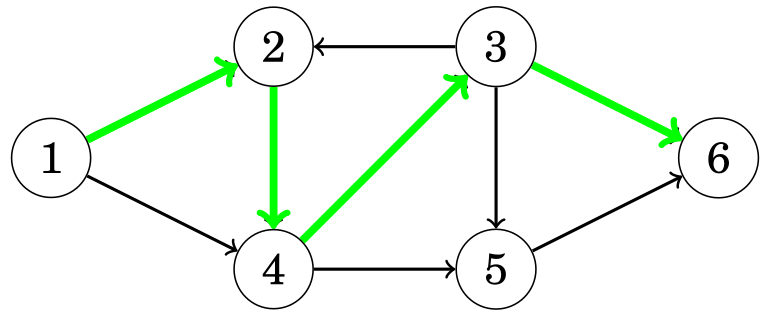 | 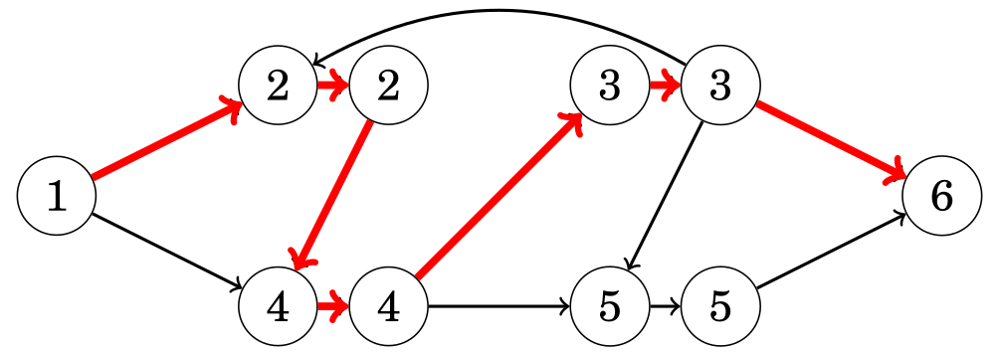 |
|:------------------------------------------------------------------------------------------:|:---------------------------------------------------------------------------------------------------:|
> *A la izquierda el grafo original y a la derecha el grafo luego de haber realizado la "division"*

- **Matching Maximo:** Dado un grafo **bipartito**[^5] no dirigido, se nos pide hallar el matching[^12] mas grande posible. Para lograrlo, basta extender el grafo con una fuente, un resumidero, aristas e interpretar todas las aristas como si tuvieran capacidad 1 y fueran dirigidas tal como se muestra en las imagenes de abajo. Luego, como la capacidad de todas las aristas es 1, al correr [Dinic](#dinic), el tamano del matching sera el mismo que el flujo maximo.

| 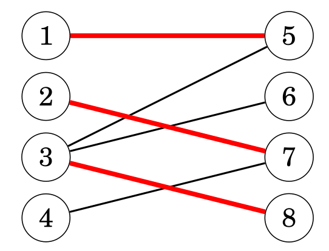 | 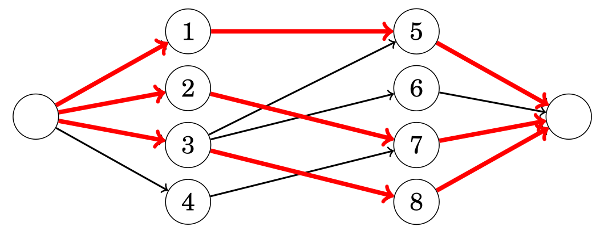 |
|:----------------------------------------------------------------------------:|:----------------------------------------------------------------:|
> *A la izquierda el grafo original y a la derecha como debe quedar el grafo tras la extension*

- **Matching Perfecto:** Dado un grafo **bipartito**[^5] no dirigido, se nos pide determinar si existe un matching[^12] perfecto en el grafo, i.e., sea `X` el conjunto de nodos de a izquierda y `Y` el conjunto de nodos a derecha, queremos hallar un matching `M` tal que `|M| = |X|` o `|M| = |Y|`. Ahora, el **teorema de Hall** nos dice que existe matching perfecto exactamente cuando cada subconjunto de `X` cumple que `|X| <= |vecinos(X)|` o cada subconjunto de `Y` cumple que `|X| <= |vecinos(X)|`. La idea es transformar el grafo igual que lo hicimos para el problema de obtener el matching maximo y correr [Dinic](#dinic) para obtener el flujo maximo. Luego, si el flujo maximo se corresponde con `|X|` o `|Y|` entonces, segun el teorema de Hall, existe matching perfecto.

- **Cobertura Minima de Nodos(MVC)/Conjunto Maximo Independiente(MIS):** Dado un grafo **bipartito**[^5] no dirigido, se nos pide hallar el minimo conjunto de nodos tales que cada arista tenga al menos un extremo en el conjunto (cobertura minima de nodos) y/o hallar el maximo conjunto de nodos tales que no haya dos nodos pertenecientes al conjunto que esten conectados por una arista. Ahora, el **teorema de Kőnig** nos dice que el tamaño de la cobertura minima de nodos es siempre igual al tamaño del maximo matching[^12], siempre que el grafo sea bipartito. La idea es transformar el grafo al igual que lo hicimos en el problema de obtener el matching maximo y posteriormente ejecutar [Dinic](#dinic). Sea `X` el conjunto de nodos de a izquierda y `Y` el conjunto de nodos a derecha, el siguiente paso es realizar una [DFS](#dfs) desde todos los nodos de `X` que quedaron sin matchear (aquellos cuyas aristas de salida no esten pasando flujo). Finalmente, el conjunto de todos los nodos de `X` que **no** fueron visitados y todos los nodos de `Y` que **si** fueron visitados componen la cobertura minima de nodos y los demas nodos son el conjunto maximo independiente.
  - La **Cobertura Minima de Aristas(MEC)** es igual a |V| - |MVC|.

- **Cobertura por Caminos de Nodos Disjuntos:** Dado un DAG (Directed Acyclic Graph), se nos pide hallar la **minima** cantidad de caminos en el grafo de forma tal que cada nodo pertenezca a exactamente un camino. La idea es transformar el grafo como se muestra en la imagen de abajo y posteriormente ejecutar [Dinic](#dinic). Sea `n` la cantidad total de nodos y `c` la cantidad total de nodos emparejados; la cantidad de caminos esta dado por los nodos **no** emparejados, o sea `n-c`. Esto tambien nos dice que son los nodos que **no** estan emparejados a derecha los que inician los caminos, por lo que comenzando desde dichos nodos, podriamos obtener los `n-c` caminos.

| 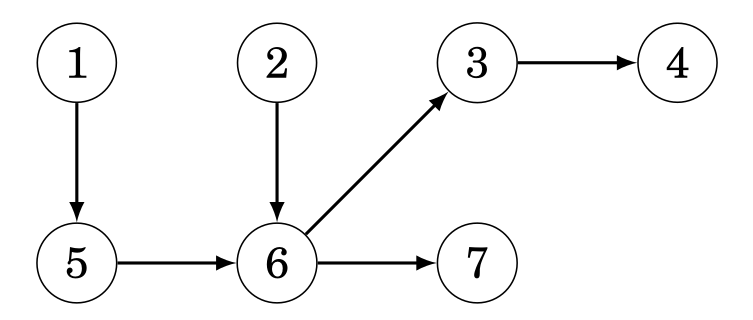 | 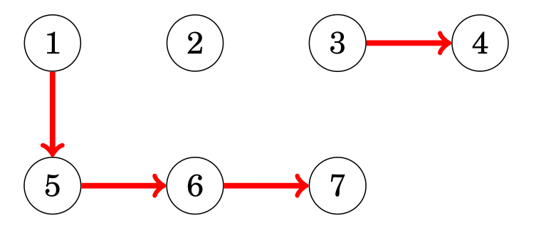 | 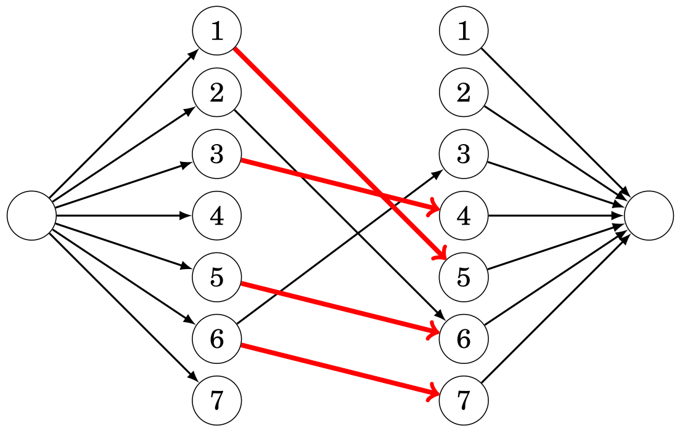 |
|:---------------------------------------------------------------------------------------------------------------------:|:--------------------------------------------------------------------------------------------------------------------------------------------------------------:|:----------------------------------------------------------------------------------------------------------------------------------------------------------------------------------------------|
> *A la izquierda el grafo original, en el centro una solucion al problema y a la derecha como debe quedar el grafo transformado*

- **Cobertura por Caminos General:** Dado un DAG (Directed Acyclic Graph), se nos pide hallar la **minima** cantidad de caminos en el grafo de forma tal que cada nodo pertenezca a al menos un camino. El problema se puede resolver de la misma forma que el problema de cobertura por caminos de nodos disjuntos con la particularidad de que en el grafo transformado existe una arista `a → b`, donde  `a` es disitnto de `b` (i.e, no existe la arista `a → a` en el grafo transformado), siempre que exista un camino desde `a` hacia `b` en el grafo original (posiblemente a traves de muchos nodos). 
  - Una posible implementacion para hallar las aristas es realizar una [DFS](#dfs) desde cada nodo y agregar una arista por cada nodo visitado, lo cual nos da una complejidad de > $\mathcal{O}(n \cdot (n + m))$ (no encontre una implementacion mas sencilla💀).

- **Hallar la Maxima Anticadena:** Dado un DAG (Directed Acyclic Graph), se nos pide hallar una anticadena de longitud **maxima**. En un grafo, se entiende por anticadena a un conjunto de nodos tal que para cada nodo en el conjunto, **no** existe un camino que lleve al resto de nodos, por lo que podemos decir que todos los nodos pertenecientes a la anticadena son de cierta forma "independientes" los unos de los otros. Ahora, el **teorema de Dilworth** nos dice que el tamaño de la maxima anticadena es igual a la cantidad de caminos que resuelven el problema de cobertura por caminos general. De hecho, si construimos los caminos tal como se indico en el problema de cobertura por caminos de nodos disjuntos, podemos formar una anticadena simplemente tomando los nodos que inician los caminos (¡Aunque no es la unica!).

- **Problema de Asignacion General:** Dados un grafo dirigido G = (V,E) y una funcion de valor w: E $\rightarrow$ Z, queremos elegir un subconjunto de nodos V' $\subseteq$ V tal que: $\forall$(u,v) $\in$ E, si v $\in$ V' $\Rightarrow$ u $\in$ V'; y maximice $\sum_{v \in V'} w(v)$.
Para resolver este problema construimos un grafo G' = (V',E') tal que:
    1. V' = V $\cup$ {S,T}, donde S es el nodo **fuente** y T es el nodo **sumidero**.
    2. Para cada nodo v $\in$ V, si w(v) < 0, agrego una arista (S,v) con capacidad -w(v), y si w $\geq$ 0, agrego una arista (v,T) con capacidad w(t).
    3. Para cada arista (u,v) $\in$ E, agrego una arista (u,v) $\in$ E' con capacidad $\infty$.
    4. Calculo el corte minimo entre S y T en G'.
    5. El conjunto de nodos V' alcanzables desde S en la red residual.
    6. El valor de V' es la suma de los w(v) positivos menos el corte minimo. 
 
- **Asignacion de Maquina y Tareas:** Un caso particular del problema anterior, es cuando tenemos un conjunto de tareas T y un conjunto de maquinas M, donde el costo de cada tarea esta dado por b(t) y quiero elegir un subconjunto de maquinas y tareas que me dan un beneficio neto maximo. La idea es reducir el problema a uno de corte minimo como sigue:
    1. Asumo que ya me pagaron todas las tareas. Entonces, no realizar la tarea t tiene un costo b(t).
    2. Defino un grafo G = (V,E).
    3. Agrego un nodo **fuente** S y un nodo **sumidero** T.
    4. Para cada maquina m $\in$ M, agrego una arista (S,m) con capacidad c(m).
    5. Para cada tarea t $\in$ T, agrego una arista (t,T) con capacidad b(t).
    6. Para cada tarea t $\in$ T y cada maquina m $\in$ M, agrego una arista (m,t) con capacidad $\infty$.
    7. Calculo el corte minimos entre S y T en G.
    8. El maximo beneficio alcanzable es $\sum_{t \in T} b(t)$ menos el costo del corte minimo. Esto representa la necesidad de la maquina m para la tarea t.
    9. Si la arista (S,m) forma parte del corte, compro la maquina m.
    10. Si la arista (t,T) forma parte del corte, entonces NO realizao la tarea t.

- **Aristas con Flujo Minimo:** La idea para resolver este problema es la siguiente:
  1. Construimos un grafo G' = (V',E'), donde V' = V $\cup$ {S,T}, nuevos nodos **fuente** y **sumidero**.
  2. $\forall$ (u,v) $\in$ E, agregamos a E' una arista (u,v) con capacidad d(u,v) - c(u,v), arista (S',v) y (u,T'), ambas con capacidad c(u,v).
  3. Agregamos aristas (S',S) y (T,T') con capacidad $\infty$.
  4. Calculamos el flujo maximo f' de S' a T'. SI hay aristas saliente de S' (excepto (S',S)) que no esten saturadas, el flujo no es satisfacible.
  5. Si el flujo es satisfacible, f(u,v) = c(u,v) + f(u,v) para cada (u,v) $\in$ E.
  6. El flujo f cumple las condiciones del problema y maximiza el valor |f|.

### Dinic

El algoritmo de Dinic es utilizando para hallar el flujo maximo y, por lo tanto, tambien nos permite hallar los nodos pertenecientes al minimo corte con un paso extra. En cada iteracion, Dinic realiza una [BFS](#bfs) para hacer una construccion por niveles del grafo, donde cada nivel se corresponde con la distancia respecto a la fuente. Luego, por medio de una [DFS](#dfs), empuja flujo por niveles a travez de las aristas hasta que ya no se pueda mas. El algoritmo termina cuando ya no se pueda agregar mas flujo, i.e., el resumidero no es alcanzable por aristas con peso positivo.

```c++
struct Dinic {
	int nodes,src,dst; // Cantidad de nodos, indice del nodo fuente, indice del nodo resumidero
	vector<int> dist,q,work; // Distancia de cada nodo respecto a la fuente, vector auxiliar para BFS, vector auxiliar para DFS
	struct edge {int to,rev;ll f,cap;}; // {nodo destino de la arista original, indice de la arista inversa en la lista de adyacencia del nodo destino, flujo actual de la arista original, capacidad maxima de la arista}
	vector<vector<edge>> adj; // Representacion del grafo como lista de adyacencia

	Dinic(int x):nodes(x),adj(x),dist(x),q(x),work(x){} // Constructor

	void add_edge(int s, int t, ll cap) {
		adj[s].pb((edge){t,sz(adj[t]),0,cap});
		adj[t].pb((edge){s,sz(adj[s])-1,0,0});
	}

	bool dinic_bfs() { //Construccion del nivel del grafo
		fill(ALL(dist),-1);
        dist[src]=0;
		int qt=0;
        q[qt++]=src;

		for (int qh=0; qh<qt; qh++) {
			int u=q[qh];
			forr(i,0,sz(adj[u])){
				edge &e=adj[u][i];
                int v=adj[u][i].to;
				if (dist[v]<0&&e.f<e.cap) {
                    dist[v]=dist[u]+1;
                    q[qt++]=v;
                }
			}
		}

		return dist[dst]>=0;
	}

	ll dinic_dfs(int u, ll f) { // Empujar flujo
		if (u==dst)
            return f;

		for (int &i=work[u]; i<sz(adj[u]); i++) {
			edge &e=adj[u][i];
			if (e.cap<=e.f)
                continue;
			int v=e.to;
			if (dist[v]==dist[u]+1) {
				ll df=dinic_dfs(v,min(f,e.cap-e.f));
				if (df>0) {
                    e.f+=df;
                    adj[v][e.rev].f-=df;
                    return df;
                }
			}
		}

		return 0;
	}

	ll max_flow(int _src, int _dst) {
		src=_src;
        dst=_dst;
		ll result=0;

		while (dinic_bfs()) {
			fill(ALL(work),0);
			while (ll delta=dinic_dfs(src,INF))
                result+=delta;
		}

		return result;
	}

    vector<int> min_cut(Dinic &dinic) {
        vector<int> min_cut;
        vector<bool> visited(dinic.nodes, false);
        queue<int> q;

        q.push(dinic.src);
        visited[dinic.src] = true;

        while (!q.empty()) {
            int u = q.front(); q.pop();
            min_cut.push_back(u);

            for (const auto &e : dinic.adj[u]) {
                if (!visited[e.to] && e.f < e.cap) {
                    visited[e.to] = true;
                    q.push(e.to);
                }
            }
        }

        return min_cut;
    }
};

int main() {
    int n = 6;  // Número de nodos
    Dinic dinic(n);

    // Agregar aristas con capacidad
    dinic.add_edge(0, 1, 3);
    dinic.add_edge(0, 2, 2);
    dinic.add_edge(1, 3, 2);
    dinic.add_edge(2, 3, 1);
    dinic.add_edge(3, 4, 4);
    dinic.add_edge(3, 5, 2);
    
    int maxflow = dinic.max_flow(0, 5);
    cout << "Max Flow: " << maxflow << endl;

    vector<int> min_cut = min_cut(dinic);
    cout << "Min-Cut Nodes: ";
    for (int v : min_cut) {
        cout << v << " ";
    }
    cout << endl;

    return 0;
}
```

> *Complejidad: $\mathcal{O}(m \cdot n^2)$*

**NOTA:**
- Para grafos bipartitos (generalmente problemas de matching), la complejidad desciende a $\mathcal{O}(m \cdot \sqrt{n})$

## Arboles

Un arbol es un grafo conexo[^3] y aciclico que consta de `n` nodos y `n-1` aristas. Cuenta con las siguientes propiedades:

- Remover una arista divide el arbol en dos componentes
- Agregar una arista crea un ciclo
- Existe un unico camino entre cada par de nodos

### Nodos de cada Subarbol

La funcion toma dos parametros: `s` que es el nodo a procesar y `e` que es el nodo previamente procesado. El proposito del parametro `e` es que no se visiten nodos ya visitados (notar que esto solamente es valido para arboles).

```c++
void dfs(int s, int e) {
    subs[s] = 1;
    for (auto u : adj[s]) {
        if (u == e) continue;
        dfs(u, s);
        subs[s] += subs[u];
    }
}

dfs(x,-1); // La primera llamada es con -1 puesto que no hay nodo previo
```

> *Complejidad $\mathcal{O}(n)$*

### Calcular Diametro[^13] del Arbol

Dado un nodo arbitrario `a` (en el algortimo tomamos 0 por simplicidad), encontramos el nodo `b` mas alejado de `a` y luego el nodo `c` mas alejado de `b`. Finalmente, el diametro del arbol esta dado por la distancia entre `b` y `c` el cual guardamos en la variable `diameter`. En este algoritmo, el arbol es visto de la siguiente forma:

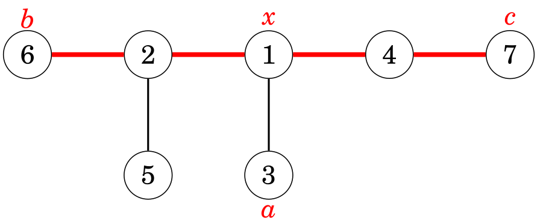
> *`x` representa el nodo donde el camino hacia el nodo `a` se une al del diametro*

```c++
int farthestNode = 0;
int diameter = 0;

void dfs(int s, int e, int l) {
    if (l > diameter) {
        diameter = l;
        farthestNode = s;
    }
    for (auto u : adj[s]) {
        if (u == e) continue; 
        dfs(u, s, l + 1);
    }
}

// Primera DFS desde el nodo 0
dfs(0, -1, 0);
// Segunda DFS desde el nodo mas alejado encontrado
diameter = 0;
dfs(farthestNode, -1, 0);
```

> *Complejidad $\mathcal{O}(n)$*

### Hallar Ancestros

El algoritmo primero preprocesa la tabla `up[x][k]` que nos indica para cada nodo `x` su ancestro despues de subir `2^j` niveles. Luego podemos obtener el `m-esimo` ancestro de cualquier nodo realizando `log(m)` consultas a la tabla o `-1` si es que no existe dicho ancestro.

```c++
const int LOG = ceil(log2(MAXN));
int up[MAXN][LOG]; // up[x][j] = 2^j-ésimo ancestro de x
memset(up, -1, sizeof(up));
int n; // Número de nodos

// **Preprocesamiento con DFS para construir la tabla up**
void dfs(int node, int parent) {
    up[node][0] = parent;  // El ancestro inmediato de node es su padre

    for (int j = 1; j < LOG; j++) {
        if (up[node][j-1] != -1)
            up[node][j] = up[up[node][j-1]][j-1];  // Saltamos 2^(j-1) + 2^(j-1)
        else
            up[node][j] = -1;  // No tiene ancestro a esa altura
    }

    // Recorremos los hijos en DFS
    for (int child : adj[node]) {
        if (child != parent) {
            dfs(child, node);
        }
    }
}

int get_ancestor(int x, int k) {
    for (int j = 0; j < LOG; j++) {
        if (k & (1 << j)) {  // Si el bit j está activo en k, saltamos 2^j
            x = up[x][j];
            if (x == -1) break;  // Si ya no tiene ancestro, salimos
        }
    }
    return x;
}

// Preprocesar la tabla up con DFS desde la raíz (asumimos raíz en 0)
dfs(0, -1);
```
> *Complejidad construccion: $\mathcal{O}(n \cdot \log(n))$*

> *Complejidad consulta: $\mathcal{O}(\log(n))$*

**NOTA**:
- `adj` es la representacion del arbol en forma de una [lista de adyacencias](#lista-de-adyacencias)

### Ancestro Comun Menor

El algoritmo comienza realizando un **Euler Tour**, el cual es un recorrido [DFS](#dfs) en el cual se va guardando el tiempo en el que aparece por primer vez cada nodo en el recorrido en el arreglo `first`, tambien se calcula la profundidad de cada nodo en el arreglo `depth` y ademas se guarda el recorrido DFS con los retornos en el arreglo `euler`. Luego, se construye una [sparse table](#sparse-table) con las profundidades para buscar eficientemente el ancestro comun menor de dos nodos (el cual sera el nodo de menor profundidad entre ambos). Finalmente, por medio de la funcion `lca`, podemos devolver el ancestro comun menor entre cualesquiera dos nodos.


> *Ejemplo de como se veria el arreglo `euler` y `depth` despues de realizar el DFS*

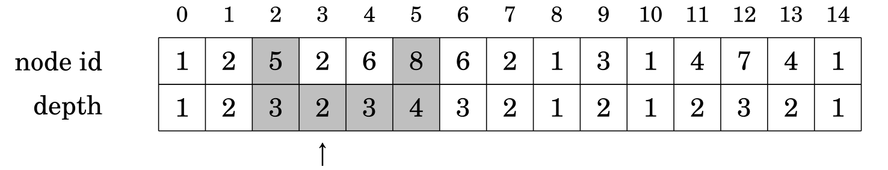
> *Ejemplo de como obtener el LCA entre los nodos 5 y 8*

```c++
const int LOG = ceil(log2(MAXN));

int euler[2 * MAXN], depth[2 * MAXN], first[MAXN]; 
int lookup[2 * MAXN][LOG]; // Sparse Table para minimo
int timer = 0;

void dfs(int node, int parent, int d) {
    first[node] = timer;
    euler[timer] = node;
    depth[timer] = d;
    timer++;

    for (int child : adj[node]) {
        if (child == parent) continue;
        dfs(child, node, d + 1);
        euler[timer] = node;  // Volvemos a agregar el nodo al Euler Tour
        depth[timer] = d;
        timer++;
    }
}

void buildSparseTable() {
    int N = timer; 
    for (int i = 0; i < N; i++)
        lookup[i][0] = i;

    for (int j = 1; (1 << j) <= N; j++) {
        for (int i = 0; i + (1 << j) <= N; i++) {
            int left = lookup[i][j - 1];
            int right = lookup[i + (1 << (j - 1))][j - 1];
            lookup[i][j] = (depth[left] < depth[right]) ? left : right;
        }
    }
}

int queryMin(int L, int R) {
    int j = 31 - __builtin_clz(R - L + 1); // log2(R - L + 1)
    int left = lookup[L][j];
    int right = lookup[R - (1 << j) + 1][j];
    return (depth[left] < depth[right]) ? left : right;
}

int lca(int u, int v) {
    int L = first[u], R = first[v];
    if (L > R) swap(L, R);
    return euler[queryMin(L, R)];
}

dfs(0, -1, 0);  // Asumimos que el nodo 0 es la raíz
build_sparse_table();
```

> *Complejidad construccion: $\mathcal{O}(n \cdot \log(n))$*

> *Complejidad consulta: $\mathcal{O}(1)$*

**NOTA**:
- `adj` es la representacion del arbol en forma de una [lista de adyacencias](#lista-de-adyacencias)

### Distancia entre Dos Nodos

Podemos calcular la distancia entre dos nodos cualesquiera de una arbol enraizado simplemente si conocemos su [ancestro comun menor](#ancestro-comun-menor) y las profundidades de los nodos con la siguiente formula:

```c++
depth[a] + depth[b] − 2 * depth[c];
```
> *Aqui queremos calcular la distancia entre los nodos `a` y `b`, y `c` es el lca*

### Spanning Tree

El arbol de expansion de un grafo consiste de todos los nodos del grafo y algunas de sus aristas, de forma tal que existe un unico camino entre cualesquiera dos nodos.
El **peso** de un spanning tree esta dado por la suma del peso de sus aristas.

**NOTA:**
- Existe mas de una forma de crear un spanning tree dado un grafo, por lo que estos arboles **no son unicos**

#### Kruskal

En el algoritmo de Kruskal, el arbol de expansion inicialmente contiene los nodos del grafo sin ninguna arista. Luego, el algoritmo recorre todas las aristas, las cuales deben estar ordenadas por peso, y luego añade la arista siempre que esta no cree un ciclo.

- Preferible para **grafos dispersos** (n≈m)

```c++
sort(edges.begin(), edges.end());
for (int i = 0; i < edges.size(); i++) {
    if (!same(get<1>(edges[i]), get<2>(edges[i])) 
        unite(get<1>(edges[i], get<2>(edges[i]))));
}
```
> *Complejidad: $\mathcal{O}(m \cdot \log(n))$*

**NOTAS:**
- `edges` es la representacion del grafo en forma de una [lista de aristas](#lista-de-aristas) que **contiene primero el peso** y luego los nodos
- Las funciones `same` y `unite` pertenecen a la estructura [DSU](#disjoint-set-union) la cual debe ser inicializada previamente
- El algoritmo resuelve el problema de hallar un **minimum spanning tree**; para resolver el problema de hallar un **maximum spanning tree**, solamente hay que cambiar el ordenamiento

#### Prim

En el algoritmo de Prim, inicialmente el arbol de expansion comienza con un nodo arbitario. Luego, siempre se añade la arista de peso minimo que agrega un nuevo nodo.

- Preferible para **grafos densos** (n<<m)

##### Minimum Spanning Tree

```c++
bitset<MAXN> visited; // Indica si un nodo ya está en el MST
int minEdge[MAXN];    // Peso mínimo para alcanzar un nodo desde el MST
int parent[MAXN];     // Para reconstruir el MST

void prim(int start) {
    fill(minEdge, minEdge + n, INT_MAX);
    fill(parent, parent + n, -1);

    priority_queue<pair<int, int>, vector<pair<int, int>>, greater<pair<int, int>>> pq; // Priority queue para minimos
    pq.push({0, start}); // Iniciamos desde el nodo `start` con peso 0
    minEdge[start] = 0;

    while (!pq.empty()) {
        int u = pq.top().second;
        pq.pop();

        if (visited[u]) continue;
        visited[u] = 1;

        // Procesamos las aristas del nodo `u`
        for (int v = 0; v < n; v++) {
            if (adj[u][v] && !visited[v] && adj[u][v] < minEdge[v]) {
                minEdge[v] = adj[u][v];
                parent[v] = u;
                pq.push({minEdge[v], v});
            }
        }
    }

    // Mostramos el MST
    cout << "Aristas del MST:\n";
    for (int i = 1; i < n; i++) { // Empezamos desde 1 porque el nodo raíz no tiene padre
        cout << parent[i] << " - " << i << " con peso " << adj[i][parent[i]] << "\n";
    }
}
```
> *Complejidad: $\mathcal{O}(n + m \cdot \log(m))$*

**NOTA:**
- `adj` es la representacion del grafo en forma de una [matriz de adyacencia](#matriz-de-adyacencia)

###### Maximum Spanning Tree

```c++
bitset<MAXN> visited; // Indica si un nodo ya está en el MST
int maxEdge[MAXN];    // Peso máximo para alcanzar un nodo desde el MST
int parent[MAXN];     // Para reconstruir el MST

void primMax(int start) {
    fill(maxEdge, maxEdge + n, INT_MIN);
    fill(parent, parent + n, -1);

    // Priority queue para seleccionar la arista de mayor peso (default: max-heap)
    priority_queue<pair<int, int>> pq; 
    pq.push({0, start}); // Iniciamos desde el nodo `start` con peso 0
    maxEdge[start] = 0;

    while (!pq.empty()) {
        int u = pq.top().second;
        pq.pop();

        if (visited[u]) continue;
        visited[u] = 1;

        // Procesamos las aristas del nodo `u`
        for (int v = 0; v < n; v++) {
            if (adj[u][v] && !visited[v] && adj[u][v] > maxEdge[v]) {
                maxEdge[v] = adj[u][v];
                parent[v] = u;
                pq.push({maxEdge[v], v});
            }
        }
    }

    // Mostramos el MST máximo
    cout << "Aristas del MST Máximo:\n";
    for (int i = 1; i < n; i++) { // Empezamos desde 1 porque el nodo raíz no tiene padre
        cout << parent[i] << " - " << i << " con peso " << adj[i][parent[i]] << "\n";
    }
}
```
> *Complejidad: $\mathcal{O}(n + m \cdot \log(m))$*

**NOTA:**
- `adj` es la representacion del grafo en forma de una [matriz de adyacencia](#matriz-de-adyacencia)

# Fuerza Bruta

Solo es util cuando el `n` lo permite, en caso contrario deberia optarse por utilizar [greedy](#greedy) o [programacion dinamica](#programacion-dinamica).

## Generacion de Subconjuntos

### Metodo 1

Dado un vector `subset` utilizado para mantener los elementos de cada subconjunto, el algortimo llama recursivamente a la funcion `search()` considerando incluir el elemento `k` o no. 

```c++
void search(int k) {
    if (k == n) {
    // process subset
    } else {
        search(k+1);
        subset.push_back(k);
        search(k+1);
        subset.pop_back();
    }
}
```

> *Complejidad: $\mathcal{O}(2^n)$*

**NOTA**:
- En la primera llamada, **`k` debe ser 0**

### Metodo 2

La idea consiste en explotar la representacion binaria de un numero. Se ve al subconjunto como un numero de `n` bits donde un 0 representa la ausencia del elemento y un 1 la presencia. Los elementos se representan de derecha izquierda siendo el primero el elemento 0.

```c++
for (int b = 0; b < (1<<n); b++) {
    // process subset
}
```

> *Complejidad: $\mathcal{O}(2^n)$*

**NOTAS**:
- Es mas rapido que el metodo 1
- Esta limitado para **0 <= n < 64** ya que en el mejor de los casos podemos utilizar `long long` para representar hasta 64 bits

## Generacion de Permutaciones

### Metodo 1

Dado un vector `permutation` utilizado para contener la permutacion y un arreglo de booleanos `chosen` (tambien se podria emplear un bitset) utilizado para indicar que elemento ya ha sido incluido en la permutacion, el algortimo llama recursivamente a la funcion `search()` que va añadiendo un nuevo elemento al vector en cada llamada hasta que se genera una permutacion cuando el tamaño halla alcanzado `n`. 

```c++
void search() {
    if (permutation.size() == n) {
    // process permutation
    } else {
        for (int i = 0; i < n; i++) {
            if (chosen[i]) continue;
            chosen[i] = true;
            permutation.push_back(i);
            search();
            chosen[i] = false;
            permutation.pop_back();
        }
    }
}
```

> *Complejidad $\mathcal{O}(n!)$*

### Metodo 2

Comenzando con la permutacion {0, 1, ..., n-1}, se generan las siguientes utilizando la funcion de la liberia estandar de C++ `next_permutation()`.

```c++
vector<int> permutation;
for (int i = 0; i < n; i++) {
    permutation.push_back(i);
}
do {
    // process permutation
} while (next_permutation(permutation.begin(),permutation.end()));
```

> *Complejidad $\mathcal{O}(n!)$*

**NOTAS**:
- Es mas rapido que el metodo 1
- Tambien se puede recorrer en **orden inverso** comenzando con la permutacion {n-1, n-2, ..., 0} y la funcion `prev_permutation()`

## Reunion en el Centro

Cuando el problema permita dividir el espacio de busqueda en dos partes de igual tamaño y exista una forma eficiente de combinarlas, conviene utilizar la tecnica de reunion en el centro.

Por ejemplo, considerese el problema de que dada una lista de `n` elementos se debe determinar si es posible tomar algunos numeros de ella de forma tal que su suma sea `x`. Sea *n = 4*, la lista *[2, 4, 5, 9]* y *x = 15*. En vez de calcular todos los subconjuntos posibles y sumar su elementos (lo cual tendria complejidad O(2^n)), podemos dividir la lista en dos sublistas *A = [2, 4]* y *B = [5, 9]*, quedandonos los subconjuntos *SA = [0, 2, 4, 6]* y *SB = [0, 5, 9, 14]*. Solo resta chequear si la suma de algun elemento de `SA` con un elemento de `SB` es igual a 15, lo cual puede hacer en O((n/2)^2). En este caso es posible ya que 6 + 9 = 15, lo cual se corresponde con haber sumado 2 + 4 + 9 en la lista original. Este enfoque reduce la complejidad temporal de O(2^n) a O(2^(n/2)) lo cual es lo mismo que $\mathcal{O}(\sqrt{2^n})$.

# Backtracking

Un algortimo de Bactracking parte desde una solucion vacia y la extiende paso a paso de manera recursiva a una solucion posible de forma tal que detiene una rama de busqueda cuando la solucion parcial se vuelve inviable.

- En los algoritmos de backtracking, la complejidad temporal se ve fuertemente afectada por la eficiencia de la **poda**. Las mejores optimizaciones vienen dadas por las podas en los primeros pasos de la recursion
- La idea de "podar" consiste en buscar propiedades que permitan identificar soluciones invalidas en los niveles mas altos del arbol de recursion

## Ejemplo: Problema de las N reinas

Fijada una fila, se itera por las columnas y se trata de colocar una reina. Si no se puede, se avanza a la siguiente columna (poda), caso contrario, se coloca una reina en esa posicion, se la marca y se avanza a la siguiente fila aunque tambien se explora la opcion de colocar la reina en la siguiente columna. Finalmente, si se pudo poner una reina por columna, eso significa que llegamos a una solucion y la variable `count` (que inicialmente es 0) se actualiza indicando que se hallo una nueva solucion.

```c++
void search(int y) {
    if (y == n) {
        count++;
        return;
    }
    for (int x = 0; x < n; x++) {
        if (column[x] || diag1[x+y] || diag2[x-y+n-1]) continue;
        column[x] = diag1[x+y] = diag2[x-y+n-1] = 1;
        search(y+1);
        column[x] = diag1[x+y] = diag2[x-y+n-1] = 0;
    }
}
```
> *Este codigo resuelve el famoso [problema de las N reinas](https://www.cs.buap.mx/~zacarias/FZF/nreinas3.pdf) en $\mathcal{O}(n!)$[^14] utilizando un algoritmo de Backtracking*

Ejemplo de soluciones parciales generadas por el algoritmo para *n = 4*:
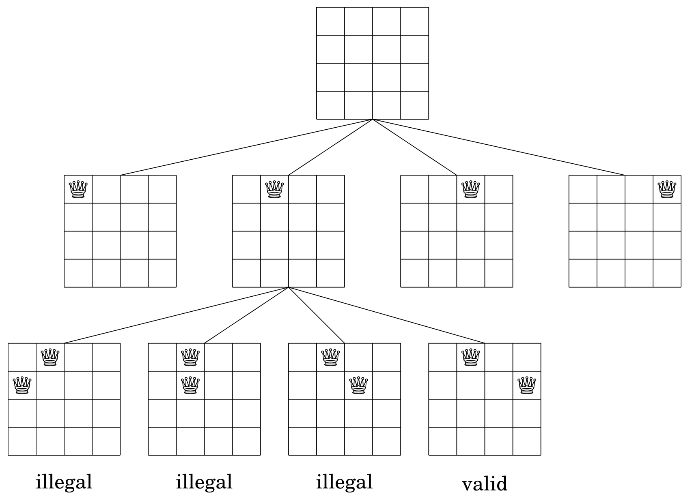

# Greedy

Un algoritmo Greedy, elige la mejor solucion en cada paso. Si conviene no tomar la solucion optima en algun paso para poder elegir otra mejor luego, Greedy no lo detecta.

- Son muy **eficientes**
- Es **dificil** encontrar la estrategia que siempre devuelva la solucion optima y mas aun demostrar que esa estrategia funciona. Una buena forma para obtener mayor confiabilidad es ver si existen **contraejemplos** a la estrategia propuesta

<u>Tips para afrontar un problema Greedy:</u>
- **Ordenar** de distintas formas (al menos mentalmente) los conjuntos (o multiconjuntos) de candidatos
- Revisar lo que sucede en los casos **maximos** y **minimos**
- Comenzar con una **solucion mala** que cumpla las restricciones y luego ir pensando como mejorarla hasta que sea optima


# Programacion Dinamica

Es un metodo que combina la **correctitud** de la busqueda completa (fuerza bruta) y la **eficiencia** de los algoritmos greedy. 

## Aplicaciones

- **Encontrar la solucion optima:** Queremos encontrar una solucion que sea lo mas grande o lo mas pequeña posible.
- **Contar el numero de soluciones:** Queremos calcular el valor total de posibles soluciones.

## Tecnicas Comunes

- **Rangos** 
- **Bitmasks[^15]**

## Requisitos

- La funcion debe ser **determinisitica** (mismo input, mismo output)
- La funcion debe ser **pura** (no depender de una variable global)
- El dominio de la funcion debe ser lo suficientemente chico para que entre en memoria (en mi experiencia no mas de 10^4 o 10^5)
- Es necesario que el problema tenga una **subestructura optima** (EVITAR CASOS BORDES por construccion)
- El problema debe poder partirse en **subproblemas** que puedan resolverse independientemente (las soluciones a los subproblemas son MEMORIZADAS y solo se calculan UNA VEZ)

## Enfoques

### TopDown

Enfoque que consiste en llamar a la funcion desde el caso de interes y llevarla hasta los casos bases.

``` c++
int D(int n){
    if (n <= 1) return 1;
    if (dp[n] != -1) return dp[n];
    return dp[n] = D(n - 1) + D(n - 2);
}
```
> *Ejemplo recursivo para calcular las posibles formas de colocar piezas de domino de 1x2 en un tablero de 2xn con un efoque topdown*

- **pros:**
  - Computa los subproblemas SOLO cuando sea necesario
  - Transformacion natural desde la definicion recursiva
  - No requiere pensar el orden de procesamiento de estados

- **contras:**
  - Ligeramente mas lentas por el *overhead* que generan las llamadas recursivas a funciones
  - Riesgo de *Memory Limit Exceded* (MLE) cuando la **profundidad** de la recursion es grande

### BottomUp

Enfoque que consiste en fijar los casos bases y desde ahi llevarlo hasta el caso de interes.

``` c++
int D[MAXN];
D[0] = D[1] = 1;
for (int n = 2; n < MAXN; ++n) {
    D[n] = D[n - 1] + D[n - 2];
}
```
> *Ejemplo iterativo para calcular las posibles formas de colocar piezas de domino de 1x2 en un tablero de 2xn con un efoque bottomup*

- **pros:**
  - Menos problemas en memoria y ligeramenter mas veloces al ser, por lo general, iterativas
  - Ahorra memoria (aunque raramente es necesario)

- **contras:**
  - Requiere visitar todos los estados
  - Se debe pensar cuidadosamente en que orden correr los estados

## Complejidad de una DP

La complejidad de una dp esta dada por la suma de sus estados. Aqui un estado es una tupla con informacion particular de un subproblema (ej, n = 3).

> *Podemos mejorar la eficiencia si representamos los estados que sean subconjuntos de elementos en forma de **bitmasks**, como por ejemplo: `dp[1<<K][N]`. Solo funciona para conjuntos con **no mas de 64 elementos** (utilizando long long)*

### Algoritmo de Kadane

Obtener la maxima suma de subarreglos:

```c++
int a[n];
int curmx = a[0], glmx = a[0];
forr(i,1,n)
{
    curmx = max(a[i], curmx + a[i]);
    glmx = max(glmx, curmx);
}
```

Obtener la minima suma de subarreglos:

```c++
int a[n];
int curmn = a[0], glmn = a[0];
forr(i,1,n)
{
    curmn = min(a[i], curmn + a[i]);
    glmn = min(glmn, curmn);
}
```

# Operaciones de Bits

## Setear el k-esimo Bit

- **a 1**
```c++
x = x | (1 << k);
```

- **a 0**
```c++
x = x & ~(1 << k);
```

- **invertir**
```c++
x = x ^ (1 << k);
```

## Chequear Potencia de 2

```c++
if(x & (x-1) == 0)
{
    /* Hacer algo cuando x sea potencia de 2 */
}
```

[^1]: *Un conjunto de puntos es convexo si contiene todos los segmentos entre todo par de puntos del conjunto.*
[^2]: *Un grafo dirigido es funcional si cada nodo tiene exactamente una arista saliente. Esto significa que el grafo forma una colección de ciclos y caminos que terminan en un ciclo*
[^3]: *Un grafo es conexo si todos los nodos estan conectados por un camino*
[^4]: *Se denomina componente de un grafo a un subconjunto conexo de los nodos del mismo*
[^5]: *Un grafo se considera bipartito si sus nodos puedes ser coloreados usando solamente dos colores de manera tal de que dos nodos adyacentes no tengan el mismo color*
[^6]: *Un puentes una arista cuya eliminacion aumenta el numero de componentes conexas del grafo.*
[^7]: *Un punto de articulacion es un nodo cuya eliminacion (junto con sus aristas) desconecta el grafo*
[^8]: *Decimos que un camino es k-interno si todos los vertices intermedios (o sea, excluyendo al primero y al ultimo) tienen un indice menor o igual a k*
[^9]: *Decimos que un grafo es fuertemente conexo si existe un camino entre cada nodo y todos los demas*
[^10]: *Un camino Euleriano es un camino que recorre cada arista exactamente una vez. Por su parte, un circuito Euleriano es un camino Euleriano que comienza y termina en el mismo nodo*
[^11]: *Un camino Hamiltoniano es un camino que recorre cada nodo exactamente una vez. Por su parte, un circuito Hamiltoniano es un camino Hamiltoniano que comienza y termina en el mismo nodo*
[^12]: *Se entiende por matching de un grafo a un conjunto de aristas sin vertices en comun pertenecientes al grafo*
[^13]: *El diametro de un arbol es la longitud maxima de un camino entre dos nodos*
[^14]: *Para `n` suficientemente grande, la complejidad se asemeja mas a $\mathcal{O}(2^n)$*
[^15]: *Una bitmask es un numero entero visto por su valor en binario*