# Librerias god 

- bits/stdc++.h

## Usando *sort()*

- **vectores:**

```c++
vector<int> v = {4,2,5,3,5,8,3};
sort(v.begin(),v.end());   // <-- DE MENOR A MAYOR
sort(v.rbegin(),v.rend()); // <-- DE MAYOR A MENOR
```

- **arreglos:**

```c++
int n = 7;
int a[] = {4,2,5,3,5,8,3};
sort(a,a+n);
```

- **strings:**

```c++
string s = "monkey";
sort(s.begin(), s.end());
```

- *Lo mismo aplica para la funcion **random_shuffle()** que ordena los elementos de manera aleatoria*

### Funcion de Comparacion

Tambien podemos utilizar la funcion *sort()* con una comparacion *ad-hoc*.

Por ejemplo, definimos la funcion *comp()* que ordena strings primero por su longitud y luego alfabeticamente:

```c++
bool comp(string a, string b) {
    if (a.size() != b.size()) 
        return a.size() < b.size();
    return a < b;
}
```

Luego, dado `v` un vector de strings, podemos ordenar utilizando *comp()* llamando a *sort()* como sigue:

```c++
sort(v.begin(), v.end(), comp);
```

## Funciones de Busqueda

**NOTAS**:
- Las siguientes funciones requieren que la estructura a iterar se encuentre **ordenada de menor a mayor**
- Al estar implementadas con busqueda lineal, su complejidad es **O(log(n))**

### *lower_bound()* 

Devuelve un puntero al primer elemento cuyo valor es >= a `x`.

```c++
auto a = lower_bound(array, array+n, x);
```

### *upper_bound()*

Devuelve un puntero al primer elemento cuyo valor es > a `x`

```c++
auto b = upper_bound(array, array+n, x);
```

### *equal_range()*

Devuelve una tupla con las salidas de *lower_bound()* y *upper_bound()* respectivamente.

```c++
auto r = equal_range(array, array+n, x);
cout << r.second-r.first << "\n";
```

# Estimado de Eficiencia

| Input size | Required time complexity |
|----------- |--------------------------|
| n <= 10    | O(n!)                    |
| n <= 20    | O(2^n)                   |
| n <= 500   | O(n^3)                   |
| n <= 5000  | O(n^2)                   |
| n <= 10^6  | O(n*log(n)) or O(n)      |
| n > 10^6   | O(log(n)) or O(1)        |


# Indice Algoritmos

| Seccion                                                                                                  | Complejidad                                      |
|----------------------------------------------------------------------------------------------------------|--------------------------------------------------|
| [Progresiones: Sumas Gaussianas](#sumas-gaussianas)                                                      | O(1)                                             |
| [Progresiones: Formula de Faulhaber](#formula-de-faulhaber-hasta-6)                                      | O(1)                                             |
| [Progresiones: Progresion Aritmetica](#progresion-aritmetica)                                            | O(1)                                             |
| [Progresiones: Progresion Geometrica](#progresion-geometrica)                                            | O(1)                                             |
| [Algebra: Raiz](#raices)                                                                                 | O(log(numero))                                   |
| [Algebra: Exponenciacion](#exponenciacion)                                                               | O(#potencias)                                    |
| [Algebra: Formula de Binet](#formula-de-binet)                                                           | O(1)                                             |
| [Geometria: Suma y resta de vectores](#suma-y-resta-de-vectores)                                         | O(1)                                             |
| [Geometria: Multiplicacion y division de vectores por escalares](#multiplacion-y-division-por-escalares) | O(1)                                             |
| [Geometria: Norma de un vector](#norma)                                                                  | O(log(U^2))                                      |
| [Geometria: Proyeccion de un vector sobre otro](#producto-vectorial)                                     | O(log(U^2))                                      |
| [Geometria: Producto punto](#producto-punto)                                                             | O(1)                                             |
| [Geometria: Producto cruz](#producto-cruz)                                                               | O(1)                                             |
| [Geometria: Calculo de perimetro](#calculo-de-perimetro)                                                 | O(#lados del poligono)                           |
| [Geometria: Calculo de area](#calculo-de-area)                                                           | O(#lados del poligono)                           |
| [Geometria: Polar Sort](#polar-sort)                                                                     | O(#puntos∗log(#puntos))                          |
| [Geometria: Convex Hull](#convex-hull)                                                                   | O(#puntos∗log(#puntos))                          |
| [Combinatoria: Computo de factoriales](#computo-de-factoriales)                                          | O(numero)                                        |
| [Combinatoria: Computo de factoriales inversos](#computo-de-factoriales-inversos)                        | O(3∗numero)                                      |
| [Teoria de Numeros: Ver si un numero es primo](#numeros-primos)                                          | O(raiz(numero))                                  |
| [Teoria de Numeros: Criba de Eratóstenes](#criba-de-eratóstenes)                                         | O(numero∗log(numero))                            |
| [Teoria de Numeros: MCD y MCM](#mcd-y-mcm)                                                               | O(log(numero))                                   |
| [Teoria de Numeros: Divisores de un numero](#divisores-de-un-numero)                                     | O(log(numero))                                   |
| [Teoria de Numeros: Factorizacion de un numero](#factorizacion-de-un-numero)                             | O(log(numero))                                   |
| [Teoria de Numeros: Ver si un numero es congruente a otro](#aritmetica-modular)                          | O(1)                                             |
| [Teoria de Numeros: Inverso modular](#inverso-modular)                                                   | O(#potencias)                                    |
| [Teoria de Numeros: Computo de inversos modulares](#computo-de-inversos-modulares)                       | O(3∗numero)                                      |
| [Busqueda: Busqueda lineal](#busqueda-lineal)                                                            | O(#elementos)                                    |
| [Busqueda: Busqueda binaria](#busqueda-binaria)                                                          | O(log(#elementos))                               |
| [Busqueda: Ventana deslizante](#ventana-deslizante)                                                      | O(2∗#elementos)                                  |
| [Busqueda: 2SUM](#2sum)                                                                                  | O(2∗#elementos)                                  |
| [Grafos: DFS](#dfs)                                                                                      | O(#aristas)                                      |
| [Grafos: BFS](#bfs)                                                                                      | O(#aristas)                                      |
| [Grafos: Bellman Ford](#bellman-ford)                                                                    | O(#vertices∗#aristas)                            |
| [Grafos: Dijkstra](#dijkstra)                                                                            | O(min{(#vertices)^2, (#aristas)∗log(#vertices)}) |
| [Grafos: Floyd-Warshall](#floyd-warshall)                                                                | O((#vertices)^3)                                 |
| [Programacion Dinamica: Ejemplo TopDown](#topdown)                                                       | O(tamaño(matriz))                                |
| [Programacion Dinamica: Ejemplo BottomUp](#bottomup)                                                     | O(tamaño(matriz))                                |
| [Programacion Dinamica: Kadane's Algorithm](#algoritmo-de-kadane)                                        | O(tamaño(matriz))                                |

# Indice Estructuras

| Seccion                                               | Memoria Total(usando `int`)                                                              |
|-------------------------------------------------------|------------------------------------------------------------------------------------------|
| [Arrays](#arrays)                                     | (4*#elementos)B                                                                          |
| [Bitsets](#bitsets)                                   | (#elementos)b                                                                            |
| [Prefix sum/Tabla aditiva](#prefix-sum)               | (8*#elementos+4)B                                                                        |
| [Vectors](#vectors)                                   | (4*#elementos)B                                                                          |
| [Strings](#strings)                                   | (#elementos + 1)B                                                                        |
| [Deques](#deques)                                     | (4*#elementos)B                                                                          |
| [Queues](#queues)                                     | (4*#elementos)B                                                                          |
| [Priority Queues](#priority-queues)                   | (4*#elementos)B                                                                          |
| [Sets](#sets)                                         | (4*#elementos)B                                                                          |
| [Multisets](#multisets)                               | (4*#elementos)B                                                                          |
| [Indexed Sets](#indexed-sets)                         | (4*#elementos)B                                                                          |
| [Maps](#maps)                                         | (8*#elementos)B                                                                          |
| [Iteradores](#iteradores)                             | 4B                                                                                       |
| [Segment Tree](#segment-tree)                         | (16*#elementos)B                                                                         |
| [Geometria: Punto](#punto)                            | 8B                                                                                       |
| [Geometria: Vector](#vector)                          | 8B                                                                                       |
| [Geometria: Recta](#recta)                            | 16B                                                                                      |
| [Geometria: Poligono](#poligono)                      | (#vectores/puntos).8B                                                                    |
| [Grafos: Lista de adyacencias](#lista-de-adyacencias) | (#nodos)4B + (#aristas)4B grafo direccional o (#aristas)8B grafo direccional pesado      |
| [Grafos: Lista de aristas](#lista-de-aristas)         | (#aristas)8B para grafos direccionales o (#aristas)12B para grafos direccionales pesados |
| [Grafos: Matriz de adyacencia](#matriz-de-adyacencia) | ((#nodos)^2)*4B                                                                          |
> *La memoria total se multiplica por 2 si los elementos son `long long`*

# Tips

- **Multiplicar en lugar de dividir**
    - Flotantes

    ``` c++
    int a, b, c, d;
    double val1 = a/b;
    double val2 = c/d;
    if (val1 == val2) {
        // do stuff…
    }
    ```

    - Enteros

    ``` c++
    int a, b, c, d;
    if (a*d == c*b) {
        // do stuff…
    }
    ```

- **Los algoritmos de grafos de obtencion de caminos minimos que son de 1 a todos se pueden transformar en algoritmos para encontrar caminos de todos a uno (revirtiendo el sentido de los ejes)**

- **Los algoritmos de grafos de obtencion de caminos minimos que son de 1 a todos se pueden usar para computar caminos de todos a todos (haciendo n ejecuciones del algoritmo, una desde cada origen)**

- **Si falta informacion en el grafo, agregar vertices para codificar dicha informacion**

- **Encarar los problemas de calcular los estados posibles como problemas de grafos**

- **Setear MAXN en un valor ligeramente mayor a 'n' para evitar casos borde de una manera sencilla**

- **Si se va a recorrer una matriz, poner un marco con valores inalcanzables para detectar/evitar casos bordes**

- **Usar un "centinela" como el valor al que queremos llegar para cortar la recursion**
  
- **Saber matematicas, pensamiento logico. Es mejor poder demostrar algo y saber que funciona en vez de ir a ciegas con una implementacion**

- **Resolver un problema consiste en detectar propiedades y observaciones del problema. Un Wrong Answer (WA) probablemente significa que faltan observaciones**

- **Un Accepted (AC) no necesariamente significa que este completamente bien. Siempre comparar con otras soluciones**

- **UPSOLVEAR. Aprender lo que no sabes**

- **Siempre es preferible utilizar la funcion `sort()` que mantener una estructura ordenada (como sets o maps)**

# Estructuras de datos

## Arrays

Lista de elementos.

Especialmente eficiente para:

- Acceder valores rapidamente -> **O(1)**
- Modificar valores rapidamente -> **O(1)**

**Usar siempre que se puedan.**

<u>Inicializacion:</u>

```c++
int A[10] = {}; // inicializado a 0
int B[200]; // inicializado con la memoria que ya estaba (basura)
```

- *Tamaño fijo*
- *Su memoria se aloja de manera contigua por lo cual es ligeramente mas rapido que un vector de su mismo tamaño*

## Bitsets

Un areglo cuyos elementos solo pueden ser 1 o 0.

Especialmente eficiente para:

- Reducir memoria (cada entrada solo ocupa 1 bit)
- Utilizar operadores de bits, como `&` (and), `|` (or) o `^` (xor)

<u>Inicializacion:</u>

```c++
bitset<10> b; // inicializado a 0
bitset<10> b(string("0010011010")); // inicializado de derecha a izquierda arbitrariamente
```

<u>Funciones:</u>
**b.count():** Devuelve el numero de 1s presentes en el bitset

- *El tamaño debe ser una **constante***

## Prefix Sum

Especialmente eficiente para:

- Responder consultas de rango o subintervalos
- Devoler la suma maxima cuando hay numeros negativos

``` c++
vector<int> S
S.push_back(0);
void sumaAditiva  (vector<int > &A) {
    for(int i = 0; i < A.size(); i++) {
        S.push_back(A[i] + S[i]);
    }
}
```
> *Complejidad construccion: O(n)*
> *Complejidad consulta: O(1)*

**NOTAS**:
- Se necesitan **dos arreglos/vectores** (uno con los elementos y otro con la suma de los primeros i elementos). El arreglo de la suma tiene un elemento mas el cual es el 0;

## Vectors

Es como un arreglo pero con la posibilidad de tener un tamaño dinamico.

<u>Inicializacion:</u>

```c++
vector<int> v; // vector vacío
vector<int> v = {2,4,2,5,1}; // vector con valores arbitrarios
vector<int> v(9); // vector de 9 ints con valor 0
vector<int> v(9, 3); // vector de 9 ints, todos con valor 3
```

<u>Funciones:</u>
**v.size():** Devuelve el tamaño del arreglo
**v.empty():** Es *true* si el vector no tiene elementos
**v.clear():** Deja sin elementos al vector
**v.push_back():** Insertar un elemento al final del vector
**v.pop_back():** Eliminar el ultimo elemento
**v.back():** Devuelve el valor del ultimo elemento

- *Se puede acceder como si fuese un array*
- *Las funciones `push_back` y `pop_back` se pueden utilizar para simular el comportamiento de un **stack** (pila), aunque la funcion `top` debe reemplazarse por `v.back()` o `v[v.size()-1]`*

## Strings

Tienen las mismas funciones que los vectores pero cuentan con caracteristicas adicionales.

<u>Inicializacion:</u>

```c++
string s; // cadena vacia
```

<u>Funciones (particulares):</u>
**s+s':** Devuelve la concatenacion de los strigns `s` y `s'` --> **O(∣s∣+∣s′∣)**
**substr(k,x):** Devuelve un substring que comienza en la posicion `k` y tiene longitud `x` --> **O(x)**
**find(t):** Devuelve la posicion en la que aparece el primer caracter (de izquierda a derecha) del primer substring `t` o `string::npos` en su defecto --> **O(∣s∣*∣t∣)**
**rfind(t):** Devuelve la posicion en la que aparece el primer caracter (de derecha a izquierda) del primer substring `t` o `string::npos` en su defecto --> **O(∣s∣*∣t∣)**

## Deques

Es como un vector pero se pueden insertar y eliminar elementos por delante y por detras en **O(1)**.

<u>Inicializacion:</u>

```c++
deque<int> d;
```

<u>Funciones (particulares):</u>
**d.push_front():** Insertar un elemento al comienzo
**d.pop_front():** Eliminar el primer elemento

- *Suelen ser ligeramente mas lentos que los vectores pero en promedio la insercion y la eliminacion son **O(1)***

## Stacks

En las competencias ICPC conviene utilizar un vector en vez de un stack debido a que tiene mas flexibilidad.

## Queues

Simula una cola/fila. Tiene un comportamiento FIFO (First In, First Out).

- *Resulta util cuando queremos agregar cosas para procesarlas luego en un orden FIFO*
- *Es preferible antes que un **set***
- *Inserciones, eliminaciones y accesos -> **O(1)***

<u>Inicializacion:</u>

```c++
queue<int> Q;
```

<u>Funciones:</u>
**Q.push():** // Q.push(5); Q.push(3); Q.push(-1);
**Q.front():** // 5
**Q.pop():** // chau 5
**Q.front():** // 3
**Q.back():** // -1

## Priority Queues

Como una *queue* normal, pero ordena internamente los elementos de mayor a menor.

<u>Inicializacion:</u>

```c++
priority_queue<int> PQ;
priority_queue<int, vector<int>, greater<int>> PQ; // cola de prioridades inversa (ordena de menor a mayor)
```

<u>Funciones:</u>
**PQ.push():** // PQ.push(5); PQ.push(10); PQ.push(7);
**PQ.top():** // 10
**PQ.pop():** // chau 10

- *Ojo! insertar y remover elementos aqui es **O(log(n))***

## Sets

Es una coleccion **ordenada** de menor a mayor de elementos **unicos**.

<u>Inicializacion:</u>

```c++
set<int> s;
set<int> s = {2,5,6,8}; // set con valores arbitrarios
```

<u>Funciones:</u>
**s.insert():** // S.insert(5); S.insert(10); S.insert(5); no da error, pero el elemento no se agrega
**s.size():** // 2
**s.erase():** // S.erase(5); chau 5
**s.count(5):** // 0; puede ser solo 0 o 1
**s.find(x):** // puntero (iterador) al elemento `x` o `end` si `x` no se encuentra en `s`
**s.lower_bound(x):** // puntero (iterador) al primer elemento >= `x` o `end` en caso contrario
**s.upper_bound(x):** // puntero (iterador) al primer elemento > `x` o `end` en caso contrario

- *Se maneja internamente con **punteros***
- *Es mas costoso de insertar (**O(log(n))**) que un vector pero es mas rapido de buscar (**O(log(n))**)*
- *Iterar el set es **O(n)**. No se puede indexar como un arreglo o vector*
- *La gran mayoria de sus operaciones son **O(log(n))***

## Multisets

Es como un set, pero permite meter mas de una vez un elemento.

<u>Inicializacion:</u>

```c++
multiset<int> MS;
```

<u>Funciones:</u>
**MS.insert():** // MS.insert(3); MS.insert(3);
**MS.erase():** // MS.erase(3); OJO: esto borra todas las repeticiones!
**MS.size():** // 0. MS.insert(10); MS.insert(10); MS.erase(MS.find(10)); MS.size(); // 1

## Indexed Sets

Es como un set, pero podemos utilizar funciones adicionales.

Como un indexed set es una policy-based data structure, debemos agregar lo siguiente para poder utilizarlo para numeros enteros:

```c++
#include <ext/pb_ds/assoc_container.hpp>
using namespace __gnu_pbds;
typedef tree<int,null_type,less<int>,rb_tree_tag,
            tree_order_statistics_node_update> indexed_set;
```

<u>Inicializacion:</u>

```c++
indexed_set is;
```

<u>Funciones (particulares):</u>
**is.find_by_order(i):** Devuelve un puntero (iterador) al elemento i-esimo 
**is.find_by_order(x):** Devuelve la posicion en la que deberia estar `x`; No hace falta que `x` pertenezca al set

- *La complejidad de estas funciones es **O(log(n))***

## Maps

Es como un arreglo de pares clave-valor, pero lo podes indexar con la estructura que quieras y ordena los indices de mayor a menor.

<u>Inicializacion:</u>

```c++
map<int, string> M; // mapea de tipo `int` a tipo `string`
```

<u>Funciones:</u>
M[5] = “V”; // asociamos el 5 con la string “V”
**M.size()**; // 1
M[7] = “VII”; // asociamos el 7 con la string “VII”
M.size(); // 2. if (M[10] == “X”) { … } OJO: este patrón agrega el elemento 10
// if (M.count(3) > 0 && M[3] == “III”) { … } este patrón si funciona como esperamos

## Unordered Sets & Unordered Maps

Como set y map, pero sus elementos no están ordenados.

- *Muchas operaciones pasan a ser **O(1)** (en promedio) en vez de O(log(n))*

## Iteradores

Es una variable que a punta a un elemento en una estructura de datos. Los iteradores `begin` y `end` definen el rango que contiene todos los elementos de una estructura de datos.

- **begin:** Apunta al primer elemento.
- **end:** Apunta a la posicion siguiente del ultimo elemento (OJO! No se puede desreferenciar ya que la posicion es invalida).

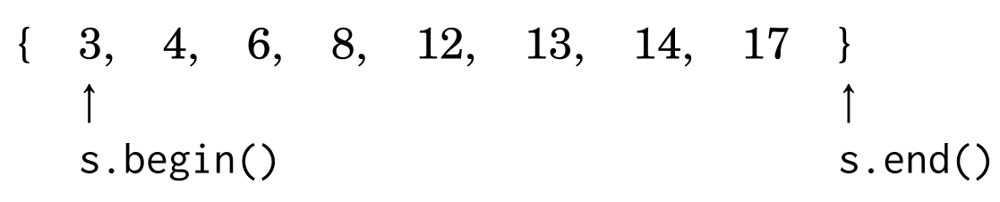 

- *Los iteradores pueden irse moviendo (de a un elemento) en la estructura por medio de `++` y `--`*
- *Tambein se pueden utilizar los iteradores **rbegin** y **rend** que apuntan al ultimo elemento y a la posicion anterior al primer elemento respectivamente*

## Segment Tree

Es un arbol que responde consultas sobre rangos (no solo sumas!).

Espcialmente eficiente para:

- Modificar y consultar valores -> O(log(n))
- Responder consultass (*querys*) sobre sub intervalos -> O(4*log(n))

<u>Proceso de creacion:</u>
1. Dado un arreglo A con N elementos, extender A con "elementos neutros" (sule ser 0 generalmente) hasta que tenga tamaño potencia de 2.
2. Crear un arbol binario completo cuyas hojas sean los elementos de A.

Luego, cada hoja representa el rango [i, i + 1), y los nodos internos representan la unión de los rangos de los hijos.

 
> *Este segment tree esta orientado a responder querys relacionadas con la suma de los subarreglos*

``` c++
int n, t[4*MAXN];
void buildst(int a[], int v, int tl, int tr) { // arreglo, nodo raiz, 0, n
    if (tl == tr) {
        t[v] = a[tl];
    }
    else {
        int tm = (tl + tr) / 2;
        buildst(a, v*2, tl, tm);
        buildst(a, v*2+1, tm+1, tr);
        t[v] = t[v*2] + t[v*2+1];
    }
}
```

<u>Actualizacion:</u>
1. Actualizo el valor del nodo actual.
2. Si hay padre, convertirlo en el nodo actual y volver al paso 1.

``` c++
void updatest(int v, int tl, int tr, int pos, int newValue) { // nodo raiz, 0, n, posicion del elemento a actualizar en A, nuevo valor
    if (tl == tr) {
        t[v] = newValue;
    }
    else {
        int tm = (tl + tr) / 2;
        if (pos <= tm) {
            updatest(v*2, tl, tm, pos, newValue);
        }
        else {
            updatest(v*2+1, tm+1, tr, pos, newValue);
        }
        t[v] = t[v*2] + t[v*2+1]
    }
}
```

<u>Responder query:</u>
1. Si el rango del nodo esta completamente incluido en la query, se retorna su valor.
2. Si el rango del nodo interseca con el de la query, se suma el subproblema en ambos sub-arboles hijos.
3. Si el rango no interseca con el de la query, se retorna 0.

``` c++
void sumst(int v, int tl, int tr, int l, int r) { // nodo raiz, 0, n, indice izquiero del subarreglo, indice derecho del subarreglo
    if (l > r) {
        return 0;
    }
    if (l == tl && r == tr) {
        return t[v];
    }
    int tm = (tl + tr) / 2;
    return sumst(v*2, tl, tm, l, min(r, tm)) + sumst(v*2+1, tm+1, tr, max(l, tm + 1), r);  
}
```

# Matematicas

## Progresiones

### Sumas Gaussianas

- Sum(n) -> (n*(n+1))/2
- Sum(n-1) -> (n*(n-1))/2

### Formula de Faulhaber (hasta 6)

$
1 + 2 + 3 + \cdots + n = \frac{n(n+1)}{2} = \frac{n^2 + n}{2}
$

$
1^2 + 2^2 + 3^2 + \cdots + n^2 = \frac{n(n+1)(2n+1)}{6} = \frac{2n^3 + 3n^2 + n}{6}
$

$
1^3 + 2^3 + 3^3 + \cdots + n^3 = \left(\frac{n^2 + n}{2}\right)^2 = \frac{n^4 + 2n^3 + n^2}{4}
$

$
1^4 + 2^4 + 3^4 + \cdots + n^4 = \frac{6n^5 + 15n^4 + 10n^3 - n}{30}
$

$
1^5 + 2^5 + 3^5 + \cdots + n^5 = \frac{2n^6 + 6n^5 + 5n^4 - n^2}{12}
$

$
1^6 + 2^6 + 3^6 + \cdots + n^6 = \frac{6n^7 + 21n^6 + 21n^5 - 7n^3 + n}{42}
$

### Progresion Aritmetica

$$
\underbrace{a + \cdots + b}_{n \text{ numbers}} = \frac{n(a + b)}{2}
$$

Donde *a* es el primer numero, *b* el ultimo y *n* la cantidad total de numeros.

**NOTA**:
- La formula es **independiente de la constante de separacion** entre los sumandos

### Progresion Geometrica

$
a + ak + ak^2 + \cdots b = \frac{bk - a}{k - 1}
$

Donde *a* es el primer numero, *b* el ultimo y *k* es el radio entre los sumandos.

## Algebra

### Enteros vs Flotantes

| Enteros                   | Flotantes                         |
|---------------------------|-----------------------------------|
| `int` hasta 2*10^9        | `float` hasta 6 digitos (NO usar) |
| `long long` hasta 4*10^18 | `double` hasta 15 digitos         |
| >= usar STRINGS           | `long double` hasta 18 digitos    |

#### Raices

##### Flotantes

- sqrt(x)  -> si x es Double
- sqrtl(x) -> si x es Long Double

##### Enteros

``` c++
int raiz(int x) {
    int l = 0, r = x+1;
    while (R - L > 1) {
        int m = (l + r) / 2;
        if (m*m <= x) l = m;
        else r = m;
    }
    return l;
}
```
> *Complejidad: O(log(n))*

**NOTA**: 
- Utiliza **busqueda lineal** y **devuelve el piso de la raiz**

#### Exponenciacion

##### Flotantes

- pow(x, e)  -> si x es Double      
- powl(x, e) -> si x es Long Double

**NOTA**: 
- SE QUEDA CORTO EN PRECISION PARA ICPC

##### Enteros

``` c++
ll exp(int b, int e) {
    ll val = 1;
    for (int i = 0; i < e; i++)
    val *= b;
    return val;
}
```
> *Complejidad: O(e)*

### Formula de Binet

$
f(n) = \frac{(1 + \sqrt{5})^n - (1 - \sqrt{5})^n}{2^n \sqrt{5}}
$

Calcula el n-esimo numero de la sucesion de *Fibonacci*.

**NOTA**: 
- El resultado debe estar en **punto flotante**

## Geometria

### Representacion

#### Punto 

``` c++
struct pto {
    ll x, y;
    pto() : x(0), y(0) {}
    pto(ll _x, ll _y) : x(_x), y(_y) {}
    pto operator+(pto b) { return pto(x+b.x, y+b.y); }
    pto operator-(pto b) { return pto(x-b.x, y-b.y); }
    pto operator+(ll k) { return pto(x+k, y+k); }
    pto operator*(ll k) { return pto(x*k, y*k); }
    pto operator/(ll k) { return pto(x/k, y/k); }
    ll operator*(pto b) { return x*b.x + y*b.y; }
    pto proj(pto b) { return b*((*this)*b) / (b*b); }
    ll operator^(pto b) { return x*b.y - y*b.x; }
    ld norm() { return sqrt(x*x + y*y); }
    ld dist(pto b) { return (b - (*this)).norm(); }
};
```

#### Vector

``` c++
struct vec {
    int x, y;
}
```
#### Recta

``` c++
struct recta {
    pto p, pq;
    constructor(pto p, pto q) {
        this.p = p;
        this.pq.x = q.x - p.x;
        this.pq.y = q.y - p.y;
    }
}
```
> *Se representa por un punto origen y un vector tangente*

#### Poligono

``` c++
pto PolygonA[n]; //estatica
vector<pto> PolygonB; // dinamica
```
> *Se representa por una lista ordenada de puntos*

### Algebra vectorial

#### Suma y resta de vectores

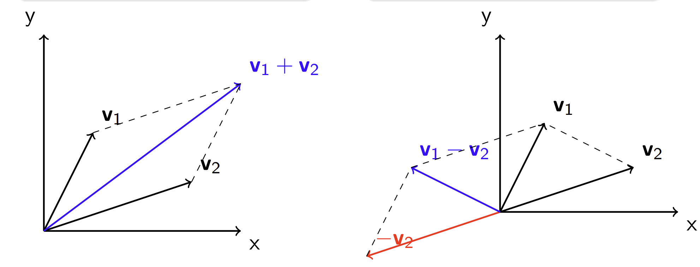 

El valor absoluto de la diferencia de vectores nos permite calcular la distancia entre dos puntos!

#### Multiplacion y division por escalares

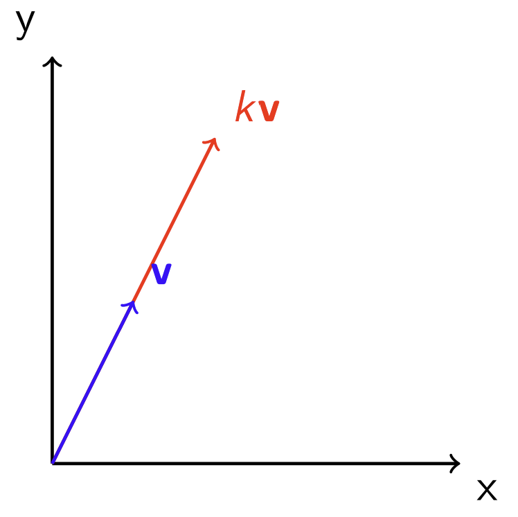

Podemos alterar el tamaño de un vector por medio de multiplicarlo o dividirlo por un valor k respectivamente.

#### Norma

Es el largo o la extension de un vector U en el espacio.

``` c++
ld Ux, Uy; // Vector U
ld norma = abs(sqrtl(Ux*Ux + Uy*Uy));
```
> *Complejidad: O(log(Ax^2 + Ay^2))*

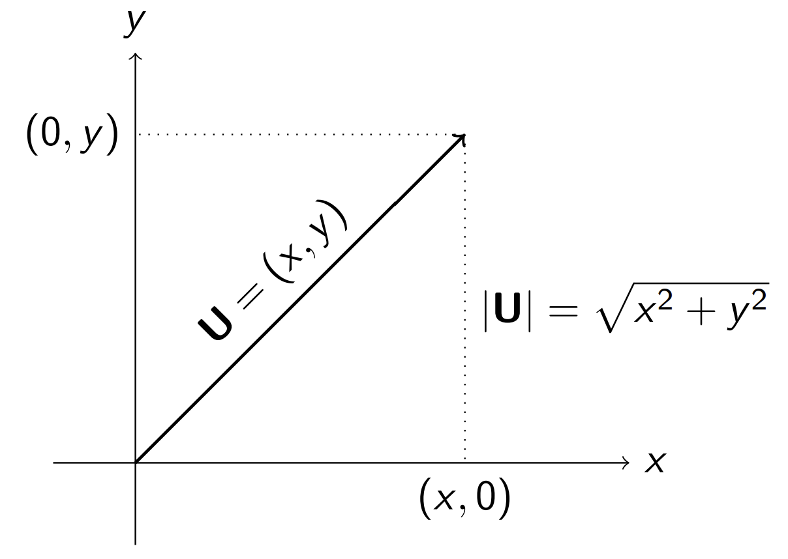

#### Proyeccion

Proyeccion de un vector U sobre un vector V:

``` c++
ld Ux, Uy; // Vector U
ld Vx, Vy; // Vector V
ld proyeccionUV =  (Vx + Vy)*((Ux*Vx + Uy*Vy)/abs(sqrtl(Ux*Ux + Uy*Uy)));
```
> *Complejidad: O(log(Ax^2 + Ay^2))*

- Podemos interpretarla como la proyeccion ortogonal del vector U sobre la linea que contiene alvector V:

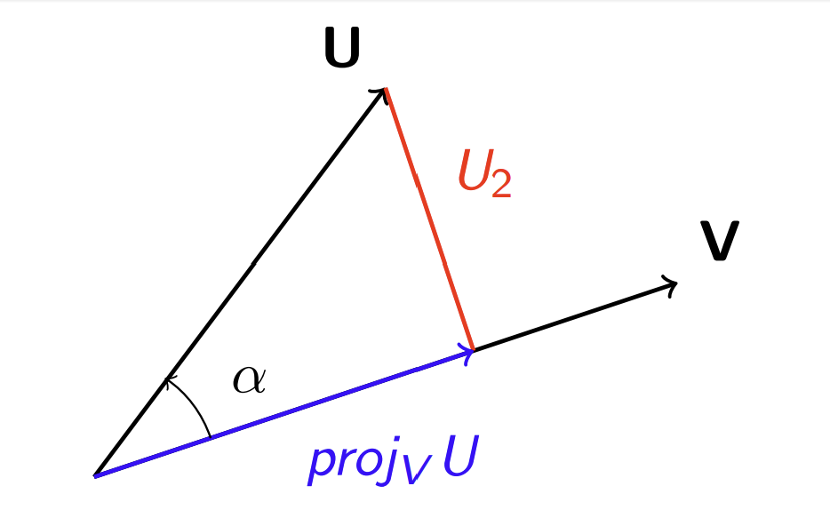

- Dado un punto P y una linea/segmento L, podemos encontrar el punto en L mas cercano a P si calculamo la proyeccion de P sobre L.


#### Producto punto

- Dos vectores son perpendiculares **<=>** su producto escalar es 0

``` c++
int Ux, Uy; // Vector U
int Vx, Vy; // Vector V
int escalar = Ux*Vx + Uy*Vy;
```
> *Complejidad: O(1)*

- Podemos interpretar el producto punto entre una direccion U y un punto V, como una medida de ”que tan lejos esta el punto V en la direccion U”:

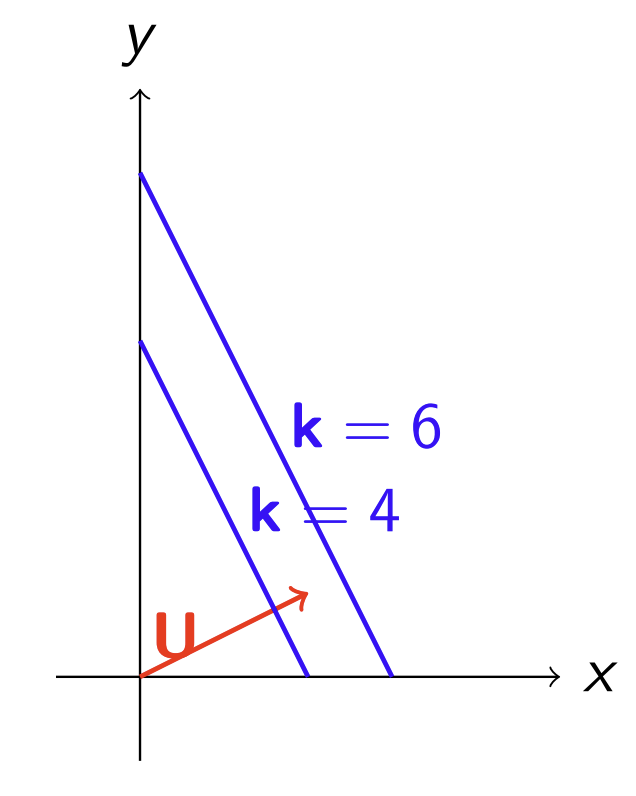

- Por teorema, el producto punto entre dos vectores alcanza un maximo cuando U y V tienen igual direccion (*cos(α) = 1*) y un minimo cuando tienene direccion opuesta  (*cos(α) = -1*)

#### Producto cruz

- Dos vectores son paralelos **<=>** el valor absoluto de su producto vectorial es 0

``` c++
int Ux, Uy; // Vector U
int Vx, Vy; // Vector V
int vectorial = Ux*Vy - Uy*Vx;
```
> *Complejidad: O(1)*

- El producto vectorial es igual al área del paralelogramo formado por los vectores

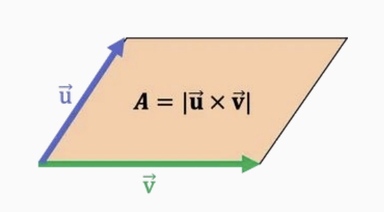

### Algoritmos

#### Calculo de perimetro

``` c++
double dist(pto A, pto B) {
    double dx = A.x - B.x
    double dy = A.y - B.y;
    return hypot(dx, dy);
}
⁝
vector<pto> Poly(n);

double per = 0;
for (int i = 0; i < n-1; i++) {
    per += dist(Poly[i], Poly[i+1]);
}
per += dist(Poly[n-1], Poly[0]);
```
> *Complejidad: O(n)*

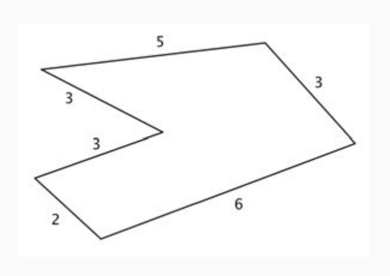

#### Calculo de area

- Un polígono se puede separar en triángulos. Luego se puede calcular el área como suma de muchas áreas pequeñas.

``` c++
double areaTri(vec A, vec B) {
    double prodVec = A.x*B.y - B.x*A.y;
    return prodVec/2;
}
⁝
vector<pto> Poly(n);
double area = 0;
for (int i = 0; i < n-1; i++) {
    area += areaTri(Poly[i], Poly[i+1]);
}
area += areaTri(Poly[n-1], Poly[0]);
```

#### Polar Sort

Dado un punto O y un vector V, el polar sort de un conjunto de puntos S es el ordenamiento de los puntos de S, en sentido antihorario, tomando a O como centro y V como direccion inicial.

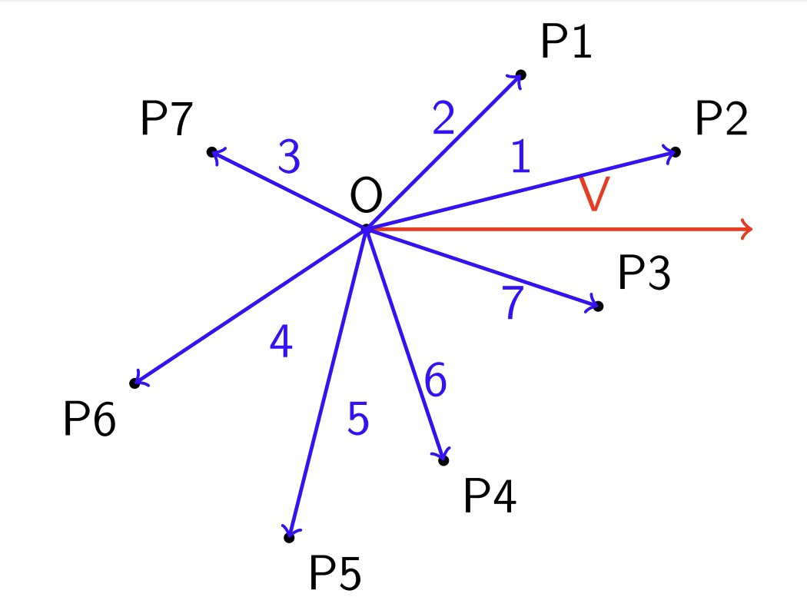

``` c++
struct cmp {
    pto o, v;
    cmp(pto no, pto nv) : o(no), v(nv) {}
    bool half(pto p) {
        assert(!(p.x == 0 && p.y == 0)); // (0,0) isn't well defined
        return (v ^ p) < 0 || ((v ^ p) == 0 && (v * p) < 0);
    }
    bool operator()(pto& p1, pto& p2) {
        return mp(half(p1 - o), T(0)) < mp(half(p2 - o), ((p1 - o) ^ (p2 - o)))
    }
};
```
> *Complejidad: O(n ∗ log(n))*

#### Convex Hull

El convex hull de un conjunto de puntos S es el conjunto convexo[^1] minimo que contiene a S.

|  | 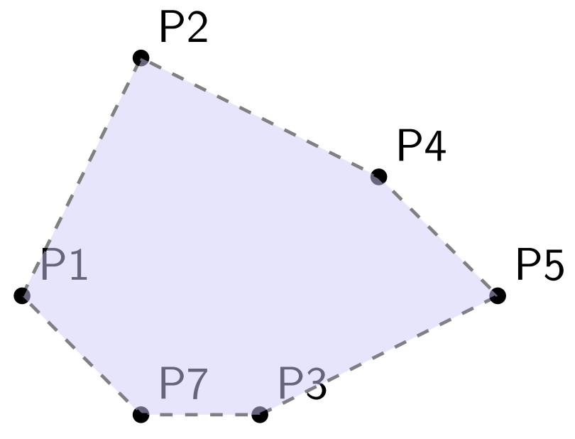 |
|:------------------------------------------------:|:------------------------------------------------:|

``` c++
vector<pto> upper_hull(vector<pto>& p) {
    vector<pto> uh;
    sort(p.begin(), p.end());
    forn(i, sz(p)) {
        while(sz(uh)>=2 && (uh[sz(uh)-1]-uh[sz(uh)-2])^(p[i]-uh[sz(uh)-2])>=0)
        uh.pop_back();
        uh.push_back(p[i]);
    }
    return uh;
}
```
> *Complejidad: O(n ∗ log(n))*

``` c++
vector<pto> lower_hull(vector<pto>& p) {
    vector<pto> uh;
    sort(p.begin(), p.end());
    forn(i, sz(p)) {
        while(sz(uh)>=2 && (uh[sz(uh)-1]-uh[sz(uh)-2])^(p[i]-uh[sz(uh)-2])<=0)
        uh.pop_back();
        uh.push_back(p[i]);
    }
    return uh;
}
```
> *Complejidad: O(N ∗ log(N))*

## Combinatoria

### Factoriales

#### Computo de factoriales

- Lo que se hace para calcular factoriales cuando **𝑛 ≤ 10^6** es **precalcular** los factoriales y guardarlos en un arreglo.

``` c++
const int MAXN = 1e7, M = 1e9+7;
ll F[MAXN];
// ...
F[0] = 1;
for(ll i = 1; i < MAXN; i++) F[i] = F[i-1]*i %M;
```
> *Aqui M es un numero primo GRANDE*
> *Complejidad O(MAXN)*

#### Computo de factoriales inversos

- Le llamamos “factorial inverso” de 𝑛 módulo 𝑀, al inverso modular del factorial de 𝑛 módulo 𝑀.

- Cuando 𝑛 ≤ 10^6, es más eficiente tener en cuenta que:

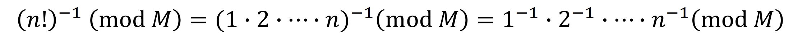

- Tras lo cual podemos precalcular los factoriales inversos en tiempo lineal:

``` c++
const int MAXN = 1e7, M = 1e9+7;
ll F[MAXN], INV[MAXN], FI[MAXN];
// ...
F[0] = 1; forr(i, 1, MAXN) F[i] = F[i-1]*i %M;
INV[1] = 1; forr(i, 2, MAXN) INV[a] = M - (ll)(M/a)*INV[M%a]%M;
FI[0] = 1; forr(i, 1, MAXN) FI[i] = FI[i-1]*INV[i] %M;
```
> *Complejidad O(3.MAXN)*

## Teoria de numeros

### Divisibilidad

#### Numeros primos

- Un número primo es aquel que tiene como únicos divisores el 1 y sí mismo.

``` c++
bool isPrime(int n) {
    for(int p = 2; p*p <= n; p++) {
        if(n%p == 0) return false;
    }
    return true;
}
```
> *Complejidad: O(raiz(n))*

#### Criba de Eratóstenes

- La criba de eratóstenes es una tabla que te indica si un número es primo o no.

``` c++
bitset isPrime[MAXN];
void criba() {
    isPrime[0] = isPrime[1] = false;
    for(int i = 2; i < MAXN; i++) isPrime[i] = true;
    for(int p = 2; p < MAXN; p++) {
        if (isPrime[p]) {
            for(int m = 2*p; m < MAXN; m += p) isPrime[m] = false;
        }
    }
}
```
> *Complejidad: O(nlog(n))*

#### MCD y MCM

- Para calcular el máximo común divisor entre dos números podemos usar el **algoritmo de euclides**.
``` c++
int mcd(int a, int b) {
    if (b == 0) return a;
    return mcd(b, a%b);
}
```
> *Complejidad: O(log(n))*

- Para calcular el mínimo común múltiplo entre dos números usamos el MCD

``` c++
int mcm(int a, int b) { return (a / mcd(a, b)) * b; }
```
> *Complejidad: O(log(n))*

**PROPIEDAD**: 
- mcd(a,b) = mcd (a,b+a*k) para cualquier k entero.

#### Divisores de un numero

``` c++
vector<int> Div;
void getDiv(int n) {
    Div.clear();
    for (int d = 1; d * d <= n; d++) {
        if (n%d == 0) {
            Div.push_back(d);
            Div.push_back(n/d);
        }
        if (d*d == n) Div.pop_back();
    }
    // sort(Div.begin(), Div.end()); // OPCIONAL
}
```
> *Complejidad: O(log(n)) (+ O(n.log(n)) si se ordena segun ChatGPT)*

#### Factorizacion de un numero

``` c++
map<int, int> F;
void fact(int n) {
    F.clear();
    for (int p = 2; p * p <= n; p++) {
        while (n%p == 0) {
            F[p]++;
            n /= p;
        }
    }
    if (n > 1) F[n]++;
}
```
*Complejidad: O(log(n))*

### Aritmetica modular

- a es congruente a b en modulo m (a≡b mod(m)) **<=>** a tiene el mismo resto que b **<=>** |a - b| % m == 0

### Inverso modular

- El Pequeño Teorema de Fermat dice que sea **𝑝 primo** y **𝑎 coprimo a 𝑝**:

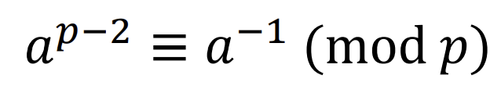

``` c++
ll expmod(ll b, ll e, ll M) {
    ll val = 1;
    for (ll i = 0; i < e; i++)
    val *= (b % M);
    return val;
}

ll invmod(ll a){ return expmod(a, M-2); }
```
> *Complejidad: O(e)*

### Computo de inversos modulares

- Cuando el módulo **𝑀 es un número primo** se satisface la siguiente fórmula:

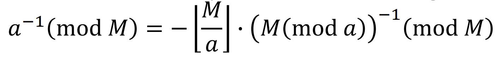

- Podemos precalcular los inversos modulares de 𝑀 para valores de **𝑛 ≤ 10^6** con el siguiente algoritmo:

``` c++
const int MAXN = 1e7, M = 1e9+7;
int INV[MAXN];

INV[1] = 1;
for(ll a = 2; a < MAXN; a++) INV[a] = M - (ll)(M/a)*INV[M%a]%M;
```
> *Complejidad: O(MAXN)*

# Algoritmos de busqueda

## Busqueda lineal

``` c++
for (int i = 0; i < n ; i ++) {
    if ( array [ i ] == X ) {
    // encontre X
    }
}
```
> *Complejidad: O(n)*

## Busqueda binaria

Especialmente eficiente para:

- Buscar valores "menores que" o "mayores que"
- Buscar valores minimos y maximos de funciones
- Buscar la primer posicion en la que cambia el valor de una funcion

``` c++
int a = 0 , b = n -1;
while (a <= b) {
    int k = (a+b )/2;
    if (array [k] == x) {
        // encontre X en indice K
    }
    if (array [k] > x) b = k -1;
    else a = k+1;
}
```
> *Complejidad: O(log(n))*

**Implementacion alternativa con saltos:**

``` c++
int k = 0;
for (int b = n/2; b >= 1; b /= 2) {
    while (k + b < n && array [k+b] <= x) k += b ;
}
if (array [k] == x) {
    // encontre X en indice K
}
```
> *Complejidad: O(log(n))*

**NOTA**: 
- Para poder utilizar estos algoritmos se deben **ordenar** los elementos.

## Ventana deslizante

Especialmente eficiente para:

- Problemas de subarreglos continuos

``` c++
// En iR , jR devolvemos la respuesta
void ventanaDeslizante  (vector<int > &A , int x , int &iR , int &jR) {
    int n = int ( A.size()), j = n-1;
    for (int i = 0; i < n ; i ++) // fijando el extremo i:
    { // mientras la suma sea > x, disminuimos j
        while ( j > i && A[i] + A[j] > x )
        j--;
        // Sale del while : (A[i] + A[j] <= x) o (j == i)
        if ( j > i && A[i] + A[j] == x )
        {
            iR = i;
            jR = j;
        }
    }
}
```
> *Complejidad: O(2n)*
> *Este algoritmo resuelve el problema de: Dado un arreglo de n numeros positivos, y un numero x, nos interesa saber si existe un subarreglo cuya suma sea x.*

**NOTAS**:
- La ventana puede tener tanto un **tamaño fijo** como un **tamaño variable** 
- Se necesitan **dos indieces/punteros** (uno para el primer elemento y otro para el ultimo)
- los numeros **deben tener el mismo signo**

## 2SUM

Especialmente eficiente para:

- Buscar dos numeros que sumen "X"

``` c++
// En iR , jR devolvemos la respuesta
void sum2  (vector<int > &A, int x, int &iR , int &jR) {
    int i, j;
    i = 0;
    j = A.size()-1;
    while((j > i) && ((A[i] + A[j]) == x)) {
        if((A[i] + A[j]) < x)) ++i;
        else --j;
    }
    if((A[i] + A[j]) == x) {
        iR = i;
        jR = j;
    }
}
```
> *Complejidad: O(2n)*

**NOTAS**:
- Los elementos deben estar **ordenados** 
- Se necesitan **dos indieces/punteros** (uno para el primer elemento y otro para el ultimo)

# Grafos

## Representacion

**NOTA**: Las siguientes estructuras son para grafos dirigidos. Para grafos no dirigidos o bidireccionales, simplemente duplicar la cantidad de aristas

### Lista de adyacencias

#### Grafo dirigido

``` c++
vector<int> adj[N];

// Para agregar usamos:

adj[1].push_back(2) // Si existe una arista de 1 a 2;
⁝
```

#### Grafo dirigido pesado

``` c++
vector<pair<int,int>> adj[N];

// Para agregar usamos:

adj[1].push_back({2,5}) // Si existe una arista de 1 a 2 con peso 5;
⁝
```

### Lista de aristas

#### Grafo dirigido

``` c++
vector<pair<int,int>> edges;

// Para agregar usamos:

edges.push_back({1,2}) // Si existe una arista de 1 a 2;
⁝
```

#### Grafo dirigido pesado

``` c++
vector<tuple<int,int,int>> edges;

// Para agregar usamos:

edges.push_back({1,2,5}) // Si existe una arista de 1 a 2 con peso 5;
⁝
```

### Matriz de adyacencia

#### Grafo dirigido 

``` c++
int adj[n][n];

// Para agregar hacemos:

for(int i = 0; i < n; ++i) {
    for(int j = 0; j < n; ++j) {
        if(/* Existe arista desde i a j */) {
            adj[i][j] = 1;
        }
        else {
            adj[i][j] = 0;
        }
    }
}
```

#### Grafo dirigido pesado

``` c++
int adj[n][n];

// Para agregar hacemos:

for(int i = 0; i < n; ++i) {
    for(int j = 0; j < n; ++j) {
        if(/* Existe arista desde i a j */) {
            adj[i][j] = /* peso de la arista */;
        }
        else {
            adj[i][j] = -1; // <-- valor para indicar que no hay arista de i a j;
        }
    }
}
```

## Algoritmos de recorrido

### DFS

Ve los vecinos en algun orden.

Especialmente eficiente para:

- Resolver puentes
- Resolver puntos de articulacion

``` c++
bitset(MAXN) visited;

void dfs(int r) { // <-- pasamos la raiz como parametro
    if(visited[r]) return;
    visited[r] = 1;
    // process node r
    for(auto u:adj[s]) {
        dfs(u);
    }
}
```
> *Complejidad O(m)*

**NOTAS**:
- adj es la representacion del grafo en forma de una **lista de adayacencia**
- MAXN debe ser ser igual a la cantidad de vertices (o un poquito mas por las moscas)

### BFS

Encuentra el **el camino mas corto** a cada vertice desde la raiz "r".

``` c++
queue<int> q;
bitset(MAXN) visited;
int distance[n];

void bfs(int r) { // <-- pasamos la raiz como parametro
    visited[r] = 1;
    distance[r] = 0;
    q.push(r);
    while(!q.empty()) {
        int s = q.front(); q.pop();
        // process node s
        for (auto u:adj[s]) {
            if(visited[u]) continue;
            visited[u] = 1;
            distance[u] = distance[s] + 1;
            q.push(u);
        }
    }
}
```
> *Complejidad O(m)*

**NOTAS**:
- "adj" es la representacion del grafo en forma de una **lista de adayacencia**
- MAXN debe ser ser igual a la cantidad de vertices (o un poquito mas por las moscas)

## Algoritmos para obtener el camino minimo

### BFS

Mismo algoritmo de la seccion anterior.

**NOTA**:
- **solo funciona si el peso de todas las aristas son iguales**

### Bellman Ford

Calcula el camino minimo desde un vertice hacia todos.

``` c++
int distance[n];
void bf (int v) {
    for(int i = 0; i < n; ++i) {
        distance[i] = INF; // INF es un valor inalcanzable
    }
    distance[v] = 0;
    for(int i = 1; i <= n-1; i++) {
        for(auto e:edges) {
            int a, b, w;
            tie(a, b, w) = e;
            distance[b] = min(distance[b], distance[a]+w);
        }
    }
}
```
> *Invariante: luego de su k-esima iteracion, calcula la distancia minima a todo v usando a lo sumo k aristas*
> *Complejidad: O(nm)*

**NOTAS**:
- "edges" es la representacion del grafo en forma de una **lista de aristas**
- **no funciona para grafos pesados**
- Bellman Ford detecta si hay un **ciclo negativo**, pero se vuelve **no determinista**

### Dijkstra

Devuelve el camino minimo de un vertice a todos.

``` c++
priority_queue<int> q;
bitset(MAXN) visited;
int distance[n];
for(int i = 0; i < n; ++i) {
    distance[i] = INF; // INF es un valor enorme
}

void dijkstra( int v ) {
    q.push(v);
    distance[v] = 0;
    int a, b, w;
    while( !q.empty() ){                   
        a = q.top().first;            
        q.pop();                           
        if(visited[a]) continue;
        visited[a] = 1;

        for(int i = 0; i < adj[a].size() ; ++i ) {
            if(!visited[a]) {
                b = adj[a][i].first;
                w = adj[a][i].second;
                if(distance[a] + w < distance[b]) {
                    distance[b] = distance[a] + w;
                    q.push(b);
                }
            }
        }
    }
}
```
> *Invariante: Antes de la k-esima iteracion, calcula correctamente la distancia hacia los k vertices mas cercanos al origen*
> *Invariante: En cada iteracion, toma al vertice no procesado que este a distancia minima del origen*
> *Complejidad: O(min{n^2, m.log(n)})*

**NOTAS**:
- "adj" es la representacion del grafo en forma de una **lista de adyacencia**
- **Requiere que el costo de las aristas sea no negativo**
- MAXN debe ser ser igual a la cantidad de vertices (o un poquito mas por las moscas)
- Util para **grafos densos**

### Floyd-Warshall

Computa la distancia entre todo par de vertices.

``` c++
int dist[n][n];
for(int i = 0; i < n; ++i) {
    for(int j = 0; j < n; ++j) {
        dist[i][j] = INF; // INF es un valor enorme
    }
}

for(int k = 0; k < n, k++) {
    for(int i = 0; i < n, i++) {
        for(int j = 0; j < n, j++) {
            dist[i][j] = min(dist[i][j], dist[i][k] + dist[k][j]);
        }
    }
}
```
> *Invariante: luego de la k-esima iteracion, computa los caminos k-internos[^2] minimos.*
> *Complejidad O(n^3)*

**NOTAS**:
- "dist" es la representacion del grafo en forma de una **matriz de adyacencia**
- **Permite arsitas con peso negativo**
- Floyd-Warshall detecta si hay un **ciclo negativo**, pero se vuelve no determinista.

# Programacion dinamica

## Tecnicas comunes

- **Rangos** 
- **Bitmasks[^3]**

## Requisitos

- La funcion debe ser **determinisitica** (mismo input, mismo output)
- La funcion debe ser **pura** (no depender de una variable global)
- El dominio de la funcion debe ser lo suficientemente chico para que entre en memoria (en mi experiencia no mas de 10^4 o 10^5)
- Es necesario que el problema tenga una **subestructura optima** (se tiene que poder alcanzar la solución del problema, utilizando soluciones de subproblemas, i.e. EVITAR CASOS BORDES por construccion)

## Enfoques

### TopDown

Enfoque que consiste en llamar a la funcion desde el caso de interes y llevarla hasta los casos bases.

``` c++
int D(int n){
    if (n <= 1) return 1;
    if (dp[n] != -1) return dp[n];
    return dp[n] = D(n - 1) + D(n - 2);
}
```
> *Ejemplo recursivo para calcular las posibles formas de colocar piezas de domino de 1x2 en un tablero de 2xn con un efoque topdown*

- **pros:**
  - Computa los subproblemas SOLO cuando sea necesario
  - Transformacion natural desde la definicion recursiva
  - No requiere pensar el orden de procesamiento de estados

- **contras:**
  - Ligeramente mas lentas por el *overhead* que generan las llamadas recursivas a funciones
  - Riesgo de *Memory Limit Exceded* (MLE) cuando la **profundidad** de la recursion es grande

### BottomUp

Enfoque que consiste en fijar los casos bases y desde ahi llevarlo hasta el caso de interes.

``` c++
int D[MAXN];
D[0] = D[1] = 1;
for (int n = 2; n < MAXN; ++n) {
    D[n] = D[n - 1] + D[n - 2];
}
```
> *Ejemplo iterativo para calcular las posibles formas de colocar piezas de domino de 1x2 en un tablero de 2xn con un efoque bottomup*

- **pros:**
  - Menos problemas en memoria y ligeramenter mas veloces al ser, por lo general, iterativas
  - Ahorra memoria (aunque raramente es necesario)

- **contras:**
  - Requiere visitar todos los estados
  - Se debe pensar cuidadosamente en que orden correr los estados

## Complejidad de una DP

La complejidad de una dp esta dada por la suma de sus estados. Aqui un estado es una tupla con informacion particular de un subproblema (ej, n = 3).

### Algoritmo de Kadane

Obtener la maxima suma de subarreglos:

```c++
int a[n];
int curmx = a[0], glmx = a[0];
forr(i,1,n)
{
    curmx = max(a[i], curmx + a[i]);
    glmx = max(glmx, curmx);
}
```

Obtener la minima suma de subarreglos:

```c++
int a[n];
int curmn = a[0], glmn = a[0];
forr(i,1,n)
{
    curmn = min(a[i], curmn + a[i]);
    glmn = min(glmn, curmn);
}
```

# Greddy

Un algoritmo Greedy, elige la mejor solucion en cada paso. Si conviene no tomar la solucion optima en algun paso para poder elegir otra mejor luego, Greedy no lo detecta.

[^1]: *Un conjunto de puntos es convexo si contiene todos los segmentos entre todo par de puntos del conjunto.*
[^2]: *Decimos que un camino es k-interno si todos los vertices intermedios (o sea, excluyendo al primero y al ultimo) tienen un indice menor o igual a k*
[^3]: *Una bitmask es un numero entero visto por su valor en binario*